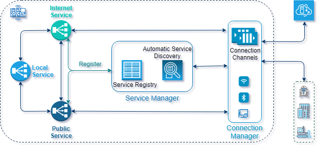

<h1 align="center" style="display: block; font-size: 2.5em; font-weight: bold; margin-block-start: 1em; margin-block-end: 1em;">
<a name="logo" href="https://www.aregtech.com"></a>
  <br><br><b>AREG SDK</b>
</h1>

> 💡 By  on GitHub and spreading AREG SDK link on social media, you help and inspire us to provide featured technology that helps to cut costs and create service enabled product!

<!-- markdownlint-disable -->
## Project status
<table class="no-border">
  <tr>
    <td></td>
    <td></td>
    <td></td>
    <td></td>
  </tr>
  <tr>
    <td></td>
    <td></td>
    <td></td>
    <td></td>
  </tr>
</table>

## Introduction

**AREG SDK** is an Interface centric lightweight real-time asynchronous communication engine to provide IPC and enable [mist computing](https://csrc.nist.gov/publications/detail/sp/500-325/final), where Things interact and provide services, as if they act like thin distributed servers.

## Motivation

Traditionally, devices are connected clients to stream data to the cloud or fog servers for further processing.
<br>

<br>
<br>
Since data is generated and collected at the edge of the network (mist network), it makes sense to change the role of connected Things and provide network accessible (_Public_) services directly on devices. This is a good foothold for robust solutions such as:
* _Increase data privacy_, which is an important factor for sensitive data.
* _Decrease data streaming_, which is a fundamental condition to optimize network communication.
* Develop _autonomous, intelligent and self-aware devices_ by providing network services directly in the environment of data origin.

## More than embedded

When we were designing AREG SDK, the guiding principle was to create a framework to develop embedded applications that intelligently interact at the edge of the network. To keep application design homogeneous and escape complexity of multiple communication layers, we defined _services_ for multi-threading, distributed and multi-processing, and for internet communication.
<br><br><br><br>
The designed services are neither processes, nor tasks managed by the operating system, they are software components with Service Interface(s), which methods are invoked remotely (_Object Remote Procedure Call_ / _ORPC_).
> 💡 The current implementation of AREG engine intelligently handles and distributed message for multi-threading (_Local_ services) and multi-processing (_Public_ services) communication. 

## Escape complexity of multiprocessing

AREG SDK simplifies the multiprocessing programming and helps developers to focus on application business logic as they would program a single process application with one thread where methods of objects are event-driven. The engine creates fault tolerant and scalable system of distributed services, it guarantees that the system automatically delivers the exact and the newest data on subscription, and the system triggers the exact request or response method of the exact servicing component (_server_ or _client_), and the messages are neither mixed, nor lost. 
<br><br><br>

## Benefits
The major features of AREG SDK to benefit:
* The combination of request-response, broadcast and subscription services.
* Transparency of service location, which also eases simulation development and test automation.
* Automated service discovery, automated messaging and dispatching, featured logging and code generator.

## Software build

AREG SDK consists of [framework library](./framework/areg/) and [multi-cast router](./framework/mcrouter/) sources to compile.
* **Supported OS**: POSIX-compliant OS (list of [POSIX API](./docs/POSIX.md#the-list-of-posix-api-used-in-areg-sdk-including-multicast-message-router)), Windows 8 and higher.
* **Supported CPU**: x86, amd64, arm and aarch64.
* **Supported compilers**: Version C++17 GCC, g++, clang and MSVC.
> 💡 The other POSIX-compliant OS and compilers are not tested yet.

Compile AREG SDK sources and examples using following tools:
* **On Linux or Windows**: import projects in _Eclipse_ to compile with POSIX.
* **On Windows**: open areg-sdk.sln file in _MS Visual Studio_ to compile with Win32.
* **On Linux**: in the terminal call “_make_” as shown below to compile with POSIX.
```shell
$ make [all] [framework] [examples]
```
For detailed instructions to load and/or compile projects see [HOWTO](./docs/HOWTO.md) document.

## Examples

We provide various [examples](./examples/) to demonstrate features of the framework. The examples are listed in the [examples/README.md](./examples/README.md) document.

## Licensing
 
AREG SDK is dual-licensed under free open source (Apache version 2 license) and commercial licenses that gives the commercial support, full rights to create and distribute software without open source license obligations. For licensing details see [LICENSE](./LICENSE.txt) document.
 
For commercial license, support or additional information, please visit [Aregtech](https://www.aregtech.com/) web site or contact _info[at]aregtech.com_.

## Inspire us!

Did you like the project? Please share the project with your connections on [](https://twitter.com/intent/tweet?text=Wow:&url=https%3A%2F%2Fgithub.com%2Faregtech%2Fareg-sdk) and [](https://github.com/aregtech/areg-sdk/) on GitHub to inspire us! You can as well become a distributor or suggest features.

[](https://twitter.com/intent/follow?screen_name=aregtech) [](https://www.linkedin.com/company/aregtech/)

<!-- markdownlint-enable -->
