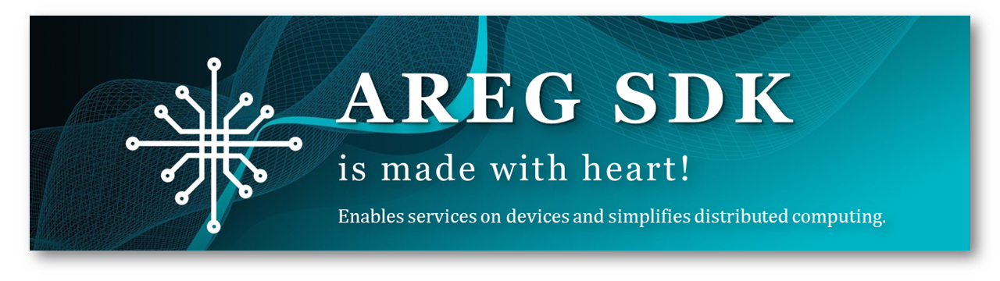
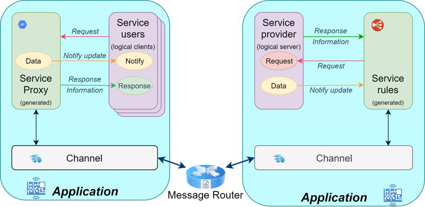
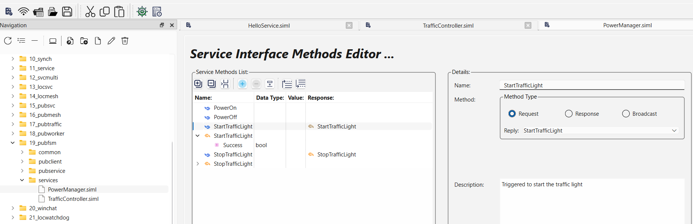
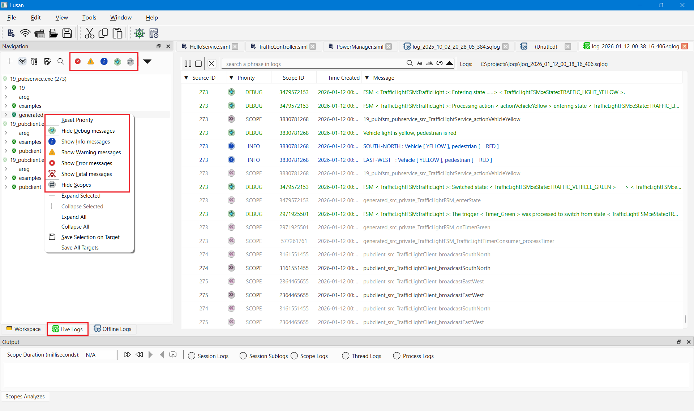
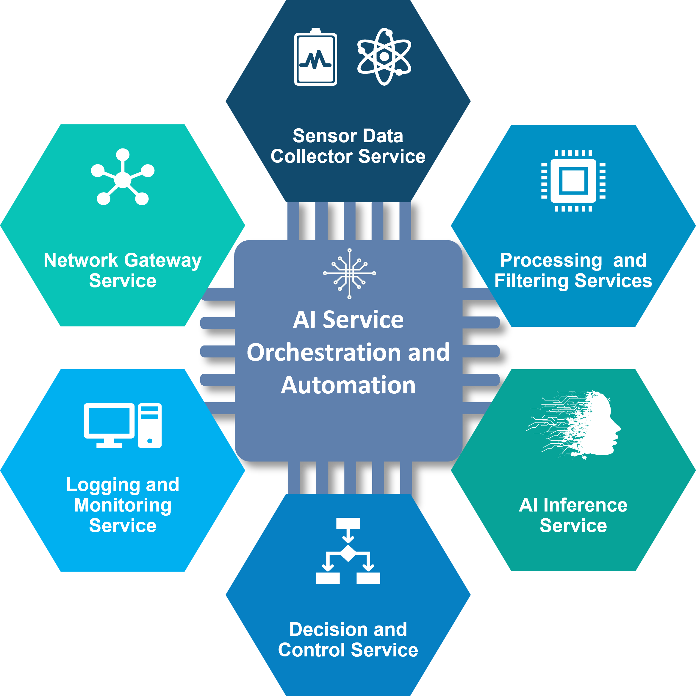
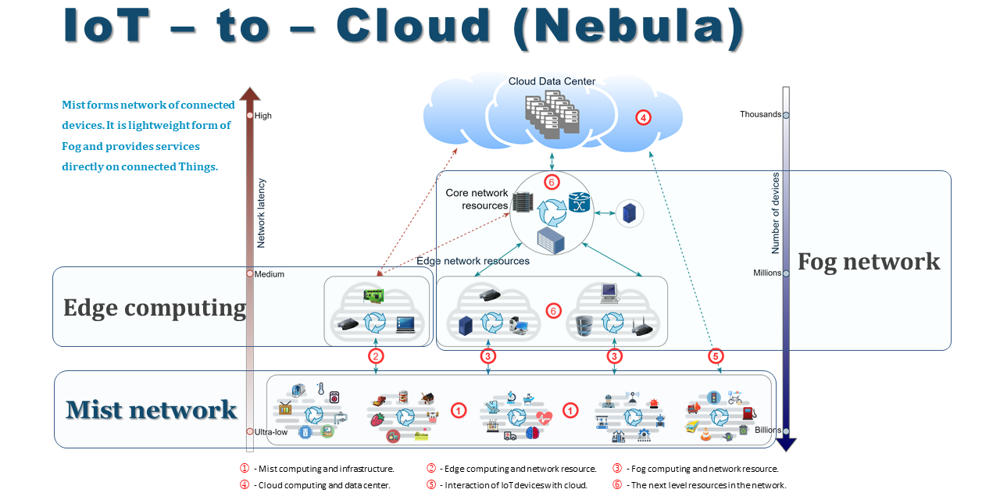
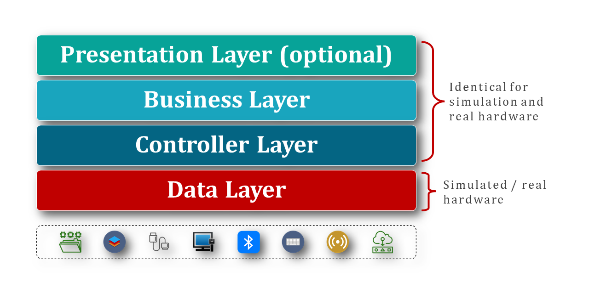
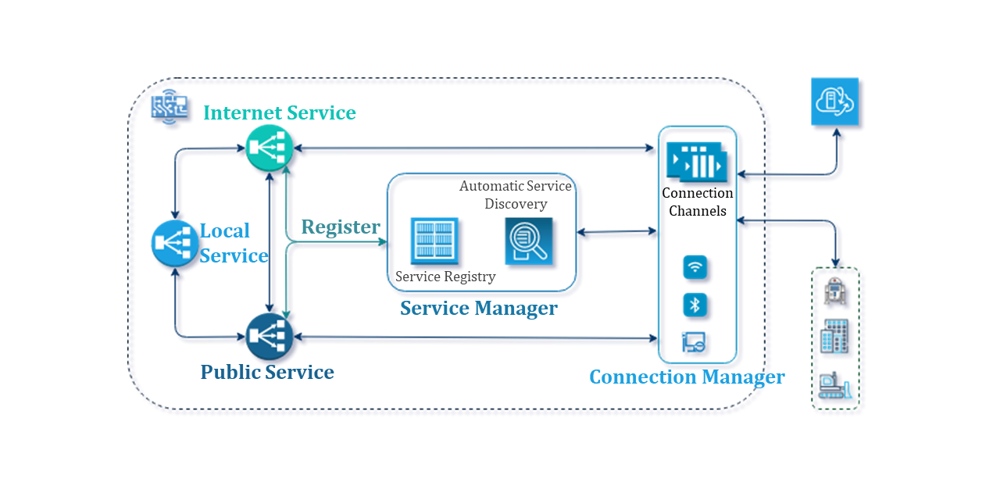
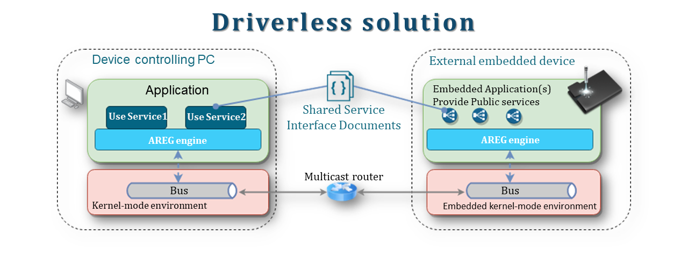

<h1 align="center" style="font-size:2.5em; font-weight:bold; margin:1em 0;">
  <a href="https://www.areg.tech">
    
  </a>
</h1>

[](https://github.com/aregtech/areg-sdk/releases/tag/v1.5.0)
[](https://github.com/aregtech/areg-sdk/compare/v1.5.0...master)
[](https://github.com/aregtech/areg-sdk/stargazers)
[](https://github.com/aregtech/areg-sdk/network/members)
[](https://github.com/aregtech/areg-sdk/watchers)
[](https://github.com/aregtech/areg-sdk/wiki/)

⭐ **If you find Areg SDK useful, please give us a star. It helps the community grow!**

---

Most C++ projects don't fail on algorithms. They fail on **threads, IPC, and fragile wiring**. Unlike traditional frameworks, **Areg SDK uses Object RPC to automate communication**, unifying async RPC, Pub/Sub, and service discovery. Its self-managed service mesh enables scalable, fault-tolerant systems across threads, processes, and devices with no boilerplate and no fragile wiring.

*Named after the ancient Armenian word for "Sun", Areg creates a star network where services orbit around a central router - enabling automatic discovery, fault tolerance, and seamless distributed computing.*

---

## Project Status[](#project-status)

<table class="no-border">
  <tr>
    <td><a href="https://github.com/aregtech/areg-sdk/actions/workflows/cmake.yml"></a></td>
    <td><a href="https://github.com/aregtech/areg-sdk/actions/workflows/msbuild.yml"></a></td>
    <td><a href="https://github.com/aregtech/areg-sdk/actions/workflows/codeql-analysis.yml"></a></td>
  </tr>
  <tr>
    <td></td>
    <td></td>
    <td></td>
  </tr>
</table>

---

## Table of Contents[](#table-of-contents)

- [Why Areg SDK: Benefits and Comparison](#why-areg-sdk-benefits-and-comparison)
- [What is Areg SDK](#what-is-areg-sdk)
- [Getting Started: Build and Integration](#getting-started-build-and-integration)
- [Core Modules and Architecture](#core-modules-and-architecture)
- [Use Cases: Distributed, RPC and IPC](#use-cases-distributed-rpc-and-ipc)
- [Roadmap](#roadmap)
- [Documentation](#documentation)
- [License](#license)
- [Community and Contribution](#community-and-contribution)

> [!IMPORTANT]
> Full technical guidance for building, using, and integrating Areg SDK is available in the [documentation](./docs/wiki/ "Areg SDK documentation").

---

## Why Areg SDK: Benefits and Comparison[](#why-areg-sdk-benefits-and-comparison "Why Areg SDK Lightweight C++ Framework")

### Is Areg Right for Your Project?

Answer these 5 questions to evaluate fit:

- [ ] Do **threading** and **synchronization** issues slow your progress?
- [ ] Does **debugging** across **threads, processes, or components** take excessive time?
- [ ] Is setting up **communication** across **processes or nodes** complex and error-prone?
- [ ] Do **remote failures** and **reconnections** create delays and extra work?
- [ ] Would a **unified communication model** across **threads, processes, and devices** simplify development?

💡 **If you answer Yes to 3+ questions**, Areg SDK is likely a strong fit for your project.

---

### Top 5 Benefits

**Areg SDK** is a **Software Development Kit** built around the **Areg Framework** - a **runtime with built-in middleware that automates threading, service discovery, and inter-node messaging**. Unlike gRPC, DDS, or ZeroMQ, it provides a self-managed mesh and a unified API across threads, processes, and devices.  
**Result:** scalable, fault-tolerant systems that are faster, simpler, and safer.

1. **No manual threading**  
   Threads, components, and watchdogs are auto-created, preventing subtle concurrency bugs and saving development time.

2. **Unified API**  
   Services are called the same way locally or remotely. Everything is async, non-blocking, and consistent across all scopes.

3. **Self-managed mesh**  
   Automatic service discovery and routing across threads, processes, and devices. No manual wiring, no brittle integration code.

4. **Resilient by design**  
   Components can join or leave dynamically. Watchdogs restart failed threads automatically for fault-tolerant systems.

5. **Built-in observability**  
   Integrated logging with visual analysis tools. Per-method duration measurement enables performance monitoring and optimization.

💡 **When to use:** Linux and Windows, C++ apps, scaling from prototype to multi-node production systems.  
⚠️ **When not to use:** RTOS (planned for future), web services, or non-C++ applications.

---

### Compared to Alternatives

| Feature          | Areg SDK                        | Competitors (gRPC, DDS, ZeroMQ)                      |
| ---------------- | ------------------------------- | ---------------------------------------------------- |
| Ease of Use      | ✅ Automated setup              | ⚠️ Manual, boilerplate, [complex](https://www.innoq.com/en/blog/2024/06/grpc/#whataresomechallengesofworkingwithgrpc) |
| Threading Model  | ✅ Automated threading          | ⚠️ Manual threading and sync |
| Automation       | ✅ Codegen, modeling, dispatch  | ⚠️ Limited, [stubs only](https://grpc.io/docs/what-is-grpc/introduction/#overview) |
| Auto-Discovery   | ✅ Self-organizing service mesh | ✅ DDS: [built-in](https://opendds.readthedocs.io/en/latest-release/devguide/introduction_to_dds.html#discovery-matching-and-association), ⚠️ gRPC/ZeroMQ: [external](https://stackoverflow.com/questions/59398556/grpc-equivalent-of-wcf-service-discovery) |
| Fault Tolerance  | ✅ Watchdog & auto-restart      | ✅ DDS: [QoS](https://opendds.readthedocs.io/en/latest-release/devguide/quality_of_service.html), ⚠️ gRPC/ZeroMQ: [Retries](https://grpc.io/docs/guides/retry/)/Manual |
| Request-Reply    | ✅ Native, built-in Object RPC  | ✅ gRPC: [RPC](https://grpc.io/docs/what-is-grpc/core-concepts/#overview), ⚠️ DDS/ZeroMQ: Over topics/[patterns](https://zguide.zeromq.org/docs/chapter3/) |
| Pub/Sub          | ✅ Native, built-in Attributes  | ✅ DDS: [Topics](https://opendds.readthedocs.io/en/latest-release/devguide/built_in_topics.html), ⚠️ Add-ons/Manual |
| Unified API      | ✅ Same, multithreads and IPC   | ⚠️ Different APIs for multithreads and IPC |
| Built-in Logging | ✅ Integrated, dynamic + viewer | ⚠️ [Vendor-specific](https://community.rti.com/static/documentation/connext-dds/current/doc/manuals/addon_products/observability/telemetry_data/logs.html) (DDS) or External |
| Dev Speed        | ✅ Faster, via automation       | ⚠️ Slower, more manual work                |

🔹**Key Differentiators:**
- **Complete Automation**: Areg automates threading, dispatch, and lifecycle - not just transport
- **True Location Transparency**: Same interface whether services are in thread, process, or network
- **Zero Configuration**: Services discover each other automatically - no registry, no broker setup
- **Integrated Stack**: Framework + Router + Tools + Logging in one cohesive SDK

<div align="right"><kbd><a href="#table-of-contents">↑ Back to top ↑</a></kbd></div>

---

## What is Areg SDK[](#what-is-areg-sdk)

**Areg SDK** is a **Software Development Kit** built around the **Areg Framework** - a C++17 framework with built-in middleware that automates distributed system development. Areg uses an **interface-centric Object RPC (ORPC)** model where services are represented as objects with methods, attributes (pub/sub), and events - rather than simple function calls like many other traditional RPC solutions.

This enables:
- **Location transparency:** Same code works locally and remotely
- **Built-in pub/sub:** Attributes automatically broadcast updates
- **Stateful services:** Objects maintain state across calls
- **Lifecycle management:** Automatic registration, discovery, and cleanup

### What's Included

The SDK provides a complete toolkit for distributed C++ development:

**Core Runtime:**  
🔹 Areg Framework (`areg`) + Multitarget Router (`mtrouter`) - The engine that automates threading, IPC, and service mesh

**Design and Development Tools:**  
🔹 Code Generator (`codegen.jar`) - Eliminates boilerplate with automated code generation  
🔹 [Lusan GUI](https://github.com/aregtech/areg-sdk-tools) - Visual service designer and distributed log viewer

**Monitoring & Debug:**  
🔹 Log Collector (`logcollector`) + Observer (`logobserver`) - Distributed logging and real-time analysis  
🔹 Areg Extend - Additional utilities and extensions

> 📦 **All components** work together seamlessly - no integration glue needed.

### How It Works

Areg uses an **interface-centric Object RPC (ORPC)** model where:
1. You define service interfaces (methods, attributes, events)
2. Code generator creates service provider and consumer base classes
3. Services automatically discover each other through `mtrouter`
4. Communication works identically whether local (thread) or remote (process/network)

This **location transparency** means you can:
- Develop as multithreaded application
- Deploy as multiprocess system
- Scale to multi-device network
- **All without changing service code** (example: [`03_helloservice`](./examples/03_helloservice))

<div align="right"><kbd><a href="#table-of-contents">↑ Back to top ↑</a></kbd></div>

---

## Getting Started: Build and Integration[](#getting-started-build-and-integration)

### Prerequisites

- **C++17 compiler**: GCC, Clang/LLVM, MSVC, or MinGW
- **CMake >= 3.20**
- **Java >= 17** (required for code generation tools)
- **Supported OS:** Linux, Windows  
- **Supported Hardware:** x86, x86_64, ARM, AArch64

See the [CMake Configuration Guide](./docs/wiki/02a-cmake-config.md) for detailed setup, compiler options, and troubleshooting tips.

---

### Build Areg SDK

Clone the repository and build the SDK:

```bash
git clone https://github.com/aregtech/areg-sdk.git
cd areg-sdk
cmake -B build
cmake --build build -j20
```

> [!TIP]
> Copy-paste these commands directly in **Linux Terminal, Windows CMD, or PowerShell**.

---

### Run Your First Example

The [minimal RPC example](./examples/01_minimalrpc/) demonstrates **multithreaded RPC** in a single process:

**Example location after build:**
```bash
# Linux example path:
.product/build/gnu-g++/linux-64-x86_64-release-shared/bin/01_minimalrpc

# Windows example path (adjust for your compiler):
.\product\build\msvc-cl\windows-64-amd64-release-shared\bin\01_minimalrpc.exe
```

**What this example demonstrates:**
- **Service Consumer** runs in one thread
- **Service Provider** runs in another thread  
- Consumer calls the method of remote Provider asynchronously
- Communication is fully automated - no manual wiring

**Message Flow:**
```text
🟢 main() → 🏗 load model → 🔗 auto-connect → 📤 Consumer request → 🖨 Provider prints → ✅ application exits
```

1️⃣ **Implementation of Service Provider:**
```cpp
class ServiceProvider : public Component, protected HelloServiceStub {
public:
  ServiceProvider(const NERegistry::ComponentEntry& entry, ComponentThread& owner)
    : Component(entry, owner), HelloServiceStub(static_cast<Component&>(*this))
  {   }

  void requestHelloService() override {
    std::cout << "\'Hello Service!\'" << std::endl;
    Application::signalAppQuit(); // quit application is if received response
  }
};
```

2️⃣ **Implementation of Service Consumer:**
```cpp
class ServiceConsumer : public Component, protected HelloServiceClientBase {
public:
  ServiceConsumer(const NERegistry::ComponentEntry & entry, ComponentThread & owner)
		: Component(entry, owner)
        , HelloServiceClientBase(entry.mDependencyServices[0].mRoleName, owner)
	{   }

  bool serviceConnected(NEService::eServiceConnection status, ProxyBase& proxy) override {
    HelloServiceClientBase::serviceConnected(status, proxy);
    if (NEService::isServiceConnected(status))
      requestHelloService();  // Call of method of remote "ServiceProvider" object.
    return true;
  }
};
```

3️⃣ **Define a model - automates threading, automates creating objects, automates service discovery:**
```cpp
BEGIN_MODEL("ServiceModel")
  BEGIN_REGISTER_THREAD("Thread1")
    BEGIN_REGISTER_COMPONENT("ServiceProvider", ServiceProvider)
      REGISTER_IMPLEMENT_SERVICE(NEHelloService::ServiceName, NEHelloService::InterfaceVersion)
    END_REGISTER_COMPONENT("ServiceProvider")
  END_REGISTER_THREAD("Thread1")

  BEGIN_REGISTER_THREAD("Thread2")
    BEGIN_REGISTER_COMPONENT("ServiceClient", ServiceConsumer)
      REGISTER_DEPENDENCY("ServiceProvider") /* dependency reference to the remote service*/
    END_REGISTER_COMPONENT("ServiceClient")
  END_REGISTER_THREAD("Thread2")
END_MODEL("ServiceModel")
```

4️⃣ **Full version of `main()` function:**
```cpp
int main() {
  Application::initApplication();
  Application::loadModel("ServiceModel"); // Start threads, create objects, establish connections
  Application::waitAppQuit(NECommon::WAIT_INFINITE);
  Application::releaseApplication();
  return 0;
}
```

📄 **Full source code:** [examples/01_minimalrpc/src/main.cpp](./examples/01_minimalrpc/src/main.cpp)

---

### Learning Path

Follow this progressive path to master Areg SDK:

1. **[01_minimalrpc](examples/01_minimalrpc/)** - Minimal RPC between two components (start here)
2. **[02_minimalipc](examples/02_minimalipc/)** - IPC across processes (**requires `mtrouter`**)
3. **[03_helloservice](examples/03_helloservice/)** - Multithreaded RPC + IPC combined
4. **[23_pubdatarate](examples/23_pubdatarate/)** - High-throughput data benchmark (test your system)
5. **[More Examples](examples/README.md)** - Advanced SDK features and usage patterns
6. **[Areg and Edge AI](https://github.com/aregtech/areg-edgeai)** - Practical use cases with Edge AI inference

> [!IMPORTANT]
> **For _IPC_ examples:** Ensure **`mtrouter` is running**. See [mtrouter documentation](./docs/wiki/05a-mtrouter.md).

---

### Integration & Extensions

- **CMake FetchContent integration:** [Integration Guide](./docs/wiki/02c-cmake-integrate.md)
- **Demo Project:** [areg-sdk-demo](https://github.com/aregtech/areg-sdk-demo)
- **Qt Integration & Tools (Lusan):** [areg-sdk-tools](https://github.com/aregtech/areg-sdk-tools)
- **Edge AI Cases:** [areg-edgeai](https://github.com/aregtech/areg-edgeai)

> 💡 **Advanced builds** (IDE setup, cross-compilation, disabling tests/examples) → consult the [Wiki](./docs/wiki/)

<div align="right"><kbd><a href="#table-of-contents">↑ Back to top ↑</a></kbd></div>

---

## Core Modules and Architecture[](#core-modules-and-architecture)

**Areg SDK** combines the Areg Framework, Multitarget Router, logging utilities, and development tools into a cohesive development kit.

### Modules Overview

| Module                                                                       | Role & Purpose                                                                                              | Required     |
|------------------------------------------------------------------------------|-------------------------------------------------------------------------------------------------------------|--------------|
| [Areg Library</br>(`areg`)](./docs/HelloService.md)                          | **Core framework + middleware.** Automates Object RPC (ORPC), IPC,<br/>threading, routing, and fault recovery.  | ✅ Always    |
| [Code Generator</br>(`codegen.jar`)](./docs/wiki/03a-code-generator.md)      | **Build-time tool.** Generates code from service APIs to eliminate<br/>manual coding and automate RPC.          | ✅ Buildtime |
| [Multitarget Router</br>(`mtrouter`)](./docs/wiki/05a-mtrouter.md)           | **Required for IPC.** Routes messages across processes and devices<br/>to form a servicemesh.                  | ⚠️ IPC only  |
| [Log Collector</br>(`logcollector`)](./docs/wiki/04d-logcollector.md)        | **Optional developer tool.** Aggregates logs from distributed apps<br/>for monitoring, debugging, and analysis. | ❌ Optional  |
| [Lusan (GUI Tool)</br>(`lusan`)](https://github.com/aregtech/areg-sdk-tools) | **Optional developer tool.** Provides visual API design, log inspection,<br/>andperformance visualization.     | ❌ Optional  |
| [Examples](./examples/README.md)                                             | **Learning & validation.** Sample projects that demonstrate Areg SDK<br/>in action.                             | ❌ Optional  |

---

### Architecture

Areg uses an **interface-centric Object RPC (ORPC)** model. Applications expose **Service Providers** and interact via **Service Consumers** using generated code and the **Multitarget Router** for inter-process communication. Services act as logical micro-servers independent of physical locations, enabling true **service-oriented architecture (SOA)**.

<div align="center"><a href="https://github.com/aregtech/areg-sdk/blob/master/docs/img/interface-centric.png"></a></div>

Areg supports both **Client-Server (Request-Reply)** and **Publish-Subscribe (Pub/Sub)** patterns, optimized for **multithreading**, **multiprocessing**, and **distributed systems** with low-latency requirements.

---

### Lusan Application

**Lusan** is a graphical development and diagnostics tool built on the Areg Framework. It streamlines the design, configuration, and monitoring of distributed Areg systems. The [open-source version](https://github.com/aregtech/areg-sdk-tools) focuses on core developer workflows: visual service interface design and centralized log collection.

#### Service Interface Design

Lusan's visual **Service Interface Designer** lets developers define, inspect, and maintain service interfaces with clarity and consistency. The integrated code generator produces ready-to-use code for Service Providers and Consumers, reducing manual errors and speeding up development.

<div align="center"><a href="./docs/img/lusan-service-if-general.png"></a></div>

For more details, see the 📄 [Service Interface Design Guide](./docs/wiki/06d-setup-lusan.md).

#### Live and Offline Log Viewer

Lusan's **log viewer** aggregates logs from multiple instances, supporting both real-time monitoring and offline analysis. It helps multiprocess application monitoring, system behavior analysis, and debugging of distributed interactions with features like:

- **Real-time log aggregation** across distributed systems
- **Dynamic scope filtering** and priority control at runtime
- **Offline analysis** of recorded sessions for post-mortem debugging
- **Performance analysis** with per-method execution timing

<div align="center"><a href="./docs/img/lusan-live-log-scope-prio.png"></a></div>

For more details, see:
- 📄 [Live Log Viewer Guide](./docs/wiki/06f-lusan-live-logging.md) - Real-time monitoring and debugging
- 📄 [Offline Log Viewer Guide](./docs/wiki/06g-lusan-offline-logging.md) - Post-mortem analysis and collaboration

**In summary**, Lusan unifies service design and runtime observability in one tool, shortening development cycles and enabling faster, safer testing and debugging of distributed applications.

---

### ✅ Quick Summary

- **`areg` + `codegen.jar`** - Build services and projects with automated code generation
- **`mtrouter`** - Enable IPC and distributed communication across processes and devices
- **`logcollector` + `Lusan`** - Monitor and debug with integrated logging and visual analysis
- **Key strengths** - Automates service communication, manages threading & IPC, enables scalable distributed apps

<div align="right"><kbd><a href="#table-of-contents">↑ Back to top ↑</a></kbd></div>

---

## Use Cases: Distributed, RPC and IPC[](#use-cases-distributed-rpc-and-ipc)

### Embedded and Distributed Edge AI

Integrating AI into embedded and edge systems requires managing concurrency, communication, and synchronization across multiple modules - data collection, preprocessing, inference, decision-making, monitoring, and connectivity. **Areg SDK** simplifies this by letting each AI stage run as an **independent service** in its own thread or process, with built-in event-driven communication.

<div align="center"><a href="https://github.com/aregtech/areg-sdk/blob/master/docs/img/areg-for-embedded-ai.png"></a></div>

🔹**Benefits:**
- **Modular AI pipelines** - Each stage (capture, preprocess, inference, decision) is an independent service
- **No manual threading** - Automatic concurrency management and event-driven communication
- **Real-time responsiveness** - Non-blocking architecture enables fast control loop reactions
- **Scalable orchestration** - Distribute AI workloads across multiple devices seamlessly

> [!TIP]
> **Featured Project:** [areg-edgeai](https://github.com/aregtech/areg-edgeai) - Practical examples of using Areg SDK with Edge AI systems, demonstrating real-world AI inference integration patterns.

---

### IoT: Mist-to-Cloud

Edge devices often stream raw data to central servers, increasing latency, network load, and privacy risks. With **Areg SDK**, services run on devices, forming a **mist network of micro-servers** that process and aggregate data locally before sending refined results to the cloud.

<div align="center"><a href="https://github.com/aregtech/areg-sdk/blob/master/docs/img/mist-network.png"></a></div>

🔹**Benefits:**
- **Low-latency processing** - Data processed at the edge, not in distant cloud
- **Autonomous operation** - Edge mesh continues working during network outages
- **Enhanced privacy** - Sensitive data stays on-device, only insights sent to cloud
- **Reduced cloud costs** - Less data transmission and cloud computing needed

---

### Simulation & Testing

Validating distributed systems is expensive and hardware-dependent. **Areg SDK** allows simulation of **Data Layer services** in external applications, providing realistic environments to test behavior, performance, and fault-tolerance. Services appear **location-transparent** to higher layers, enabling comprehensive testing without physical hardware.

<div align="center"><a href="https://github.com/aregtech/areg-sdk/blob/master/docs/img/software-layers.png"></a></div>

🔹**Benefits:**
- **Hardware-independent testing** - Test higher-layer logic without physical devices
- **Continuous integration** - Automated testing without hardware dependencies
- **Fault injection** - Simulate failures and test recovery mechanisms safely
- **Cost reduction** - Reduce need for expensive test hardware and lab time

---

### Beyond Embedded

Many small devices lack scalable infrastructure for complex applications. **Areg SDK** transforms embedded applications into **distributed modules** that scale seamlessly across remote nodes and platforms, orchestrating **multithreaded and multiprocess C++ services**.

<div align="center"><a href="https://github.com/aregtech/areg-sdk/blob/master/docs/img/areg-services.png"></a></div>

- **Local Services** - Multithreading within a single device or application
- **Public Services** - Accessible across processes, applications, and devices

🔹**Benefits:**
- **Seamless scaling** - Start with local services, expose as public without code changes
- **Location transparency** - Services work identically whether local or remote
- **Platform independence** - Same code runs on embedded, desktop, and server platforms

---

### Driverless Devices

Traditional device drivers are **slow to develop, complex to maintain, and platform-specific**. **Areg SDK** enables you to **expose hardware as portable, service-enabled components**, making devices platform-independent and network-accessible.

<div align="center"><a href="https://github.com/aregtech/areg-sdk/blob/master/docs/img/driverless-solution.png"></a></div>

🔹**Benefits:**
- **Faster development** - Accelerates prototyping, testing, and iteration cycles
- **Platform independence** - Hardware abstracted as services, not platform-specific drivers
- **Network accessibility** - Devices accessible from anywhere on the network
- **Early bug detection** - Test hardware integration before full driver implementation

<div align="right"><kbd><a href="#table-of-contents">↑ Back to top ↑</a></kbd></div>

---

## Roadmap[](#roadmap)

Areg SDK continues to evolve for Desktop and Embedded platforms. The focus is on automation, reliability, platform expansion, and developer experience.

🔹**2026 Priorities:**  
- **Multi-channel support** - Multiplexed communications for higher throughput and efficiency
- **Enhanced security** - encryption, authentication, and authorization mechanisms
- **RTOS support (Zephyr OS)** - Bring Areg SDK into real-time embedded environments
- **Lusan application improvements** - Enhanced performance, stability, and usability ([Areg SDK Tools](https://github.com/aregtech/areg-sdk-tools))
- **Expanded documentation** - More tutorials, guides, and real-world examples
- **Performance optimization** - Profiling tools and benchmark suite

🔹**Future Vision:**
- Cross-language bindings (Python, Rust, etc.) for polyglot systems
- Cloud integration patterns and deployment guides
- Container orchestration support (Kubernetes, Docker Compose)
- Advanced debugging and profiling tools

> [!TIP]
> Want to influence the roadmap? Join [discussions](https://github.com/aregtech/areg-sdk/discussions) or contribute via [issues](https://github.com/aregtech/areg-sdk/issues?q=is%3Aissue+is%3Aopen+label%3A%22help+wanted%22).

<div align="right"><kbd><a href="#table-of-contents">↑ Back to top ↑</a></kbd></div>

---

## Documentation[](#documentation)

- **[Installation and Build](./docs/wiki/README.md#1-installation-and-build)** - Cross-platform builds, toolchains, CMake integration for embedded and desktop targets
- **[Build Options and Integrations](./docs/wiki/README.md#2-build-options-and-integrations)** - FetchContent, packaging, and embedding Areg SDK as a library
- **[Networking and Communication](./docs/wiki/README.md#3-networking-and-communication)** - Multitarget router for IPC and low-latency 
- **[Logging and Monitoring](./docs/wiki/README.md#4-logging-and-monitoring)** - Log collector and observer usage for distributed systems
messaging
- **[Persistence](./docs/wiki/README.md#5-persistence)** - Local data storage in text files
- **[Development and Testing Tools](./docs/wiki/README.md#6-development-and-testing-tools)** - Core and optional tools that accelerate development and enforce architectural consistency
- **[Troubleshooting](./docs/wiki/README.md#7-troubleshooting)** - Common issues and recommended solutions
- **[Examples and Tests](./docs/wiki/README.md#8-examples-and-tests)** - Catalog of sample projects (RPC, IPC, Pub/Sub, FSM, and more)
- **[HOWTO Guide](docs/HOWTO.md)** - Practical reference for common development tasks

<div align="right"><kbd><a href="#table-of-contents">↑ Back to top ↑</a></kbd></div>

---

## License[](#license)

Areg SDK is released under the **[Apache License 2.0](LICENSE.txt)**. This permissive license is suitable for both open-source and commercial use.

**Commercial licensing & services:** Dedicated support, training, and tailored licensing options are available for enterprise customers. Visit **[areg.tech](https://www.areg.tech/)** or email **info[at]areg[dot]tech** for more details.

<div align="right"><kbd><a href="#table-of-contents">↑ Back to top ↑</a></kbd></div>

---

## Community and Contribution[](#community-and-contribution)

🚀 **Join the Areg SDK community** and help shape the future of distributed C++ development:

- 🛠️ [Contribute to open issues](https://github.com/aregtech/areg-sdk/issues?q=is%3Aissue+is%3Aopen+label%3A%22help+wanted%22) - Review the **[contribution guidelines](CONTRIBUTING.md)** before submitting
- 💡 Share ideas or request features via [issues](https://github.com/aregtech/areg-sdk/issues) or [discussions](https://github.com/aregtech/areg-sdk/discussions)
- 🔀 Submit pull requests following the [contribution guidelines](CONTRIBUTING.md)
- ⭐ **Give us a star** if you like Areg SDK - it helps others discover the project
- 🌍 **Show your project** - We're collecting early adopters. [Share your work](https://github.com/aregtech/areg-sdk/discussions/new?category=show-and-tell)!

<div align="right"><kbd><a href="#table-of-contents">↑ Back to top ↑</a></kbd></div>

---

**Used by**  
[](mailto:info@areg.tech)  
🔹[Edge AI Agents](https://github.com/aregtech/areg-edgeai): Distributed Edge AI agent service providers and consumers built on top of the Areg SDK
🔹[Lusan application](https://github.com/aregtech/areg-sdk-tools): Design and monitoring tool  

**Follow Us**  
[](https://x.com/aregtech?lang=en)
[](https://www.linkedin.com/company/aregtech)
[](https://gitter.im/areg-sdk/community)

---
