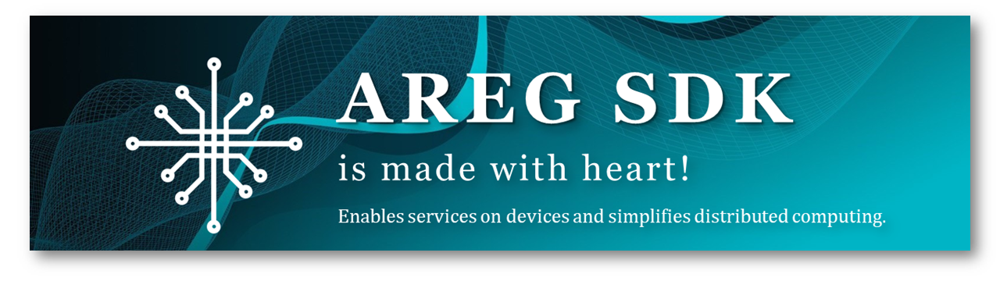
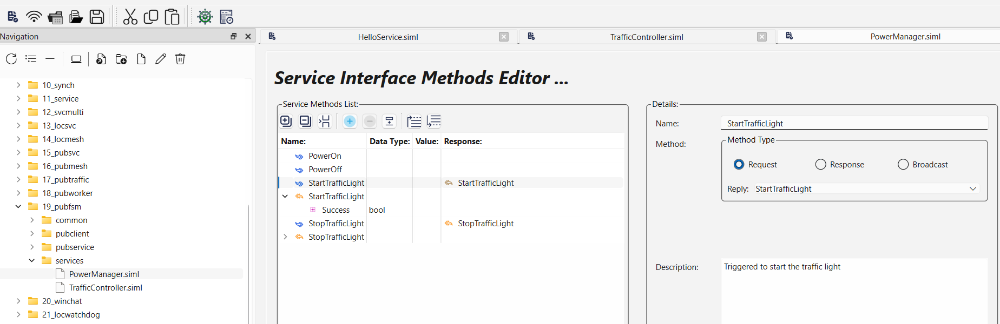
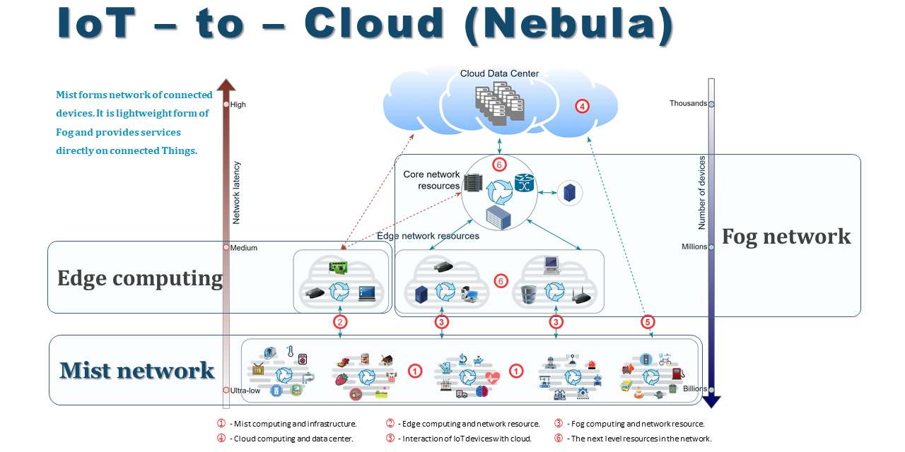

<div align="center">

<h1 align="center" style="font-size:2.5em; font-weight:bold; margin:1em 0;">
  <a href="https://www.areg.tech">
    
  </a>
</h1>
</div>

**High-throughput, service-oriented C++ middleware**  
**From embedded systems to high-performance distributed applications**

[](https://github.com/aregtech/areg-sdk/releases/tag/v1.5.0)
[](https://github.com/aregtech/areg-sdk/compare/v1.5.0...master)
[](https://github.com/aregtech/areg-sdk/stargazers)
[](./docs/wiki/README.md)

---

## Project Status[](#project-status)

<table class="no-border">
  <tr>
    <td><a href="https://github.com/aregtech/areg-sdk/actions/workflows/cmake.yml"></a></td>
    <td><a href="https://github.com/aregtech/areg-sdk/actions/workflows/msbuild.yml"></a></td>
    <td><a href="https://github.com/aregtech/areg-sdk/actions/workflows/codeql-analysis.yml"></a></td>
  </tr>
  <tr>
    <td></td>
    <td></td>
    <td></td>
  </tr>
</table>

---

> Most C++ projects don't fail on algorithms. They fail on **threads**, **IPC**, and **brittle integration code**.  
> Areg SDK eliminates that category of failure — and does it without sacrificing throughput.

---

## Table of Contents

- [Why Areg SDK](#why-areg-sdk)
- [How It Works](#how-it-works)
- [Performance](#performance)
- [Areg SDK vs. Alternatives](#areg-sdk-vs-alternatives)
- [Getting Started](#getting-started)
- [Architecture](#architecture)
- [Network Deployment Model](#network-deployment-model)
- [Use Cases](#use-cases)
- [Roadmap](#roadmap)
- [Documentation](#documentation)
- [License](#license)
- [Community](#community)

---

## Why Areg SDK[](#why-areg-sdk)

### Ask yourself these questions:

- Do threading and synchronization issues slow your development velocity?
- Is your IPC integration fragile, hard to test, or hard to extend?
- Does moving a component from in-process to out-of-process require rewriting its interface?
- Do you lose hours debugging silent failures when a service restarts unexpectedly?
- Is your distributed system difficult to monitor and diagnose in production?
- Are you building a data-intensive pipeline where framework overhead must be near zero?

**If you answered yes to three or more — Areg SDK is worth your time.**

Areg SDK is a C++ service framework that automates threading, inter-process communication,
service discovery, fault recovery, and message dispatch — across thread boundaries, process
boundaries, and network boundaries — using a single consistent programming model.

**The same service code runs:**
- Multithreaded (components in the same process)
- Multiprocessing (components on the same machine)
- Multi-device (components across a network)

**No code changes. Configuration only.**

> [!NOTE]
> **Best for:** C++ applications requiring reliable service communication, automated threading,
> high-throughput IPC, or location-transparent services — from embedded edge devices
> to high-performance distributed systems.
>
> **Not for:** RTOS hard real-time targets (planned), web services, or non-C++ ecosystems.

<div align="right"><kbd><a href="#table-of-contents">↑ Back to top ↑</a></kbd></div>

---

## How It Works[](#how-it-works)

Areg SDK implements **Object RPC (ORPC)** — a service model where components expose
typed interfaces and communicate through generated proxies, regardless of where they run.
Unlike gRPC or ZeroMQ, the same proxy code calls a thread, a process, or a networked
device — the framework resolves the location at runtime with no API changes.

```
┌─────────────────────────────────────────────────────────┐
│  Same code. Same interface. Different deployment.       │
│                                                         │
│  Thread A ──────────────── Thread B      (in-process)   │
│  Process A ─── mtrouter ── Process B     (same machine) │
│  Device A  ─── mtrouter ── Device B      (network)      │
└─────────────────────────────────────────────────────────┘
```

Consumers reference services by **name**, not by network address or endpoint.
The framework connects a consumer to the named service wherever it runs —
whether in the same process, on the same machine, or on a remote node.

**What the framework handles automatically:**
- Thread lifecycle and synchronization
- Service discovery and registration
- Request and response routing and dispatching
- Fault detection and watchdog restart
- Connection management and reconnection

**What you write:**
- A service interface definition (`.siml` file) — designed visually with [`Lusan`](https://github.com/aregtech/areg-sdk-tools/) or edited as XML
- Extend generated provider and consumer classes with business logic

The code generator produces all RPC infrastructure — serialization, proxies, events, and service provider and consumer base classes. You fill in the logic.

### Service Interface and Code Generation

A **service interface** defines the API contract: data types, attributes (pub/sub),
requests, responses, broadcasts, and constants. A **service** is a named component
instance that implements one or more interfaces. Consumers declare which named service
they depend on — the framework connects them automatically when that service becomes
available anywhere on the network.

The workflow from interface definition to running code:

```
MyService.siml  ──►  codegen.jar  ──►  MyServiceProviderBase.hpp
  (design in Lusan)        │           MyServiceConsumerBase.hpp
                           │           MyServiceProxy.hpp
                           │           Serialization code
                           |           Event objects
```

**CMake integration** — one line generates and links all infrastructure:

```cmake
addServiceInterface(MyServiceLib ./services/MyService.siml)
```

For full details, see the [Service Interface Guide](./docs/wiki/06e-lusan-service-interface.md).

<div align="right"><kbd><a href="#table-of-contents">↑ Back to top ↑</a></kbd></div>

---

## Performance[](#performance)

Areg SDK's transport layer is designed for production-grade data pipelines.
The numbers below are measured on **mobile-class consumer hardware** and include
data serialization, event dispatching, and multithreading — not raw socket throughput.

> [!NOTE]
> **Benchmark — IPC throughput on mobile-class CPUs, TCP `localhost`, 1:1 application communication:**
>
> Measurements taken at `mtrouter` — duplex communication, high-precision timers.
>
> | Platform        | CPU Type         | ~3 MB data   | ~3 KB msg/s      | ~0.5 KB msg/s   |
> |-----------------|------------------|--------------|------------------|-----------------|
> | Windows 11 ¹    | i7-13700H (DDR4) | 2.4–2.6 GB/s | 450–520K msg/s   | 1.0–1.2M msg/s  |
> | WSL2 Ubuntu ²   | i7-13700H (DDR4) | 5.5–6.0 GB/s | 330–375K msg/s   | 650–700K msg/s  |
> | macOS native ³  | M3 Pro (LPDDR5)  | 6.5–7.0 GB/s | 700K–1.0M msg/s  | 2.5–3.0M msg/s  |
> | Linux native ⁴  | x86_64 (DDR4)    | 6.0–6.5 GB/s | 600–800K msg/s   | 2.2–2.8M msg/s  |
>
> ¹ On Windows, stable end-to-end consumer dispatch reaches 300–400K msg/s; above that the RPC dispatch thread becomes the bottleneck. macOS stable dispatch measured at 500–600K msg/s. See [23_pubdatarate README](examples/23_pubdatarate/ReadMe.md) for details.  
> ² Requires [network tuning](./docs/wiki/07d-troubleshooting-network-tunning.md); default WSL2 settings yield ~4.5 GB/s and ~700K msg/s.  
> ³ Measured without network tuning. Numbers are transport-layer ceiling; current optimization level. M4 Pro results pending re-measurement.  
> ⁴ Estimated from WSL2 baseline. Bare-metal Linux measurements pending.
>
> **Full stack:** data serialization, event dispatching, multithreading — not raw socket throughput.
>
> **Real-world fit:** covers the software pipeline layer of scientific imaging (laser microscopy, X-ray, electron microscopy) and industrial machine vision on a standard laptop.
>
> 📊 Measure your own hardware: run [`23_pubdatarate`](examples/23_pubdatarate/) — see the [README](examples/23_pubdatarate/ReadMe.md) for benchmark recipes and results.

<div align="right"><kbd><a href="#table-of-contents">↑ Back to top ↑</a></kbd></div>

---

## Areg SDK vs. Alternatives[](#areg-sdk-vs-alternatives)

| Feature                   | Areg SDK                       | gRPC / DDS / ZeroMQ                                                                                                                                                                                                                                         |
|---------------------------|--------------------------------|-------------------------------------------------------------------------------------------------------------------------------------------------------------------------------------------------------------------------------------------------------------|
| **Setup Complexity**      | ✅ Automated, zero boilerplate | ⚠️ Manual configuration, [verbose setup](https://www.innoq.com/en/blog/2024/06/grpc/#whataresomechallengesofworkingwithgrpc)                                                                                                                               |
| **Threading**             | ✅ Automated threading         | ⚠️ Manual threading and synchronization                                                                                                                                                                                                                    |
| **Code Generation**       | ✅ Full ORPC automation        | ⚠️ [Stubs only](https://grpc.io/docs/what-is-grpc/introduction/#overview), manual dispatch                                                                                                                                                                 |
| **Service Discovery**     | ✅ Name-based, automatic       | ✅ DDS: [native](https://opendds.readthedocs.io/en/latest-release/devguide/introduction_to_dds.html#discovery-matching-and-association), ⚠️ gRPC/ZeroMQ: [external](https://stackoverflow.com/questions/59398556/grpc-equivalent-of-wcf-service-discovery) |
| **Fault Recovery**        | ✅ Watchdog auto-restart       | ✅ DDS: [QoS policies](https://opendds.readthedocs.io/en/latest-release/devguide/quality_of_service.html), ⚠️ gRPC/ZeroMQ: [manual](https://grpc.io/docs/guides/retry/)                                                                                    |
| **Request-Reply**         | ✅ Native Object RPC           | ✅ gRPC: [RPC](https://grpc.io/docs/what-is-grpc/core-concepts/#overview), ⚠️ DDS/ZeroMQ: [topic/pattern](https://zguide.zeromq.org/docs/chapter3/)                                                                                                        |
| **Pub/Sub**               | ✅ Native Attributes           | ✅ DDS: [topics](https://opendds.readthedocs.io/en/latest-release/devguide/built_in_topics.html), ⚠️ gRPC/ZeroMQ: add-ons                                                                                                                                  |
| **Location Transparency** | ✅ One API for threads and IPC | ⚠️ Different APIs for local vs. remote                                                                                                                                                                                                                      |
| **Logging System**        | ✅ Distributed logs + viewer   | ⚠️ [Vendor-specific](https://community.rti.com/static/documentation/connext-dds/current/doc/manuals/addon_products/observability/telemetry_data/logs.html) or external tools                                                                               |
| **Developer Speed**       | ✅ Faster via full automation  | ⚠️ Slower, more boilerplate                                                                                                                                                                                                                                 |

🔹 **Key Differentiators:**
- **Complete automation** — Not just transport, but threading, dispatch, and lifecycle
- **True location transparency** — Same interface whether thread, process, or network
- **Service Discovery** — automatically connects service consumers and providers by name, and routes messages
- **Integrated stack** — Framework + Router + Tools + Logging in one cohesive SDK
- **High-throughput transport** — Full service stack, not stripped-down benchmark conditions

<div align="right"><kbd><a href="#table-of-contents">↑ Back to top ↑</a></kbd></div>

---

## Getting Started[](#getting-started)

### Requirements

| Dependency   | Minimum                    | Notes                     |
|--------------|----------------------------|---------------------------|
| C++ compiler | C++17                      | GCC, Clang, MSVC          |
| CMake        | 3.20+                      | MSVS solution included    |
| Java Runtime | 17+                        | Code generator only       |
| OS           | Windows 10+, Linux, macOS  | Cygwin, MinGW inclusive   |

### Quick Build

```bash
git clone https://github.com/aregtech/areg-sdk.git
cd areg-sdk
cmake -B build
cmake --build build -j20
```

### Run Your First Example

**Example location after build:**

```bash
# Linux
./product/build/gnu-g++/linux-64-x86_64-release-shared/bin/01_minimalrpc.elf

# macOS
./product/build/llvm-clang++/macos-64-arm64-release-shared/bin/01_minimalrpc.mac

# Windows
.\product\build\msvc-cl\windows-64-amd64-release-shared\bin\01_minimalrpc.exe
```

**What happens:** The developer defines a **model** — a structured declaration of
threads, components, and their provided or consumed services. A single call to
`Application::load_model()` instantiates all threads, loads components, and starts
services automatically. No manual thread creation or object management required.

At runtime, the service consumer detects the provider, sends a `hello` request,
the provider prints `'Hello Service!'` and triggers an application-quit event.
`Application::unload_model()` then stops all services, exits threads, and notifies
every consumer that services are no longer available — all handled by the framework.

Models can be defined statically at compile time or constructed dynamically at
runtime. Loading and unloading is always dynamic and safe.

**Expected output:**
```
'Hello Service!'
```

The companion example `02_minimalipc` runs the **same** `ServiceComponent` and
`ClientComponent` code in **separate processes** via `mtrouter`. Change only `areg.init`
to point `mtrouter` at a remote machine and it becomes device-to-device communication.
These two examples are the concrete proof of "same code — thread, process, network."

### Start Your Own Project

```bash
git clone https://github.com/aregtech/areg-sdk.git
cd areg-sdk
cmake -B build -DAREG_BUILD_EXAMPLES=OFF
cmake --build build -j20
```

Then use the project setup tool:

```bash
# Linux / macOS
./areg-sdk/tools/setup-project.sh
```

```powershell
# Windows
.\areg-sdk\tools\setup-project.bat
```

After generation, build with:

```bash
cd <your_project>
cmake -B build
cmake --build build -j20
```

### Learning Path

1. **[01_minimalrpc](examples/01_minimalrpc/)** — Multithreading: service provider and consumer in separate threads, one process, no `mtrouter`
2. **[02_minimalipc](examples/02_minimalipc/)** — IPC: the same components from `01_minimalrpc` running in separate processes via `mtrouter`
3. **[03_helloservice](examples/03_helloservice/)** — Extended progression: three projects showing the same service and consumer in one thread → separate threads → separate processes
4. **[16_pubmesh](examples/16_pubmesh/)** — Service mesh: multiple local and public services discovering each other automatically
5. **[23_pubdatarate](examples/23_pubdatarate/)** — Platform-dependent high-throughput benchmark: 2.2–7 GB/s and 1M+ msg/s on `localhost`
6. **[More Examples](examples/README.md)** — Advanced patterns and features

<div align="right"><kbd><a href="#table-of-contents">↑ Back to top ↑</a></kbd></div>

---

## Architecture[](#architecture)

### Component Model

Areg SDK uses an **Object RPC (ORPC)** model. Services expose typed interfaces; consumers
communicate through generated proxies. The framework routes all communication — whether
the target is a thread, a process, or a remote device.

```
┌──────────────────────────────────────────────────────────────────┐
│  Service Interface (.siml)                                       │
│       │                                                          │
│       ├─ Code Generator ──► Provider Base  (implement logic)     │
│       │                     Consumer Proxy (call methods)        │
│       │                                                          │
│       └─ Framework ────────► Service Registry                    │
│                              Thread Manager                      │
│                              Message Dispatcher                  │
│                              Watchdog                            │
└──────────────────────────────────────────────────────────────────┘
```

### Service Identity Model

A **service interface** is the API contract — data types, requests, responses, broadcasts,
and constants defined in a `.siml` file. A **service** is a named component instance that
implements one or more interfaces. The same interface can be implemented by many services
playing different roles.

| Concept               | Description                                                                      | Example                                                              |
|-----------------------|----------------------------------------------------------------------------------|----------------------------------------------------------------------|
| **Service Interface** | API contract — the typed communication definition                                | `PrinterDevice` interface                                            |
| **Service**           | Named component instance implementing one or more interfaces                     | `HP-Lab1` (implements `ScannerDevice` and `PrinterDevice`), `Canon-Floor3` (implements `PrinterDevice`) |
| **Consumer**          | Declares which named service it depends on; receives `connected` when it appears | Consumer of `HP-Lab1`                                          |

A consumer claims a specific service by name — "I need `HP-Lab1`." The framework
connects them when that named service becomes available anywhere on the network, and
notifies the consumer immediately. No polling. No manual connection management.

### Module Overview

| Module         | Description                                                                                                               |
|----------------|---------------------------------------------------------------------------------------------------------------------------|
| `areg`         | Core framework: threading, IPC, ORPC, service model, communication                                                        |
| `aregextend`   | Extended services: communication, SQLite wrapper, other small utilities                                                   |
| `areglogger`   | Log Observer API and library                                                                                              |
| `mtrouter`     | Multi-target message router: routes IPC and network traffic                                                               |
| `logcollector` | Distributed log aggregation service                                                                                       |
| `logobserver`  | Log capture, storage (file + SQLite), scope control                                                                       |
| `Lusan`        | GUI tool for service interface design, live log collection, and log analysis ([`Lusan` app](https://github.com/aregtech/areg-sdk-tools)) |

<div align="center"><a href="./docs/img/lusan-service-if-general.png"></a></div>

### Location Transparency

The same service operates identically at three deployment levels:

| Deployment                    | Transport             | Code change required |
|-------------------------------|-----------------------|----------------------|
| Multithreaded (same process)  | Direct call           | None                 |
| Multiprocessing (same machine)| TCP via `mtrouter`    | None                 |
| Multi-device (network)        | TCP via `mtrouter`    | None                 |

Components can be developed and tested in a single process, then deployed across
machines with only configuration and build script changes.

<div align="right"><kbd><a href="#table-of-contents">↑ Back to top ↑</a></kbd></div>

---

## Network Deployment Model[](#network-deployment-model)

Areg SDK is designed for **controlled private networks** — deployments where nodes
are known, the network is trusted, and communication patterns are defined at design
time.

<div align="center"><a href="./docs/img/mist-network.png"></a></div>

**Mist layer** — Device clusters: sensors, actuators, and controllers form a local
service mesh, resolving each other by name automatically without a central broker.

**Edge layer** — Gateway nodes: aggregate data from mist clusters, run local
inference or control logic, and expose services to private infrastructure.

**Private infrastructure** — Servers and workstations: process edge data,
coordinate distributed workloads, and host operator tools.

The same service interfaces, generated code, and operational model work at every
layer — a **vertically consistent architecture** from device cluster to data center.

> [!NOTE]
> Areg SDK is not designed for internet-facing communication — not a web server,
> REST endpoint, or public MQTT broker. It operates in trusted, controlled
> networks: industrial automation, scientific instrumentation, private distributed
> computing. This is where it performs without compromise.

<div align="right"><kbd><a href="#table-of-contents">↑ Back to top ↑</a></kbd></div>

---

## Use Cases[](#use-cases)

The answer to **_"why Areg SDK and not something else"_** is different for each domain,
but the underlying reason is always the same: Areg SDK combines **high-throughput transport**,
**automated threading**, **location-transparent services**, and **built-in fault
recovery** in a single cohesive stack — with only configuration changes required when
moving between thread, process, and network deployment.

> 📖 For more use cases, diagrams, and patterns, see [USECASES.md](./docs/USECASES.md).

---

### Scientific and Industrial Imaging Pipelines

**Why Areg SDK:** Imaging pipelines — laser microscopy, X-ray, electron microscopy,
machine vision — move continuous multi-megabyte frames between acquisition, processing,
and storage processes. At 2.0–6.0 GB/s full-stack IPC on a standard laptop CPU, Areg SDK
covers the software transport layer for virtually every such pipeline without custom
networking code or stripped-down benchmarks. Few service-oriented C++ frameworks
reach this throughput with full service semantics active.

<div align="center"><a href="https://github.com/aregtech/areg-sdk/blob/master/docs/img/interface-centric.png"></a></div>

**What this means in practice:** Replace custom shared-memory hacks and platform-specific
IPC with typed, named service interfaces. Pipeline stages can be rearranged from threads
to separate processes to separate machines with only configuration and build script changes.

<div align="right"><kbd><a href="#table-of-contents">↑ Back to top ↑</a></kbd></div>

---

### Edge AI and Inference Pipelines

**Why Areg SDK:** An edge AI pipeline — sensor acquisition → preprocessing → model
inference → output / telemetry — requires fast IPC between stages that may run as
threads, processes, or distributed nodes depending on hardware constraints. Areg SDK's
location transparency means the pipeline topology can change without touching the
inference or acquisition code. Few frameworks combine this flexibility with IPC
throughput rates that match hardware DMA and PCIe data rates on standard CPUs.

<div align="center"><a href="https://github.com/aregtech/areg-sdk/blob/master/docs/img/areg-for-embedded-ai.png"></a></div>

**What this means in practice:** Develop and test the full pipeline in a single process.
Deploy acquisition on a dedicated core process and inference on a GPU-attached process.
Scale to distributed nodes. Only configuration and build script changes at each transition.

<div align="right"><kbd><a href="#table-of-contents">↑ Back to top ↑</a></kbd></div>

---

### Device-as-a-Service (Driverless Hardware)

**Why Areg SDK:** Kernel-mode driver development is months of specialized work, requires
OS-specific expertise, and produces code that is dangerous to debug and expensive to
maintain. Areg SDK enables a driverless architecture: the device application exposes its
functionality as a named service. Any host application calls the device API through a
generated proxy — no driver installation, no kernel-mode code, no special permissions.

<div align="center"><a href="https://github.com/aregtech/areg-sdk/blob/master/docs/img/driverless-solution.png"></a></div>

**What this means in practice:** External hardware (measurement instruments, industrial
sensors, embedded controllers) registers as a named service via `mtrouter`. Host
applications connect to that specific device by name — exactly as they would connect to
any local service. Development time drops from months to days. The device is debuggable,
testable, and upgradeable like any user-mode application.

<div align="right"><kbd><a href="#table-of-contents">↑ Back to top ↑</a></kbd></div>

---

### Industrial Automation and Robotics (Industry 4.0)

**Why Areg SDK:** Industrial control systems fail in ways that are hard to predict and
expensive to recover from manually. Areg SDK's built-in watchdog restart, automatic
service re-registration, and fault-tolerant reconnection handle the failure cases that
break hand-written IPC code. Components restart their threads and reconnect without
operator intervention — and without changing a line of application logic.

<div align="center"><a href="https://github.com/aregtech/areg-sdk/blob/master/docs/img/areg-services.png"></a></div>

**What this means in practice:** Sensor fusion nodes, PLC replacement controllers, and
robot arm coordinators communicate through typed service interfaces. When a node's thread
restarts after a fault, it re-registers and consumers reconnect automatically. No
supervisory restart scripts, no manual reconnection logic.

<div align="right"><kbd><a href="#table-of-contents">↑ Back to top ↑</a></kbd></div>

---

### Digital Twins and Real-Time Monitoring

**Why Areg SDK:** A digital twin requires bidirectional real-time synchronization between
a physical device and its software representation. Areg SDK's event-driven architecture
delivers state changes from hardware to software and commands from software to hardware
with no additional middleware layers. The same service interface defines both the physical
device and its digital twin — providing an identical API whether connecting to real
hardware or its virtual counterpart.

**What this means in practice:** Replace polling loops and custom TCP protocols with
pub/sub attribute broadcasting and request/reply RPC. The digital twin can mirror,
simulate, or proxy the real device — all sharing the same service interface. Consumers
require no code changes when switching between real hardware and its twin.

<div align="right"><kbd><a href="#table-of-contents">↑ Back to top ↑</a></kbd></div>

---

### Simulation and Hardware-in-the-Loop Testing

**Why Areg SDK:** Testing against real hardware is slow, expensive, and unavailable
during early development. Because Areg SDK services are discovered by name, a simulated
service registered under the same name is indistinguishable from the real hardware
service. Swap the real hardware service for a simulation that registers under the same
service name — the rest of the application never notices the difference. No test-specific
code paths, no mocking frameworks, no conditional compilation.

<div align="center"><a href="https://github.com/aregtech/areg-sdk/blob/master/docs/img/software-layers.png"></a></div>

**What this means in practice:** Develop and verify full application business logic before
hardware exists. Run automated regression tests against simulated services in CI. Deploy
to real hardware with zero application code changes.

<div align="right"><kbd><a href="#table-of-contents">↑ Back to top ↑</a></kbd></div>

---

### Distributed C++ Backend Services

**Why Areg SDK:** C++ backend systems — game servers, simulation engines, financial data
processors, real-time analytics — typically build custom threading and IPC from scratch.
Areg SDK replaces that infrastructure with a generated, typed service layer that handles
thread safety, message dispatch, and inter-process routing automatically. With stable
consumer dispatch at 300–600K msg/s on a single machine (platform-dependent), the
framework does not constrain throughput for any realistic backend workload.

**What this means in practice:** Define service interfaces, generate the infrastructure,
implement the logic. Services scale from in-process components to distributed nodes
without architectural changes. The same watchdog and logging infrastructure that works
in embedded deployments works in backend deployments.

<div align="right"><kbd><a href="#table-of-contents">↑ Back to top ↑</a></kbd></div>

---

## Roadmap[](#roadmap)

**In progress (2026):**
- RTOS platform support (FreeRTOS, Zephyr)
- Enhanced serialization throughput (targeting 500K+ stable msg/s consumer dispatch)
- Python-based code generator (replaces Java dependency)
- Shared memory transport (zero-copy for same-machine IPC)
- Secure communication (optional TLS for `mtrouter` connections)
- Extended networking protocols

**Considering for community input:**
- Language bindings (Python, Rust)
- Cloud-native deployment patterns
- WebSocket transport

<div align="right"><kbd><a href="#table-of-contents">↑ Back to top ↑</a></kbd></div>

---

## Documentation[](#documentation)

The wiki covers all deployment, integration, and development scenarios in depth:

- **[Installation and Build](./docs/wiki/README.md#1-installation-and-build)** - Cross-platform builds, toolchains, CMake integration
- **[Build Options and Integrations](./docs/wiki/README.md#2-build-options-and-integrations)** - FetchContent, packaging, embedding
- **[Networking and Communication](./docs/wiki/README.md#3-networking-and-communication)** - Router setup, IPC, low-latency messaging
- **[Logging and Monitoring](./docs/wiki/README.md#4-logging-and-monitoring)** - Distributed logging for debugging
- **[Persistence](./docs/wiki/README.md#5-persistence)** - Local data storage
- **[Development and Testing Tools](./docs/wiki/README.md#6-development-and-testing-tools)** - Code generator, Lusan, testing utilities
- **[Troubleshooting](./docs/wiki/README.md#7-troubleshooting)** - Common issues and solutions
- **[Examples and Tests](./docs/wiki/README.md#8-examples-and-tests)** - Sample projects catalog
- **[HOWTO Guide](docs/HOWTO.md)** - Practical development tasks

<div align="right"><kbd><a href="#table-of-contents">↑ Back to top ↑</a></kbd></div>

---

## License[](#license)

Areg SDK is released under the **[Apache License 2.0](LICENSE.txt)** — a permissive license suitable for both open-source and commercial use.

**Commercial support:** Enterprise licensing, training, and dedicated support available. Visit **[areg.tech](https://www.areg.tech/)** or email **info[at]areg[dot]tech**.

<div align="right"><kbd><a href="#table-of-contents">↑ Back to top ↑</a></kbd></div>

---

## Community[](#community)

[](https://github.com/aregtech/areg-sdk)

Add this badge to your project if you use Areg SDK.

**Contribute:**
- [Issues](https://github.com/aregtech/areg-sdk/issues)
- [Discussions](https://github.com/aregtech/areg-sdk/discussions)
- [Contributing Guide](./CONTRIBUTING.md)
- [Wiki](https://github.com/aregtech/areg-sdk/wiki)

**Showcase your project:**
If you build something with Areg SDK, open a discussion and tell us about it.

---

*Areg (Արեգ) — Old Armenian: the Sun.*
