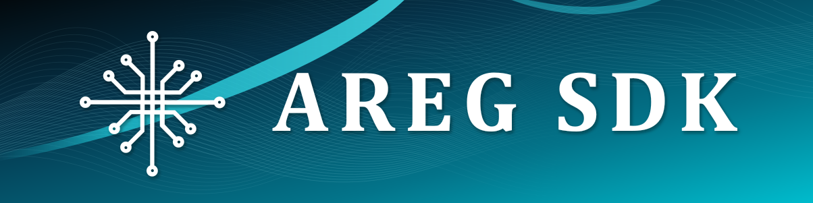
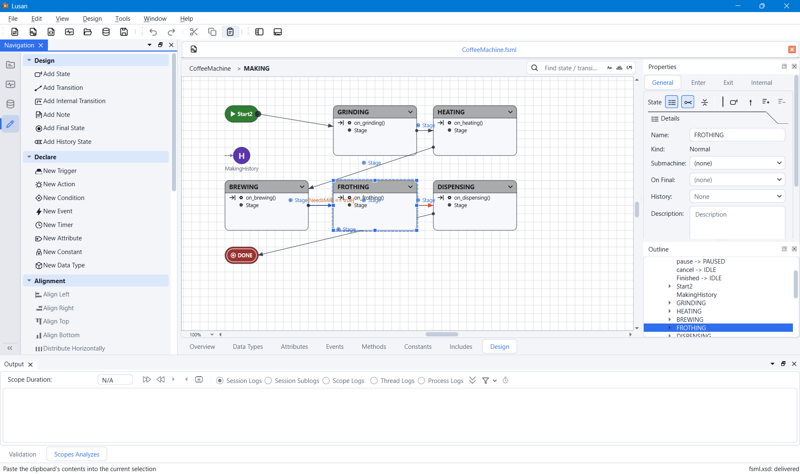
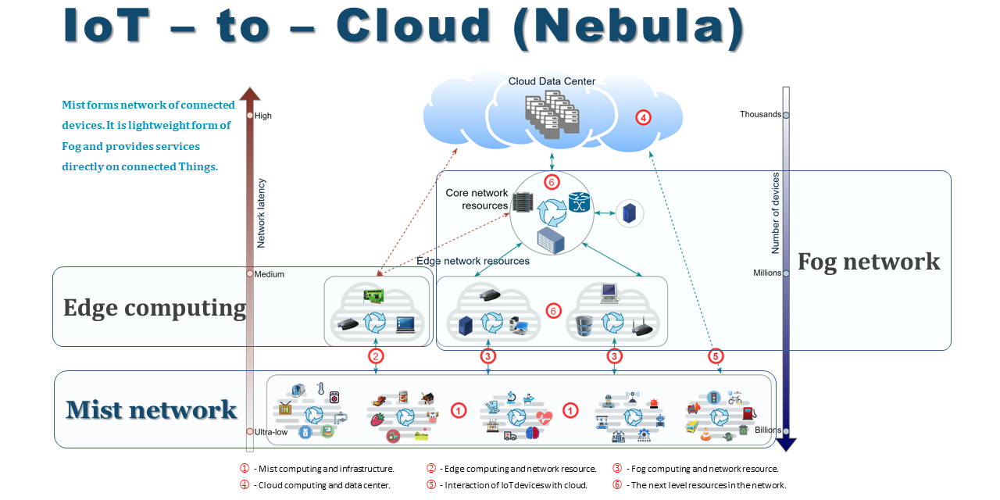
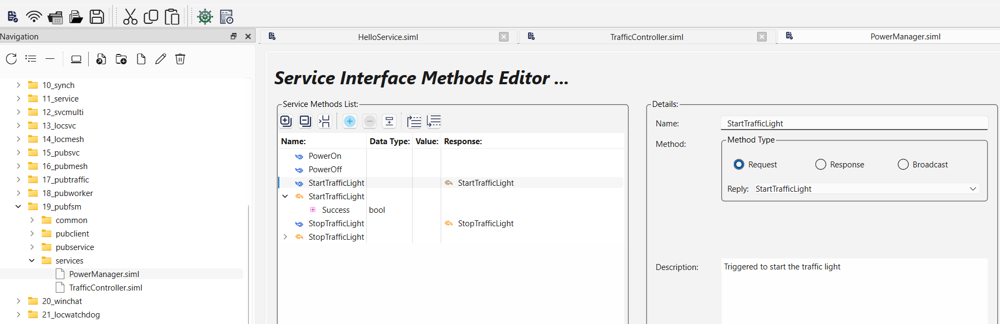

<div align="center">
  <a href="https://www.areg.tech">
    
  </a>

**Distributed C++ services: one codebase for a thread, a process, or a network.**

[](https://github.com/aregtech/areg-sdk/actions/workflows/cmake.yml)
[](./LICENSE.txt)
[](#getting-started)
[](#getting-started)

</div>

Most C++ projects don't fail on algorithms. They fail on **threads**, **IPC** and
**brittle integration code**.

Areg takes that work off your hands. Describe a service interface once: the code generator
writes the proxies, the serialization and the dispatch, the framework runs each component in
the thread the model gives it and finds services by name, and you write the logic.

**~9.9 µs one-way latency (P50) and ~6.5 GB/s sustained throughput (8 GB/s peak)** over
TCP loopback, with full service dispatch, on a laptop Core i7 running Linux.
[Conditions and data](#performance)

For C++ on devices, desktops and servers in trusted networks. Not for web services or
public internet endpoints.

**You write the logic.** The generated base classes deliver each call to the component's thread:

```cpp
// Provider thread or process: answer the request
void ServiceProvider::request_hello_service(const areg::String & client)
{
    std::cout << "provider: hello, " << client << std::endl;
    response_hello_service(true);
}

// Consumer thread or process: receive the answer, asynchronously
void ServiceConsumer::response_hello_service(bool success)
{
    std::cout << "consumer: " << (success ? "greeted" : "failed") << std::endl;
}
```

**You decide where it runs.** Here, two threads in one process:

```cpp
areg::Model model("HelloModel");
model.add_thread("ProviderThread")
     .add_component<ServiceProvider>("ServiceProvider")
     .add_supported_service(HelloService::ServiceName, HelloService::InterfaceVersion);
model.add_thread("ConsumerThread")
     .add_component<ServiceConsumer>("ServiceConsumer")
     .add_dependency_service("ServiceProvider");
```

For two processes the classes stay the same: the interface is marked `Public`, each
process loads its part of the model, and `mtrouter` connects them.
Full working code: [one process](./docs/agent/recipes/01-local-single-process/) ·
[two processes](./docs/agent/recipes/02-ipc-two-processes/) ·
[model in plain C++](./docs/agent/recipes/10-runtime-model/) · [How it works](#how-it-works)

---

## Quick start[](#quick-start)

You can setup and start your own project, replace `myapp` with your real project name:
```bash
git clone https://github.com/aregtech/areg-sdk.git
sh areg-sdk/tools/setup-project.sh --name myapp --root myapp --mode local --sdk-root areg-sdk
cd myapp
cmake -B build
cmake --build build -j
```

On Windows without a POSIX shell, run `areg-sdk\tools\setup-project.bat` with the same options.

Run `myapp` from `build/bin/` (the file name carries a platform suffix). It prints
`provider: hello, ServiceConsumer` and `consumer: greeted`, then exits.

Needs a C++17 compiler, CMake 3.20+ and Java 17+, which runs the code generator during the build.

If Areg saves you work, a ⭐ helps other C++ developers find it.

> [!NOTE]
> 🤖 **Coding with an AI agent?** Areg ships a guide, generators and checkers so an agent
> that has never seen the `areg` framework can still build on it correctly. [Agentic coding](#agentic-coding)

---

## Table of Contents

- [Why Areg](#why-areg)
- [How it works](#how-it-works)
- [Agentic coding](#agentic-coding)
- [Performance](#performance)
- [Areg vs. alternatives](#areg-vs-alternatives)
- [Getting started](#getting-started)
- [Architecture](#architecture)
- [Network deployment](#network-deployment-model)
- [Use cases](#use-cases)
- [Tools](#tools)
- [Project status](#project-status)
- [Roadmap](#roadmap)
- [Documentation](#documentation)
- [License](#license)
- [Community](#community)

---

## Why Areg[](#why-areg)

- **Less infrastructure code:** threading, IPC, service discovery and reconnection come
  from the framework and the generator instead of being rebuilt in every project.
  *([Estimated time savings](./docs/wiki/08d-areg-framework-rankings.md#10-development-time-savings-with-areg-sdk))*
- **No locks needed in component code:** its calls run only in the thread that owns it;
  raw bytes route to that thread before any deserialization.
- **No startup-order logic:** services find each other by name, wherever they run, with
  no retry loops.
- **Recovery built in:** the watchdog restarts a stuck component thread; consumers are
  notified when a service disappears and reconnect when it returns.
- **Test before hardware exists:** register a simulation under the same service name and
  the rest of the system never notices. No conditional compilation, no mock frameworks.

<div align="right"><kbd><a href="#table-of-contents">↑ Back to top ↑</a></kbd></div>

---

## How it works[](#how-it-works)

Areg implements **Object RPC (ORPC)**: components expose typed interfaces and communicate
through generated proxies. Consumers refer to a service by **name**, not by address. The
framework finds the provider in the same thread, another process or another machine, and
delivers every call to the thread that owns the component.

The interface is a `.siml` document, designed in [Lusan](https://github.com/aregtech/areg-sdk-tools)
or edited as XML. This is the request of the example above:

```xml
<Method ID="2" Name="hello_service" MethodType="Request" Response="hello_service">
    <ParamList><Parameter ID="51" Name="client" DataType="String"/></ParamList>
</Method>
```

One CMake line generates the serialization, proxies, events and the provider and consumer
base classes, and links them:

```cmake
addServiceInterface(MyServiceLib ./services/MyService.siml)
```

| The framework handles | You write |
|---|---|
| thread lifecycle and message dispatch | the service interface |
| service discovery and registration | the logic in the provider and consumer classes |
| request, response and broadcast routing | the model: which component runs in which thread |
| watchdog, connection loss and reconnection | |

The model can be written in plain C++, as above, or with the `BEGIN_MODEL` macros the
examples use. Details: [Service interface guide](./docs/wiki/06e-lusan-service-interface.md) ·
[Code generator](./docs/wiki/06b-code-generator.md).

<div align="right"><kbd><a href="#table-of-contents">↑ Back to top ↑</a></kbd></div>

---

## Agentic coding[](#agentic-coding)

Areg is built to be learned by coding agents while they work. The repository is the
course: [`AGENTS.md`](./AGENTS.md) routes an agent to the one page its task needs. An
agent that has never seen Areg learns to write a service interface (`.siml`), a state
machine (`.fsml`) and a data type (`.dtml`), and wire them into a running project -- not
an API it half-remembers from training.

<div align="center"></div>

**Try it:** point your agent at [one of eight ready prompts](./examples/ai-benchmark/) --
coffee machine, ATM, elevator, greenhouse -- and watch it design, generate and build a
service from nothing; the same harness scores it against hidden checks and runs the
identical task on gRPC to compare.

In our runs, agents finished the task on Areg as reliably as on gRPC: 57 of 57 runs
passed every hidden probe over 3 days, on 4 tasks and 3 model families. With Claude Code
and Sonnet 5, Areg needed about half the API requests of gRPC (median 26, range 16-32,
against 55.5, range 31-90), for equal output tokens and time, with no filesystem
searches -- not behind a framework the model was trained on. GitHub Copilot's
GPT-5.6-Terra has been the cheapest of everything we've tried so far, across two agents
and five models -- as few as 12 API requests, still 5 of 5 hidden probes passed. Agent
runs vary: [ranges and method](./examples/ai-benchmark/).

<div align="right"><kbd><a href="#table-of-contents">↑ Back to top ↑</a></kbd></div>

---

## Performance[](#performance)

Measured on **mobile-class consumer hardware** with the full stack active:
serialization, event dispatching and multithreading. These are not raw socket numbers.
Raw output and methodology are published for independent verification:
[current latency dataset](./docs/wiki/areg-latency-benchmark-20260705.csv) (bare TTY) ·
[earlier round](./docs/wiki/areg-latency-benchmark-20260629.txt) (`gnome-terminal`).

### Throughput: TCP `localhost`, 1:1, measured at `mtrouter`

| Platform       | CPU              | ~3 MB, GB/s              | ~0.5 KB, msg/s            |
|----------------|------------------|--------------------------|---------------------------|
| Linux Ubuntu ¹ | i7-13700H (DDR4) | ~6.5 sust. / ~8.0 peak   | ~2.0M sust. / ~2.5M peak  |
| macOS native ² | M3 Pro (LPDDR5)  | ~6.5 sust. / ~7.0 peak   | ~2.5M sust. / ~3.0M peak  |
| Windows 11 ³   | i7-13700H (DDR4) | ~2.7                     | ~2.5M+                    |

¹ Ubuntu 26.04, `Performance` power mode. Peak = best short run; sustained = 5+ min run.
² No network tuning.
³ Latest runs; sustained and peak are not reported separately.

### Latency: TCP `localhost`, full stack, 204-byte messages

Timestamps span the full call path, from before serialization at the sender to after
dispatch at the receiver. OWT = one-way (2 hops). RTT = round trip through `mtrouter`
(4 hops). Linux runs from a bare TTY with `mtrouter`, provider and consumer each pinned to
a core ([methodology](./docs/wiki/08b-areg-sdk-performance-benchmarks.md#21-measurement-environment-terminal-restart-protocol-and-absolute-floor)).

| Platform       | CPU               | OWT Min    | OWT P50     | RTT Min     | RTT P50      |
|----------------|-------------------|------------|-------------|-------------|--------------|
| Linux Ubuntu   | i7-13700H (DDR4)  | **9.6 µs** | **~9.9 µs** | **19.1 µs** | **~19.5 µs** |
| macOS M3 Pro   | Apple M3 (LPDDR5) | 21.6 µs    | 31.4 µs     | 46.0 µs     | 62.5 µs      |
| Windows 11     | i7-13700H (DDR4)  | 32.5 µs    | 40.3 µs     | 64.0 µs     | 82.5 µs      |

Latency is payload-insensitive up to 4 KB: Min rises 1.0 µs across a 20× size increase.
For context only (third-party, 2021, different hardware): gRPC C++ sequential RTT
~116–167 µs over a Unix domain socket
([MPI-HD, F. Werner](https://www.mpi-hd.mpg.de/personalhomes/fwerner/research/2021/09/grpc-for-ipc/)).

📊 Measure your own hardware: [`23_pubdatarate`](./examples/23_pubdatarate/) (throughput) · [`30_publatency`](./examples/30_publatency/) (latency)
📈 [Full data and methodology](./docs/wiki/08b-areg-sdk-performance-benchmarks.md) · [vs ZMQ/NanoMsg/NNG](./docs/wiki/08c-areg-vs-hitachi-benchmark.md) · [Framework rankings](./docs/wiki/08d-areg-framework-rankings.md)

<div align="right"><kbd><a href="#table-of-contents">↑ Back to top ↑</a></kbd></div>

---

## Areg vs. alternatives[](#areg-vs-alternatives)

| | Areg SDK | gRPC | DDS |
|---|---|---|---|
| **Service model** | requests, attributes, broadcasts | RPC from `.proto` | typed topics |
| **Generated code** | proxies, base classes, dispatch | stubs, service bases | types, readers, writers |
| **Threading** | calls run in the owning thread | yours to synchronize | yours to synchronize |
| **Discovery** | by service name | DNS or xDS resolvers | built in |
| **Thread, process, network** | same classes; the model decides | same stubs; you pick the channel | same API |
| **Fault recovery** | watchdog restart, reconnect | retries, health checks | liveliness QoS |
| **Logging and tracing** | distributed logs, viewer | OpenTelemetry plugin | vendor tools |

ZeroMQ, NanoMsg and NNG are messaging transports rather than service frameworks: see the
[transport benchmark](./docs/wiki/08c-areg-vs-hitachi-benchmark.md).

<sub>Sources: gRPC [name resolution](https://grpc.io/docs/guides/custom-name-resolution/) ·
[in-process channel](https://grpc.github.io/grpc/cpp/classgrpc_1_1_server.html) ·
[retry](https://grpc.io/docs/guides/retry/) · [health checking](https://grpc.io/docs/guides/health-checking/) ·
[OpenTelemetry](https://grpc.io/docs/guides/opentelemetry-metrics/); DDS (OpenDDS)
[discovery](https://opendds.readthedocs.io/en/latest-release/devguide/introduction_to_dds.html#discovery-matching-and-association) ·
[QoS](https://opendds.readthedocs.io/en/latest-release/devguide/quality_of_service.html).</sub>

<div align="right"><kbd><a href="#table-of-contents">↑ Back to top ↑</a></kbd></div>

---

## Getting started[](#getting-started)

### Requirements

| Dependency   | Minimum                   | Notes |
|--------------|---------------------------|-------|
| C++ compiler | C++17                     | GCC, Clang, MSVC |
| CMake        | 3.20+                     | Visual Studio solution included |
| Java runtime | 17+                       | runs the code generator during the build |
| OS           | Windows 10+, Linux, macOS | Cygwin and MinGW included |
| Python 3     | *for agentic coding*      | runs the AI-agent tools; never needed to generate, build or run |

### Build the SDK and run an example

```bash
git clone https://github.com/aregtech/areg-sdk.git
cd areg-sdk
cmake -B build
cmake --build build -j
```

Binaries are written to `product/build/<compiler>/<os>-<bits>-<cpu>-release-shared/bin/`.
Run `01_minimalrpc` from there: a consumer finds the provider in another thread, sends a
`hello` request, the provider prints `'Hello Service!'` and the application exits.
[`02_minimalipc`](./examples/02_minimalipc/) runs the same components in two processes
through `mtrouter`. More: [Build with CMake](./docs/wiki/01b-cmake-build.md) ·
[Visual Studio](./docs/wiki/01c-msvc-build.md) · [WSL](./docs/wiki/01d-wsl-build.md).

### Start your own project

The [Quick start](#quick-start) script takes three modes: `--mode local` is one process
with two threads; `--mode ipc` is two processes through `mtrouter`, with a `run.sh` and
`run.bat` that start them in order; `--mode pubsub` is a `local` project whose
interface also declares attributes and broadcasts, which the consumer subscribes to.
Those are interface elements rather than an application type: an `ipc` project may
declare them just as well. Without `--sdk-root`, the project fetches Areg from
GitHub at configure time.

Other ways in: [CMake integration](./docs/wiki/02b-cmake-integrate.md) for an existing
project · [all scaffolding options](./docs/wiki/02a-quick-project-setup.md).

### Learning path

1. **[01_minimalrpc](./examples/01_minimalrpc/)**: multithreading. Provider and consumer in two threads, one process, no `mtrouter`.
2. **[02_minimalipc](./examples/02_minimalipc/)**: IPC. The same components in two processes through `mtrouter`.
3. **[03_helloservice](./examples/03_helloservice/)**: one thread, then separate threads, then separate processes.
4. **[16_pubmesh](./examples/16_pubmesh/)**: a mesh of local and public services discovering each other.
5. **[23_pubdatarate](./examples/23_pubdatarate/)** and **[30_publatency](./examples/30_publatency/)**: throughput and latency benchmarks on your hardware.
6. **[33_tempalarm](./examples/33_tempalarm/)**: built by an AI agent. A monitor and an operator in two processes, attributes and broadcasts.
7. **[34_coffeemachine](./examples/34_coffeemachine/)**: built by an AI agent. A service driven by a generated state machine, in two processes.
8. **[All examples](./examples/README.md)**

<div align="right"><kbd><a href="#table-of-contents">↑ Back to top ↑</a></kbd></div>

---

## Architecture[](#architecture)

### Service identity

| Concept               | Description | Example |
|-----------------------|-------------|---------|
| **Service interface** | the API contract: data types, requests, responses, broadcasts, constants, in a `.siml` file | `PrinterDevice` |
| **Service**           | a named component instance implementing one or more interfaces | `HP-Lab1` (implements `ScannerDevice` and `PrinterDevice`), `Canon-Floor3` (implements `PrinterDevice`) |
| **Consumer**          | declares which named service it depends on; notified when it appears or disappears | consumer of `HP-Lab1` |

A consumer claims a service by name: "I need `HP-Lab1`." The framework connects them when
that service becomes available anywhere on the network, and notifies the consumer at once.
No polling, no manual connection management.

### Location transparency

The provider and consumer classes are the same in every deployment. What changes:

| Deployment                     | Transport          | What changes |
|--------------------------------|--------------------|--------------|
| Multithreaded (same process)   | direct dispatch    | only the model |
| Multiprocessing (same machine) | TCP via `mtrouter` | the model per process; the interface is `Public` |
| Multi-device (network)         | TCP via `mtrouter` | as above, plus the router address in the configuration |

<div align="right"><kbd><a href="#table-of-contents">↑ Back to top ↑</a></kbd></div>

---

## Network deployment model[](#network-deployment-model)

Areg is designed for **controlled private networks**: nodes are known, the network is
trusted, and communication patterns are defined at design time.

<div align="center"><a href="./docs/img/mist-network.png"></a></div>

- **Mist layer:** sensors, actuators and controllers form a local service mesh and
  resolve each other by name, with no central broker.
- **Edge layer:** gateways aggregate mist data, run local inference or control logic, and
  expose services to private infrastructure.
- **Private infrastructure:** servers and workstations process edge data, coordinate
  distributed workloads and host operator tools.

The same interfaces, generated code and operational model work at every layer.

> [!NOTE]
> Areg is not for internet-facing communication: not a web server, REST endpoint or
> public MQTT broker. It works in trusted networks: industrial automation, scientific
> instrumentation, private distributed computing.

<div align="right"><kbd><a href="#table-of-contents">↑ Back to top ↑</a></kbd></div>

---

## Use cases[](#use-cases)

| Domain | Why Areg |
|---|---|
| [Scientific and industrial imaging](./docs/USECASES.md#scientific-and-industrial-imaging-pipelines) | multi-megabyte frames at ~2.7 GB/s (Windows) to ~6.5 GB/s (Linux) full-stack IPC on a laptop CPU; pipeline stages move between threads, processes and machines |
| [Device-as-a-service](./docs/USECASES.md#device-as-a-service-driverless-hardware) | a device exposes its functions as a named service; hosts call it through a generated proxy, with no kernel driver |
| [Industrial automation and robotics](./docs/USECASES.md#industrial-automation-and-robotics) | watchdog restart, automatic re-registration and reconnection handle the faults that break hand-written IPC |
| [Edge AI and inference](./docs/USECASES.md#edge-ai-and-inference-pipelines) | acquisition, preprocessing and inference change topology without touching their classes |
| [Digital twins and monitoring](./docs/USECASES.md#digital-twins-and-real-time-monitoring) | one interface for the device and its twin; consumers cannot tell them apart |
| [Simulation and hardware-in-the-loop](./docs/USECASES.md#simulation-and-hardware-in-the-loop-testing) | a simulation registered under the real service name; regression tests in CI before hardware exists |
| [Distributed C++ applications](./docs/USECASES.md#distributed-c-applications) | ~2.0M–2.5M msg/s on one laptop replaces custom threading and IPC in backends |

More patterns, diagrams and limits: [Use cases and benefits](./docs/USECASES.md).

<div align="right"><kbd><a href="#table-of-contents">↑ Back to top ↑</a></kbd></div>

---

## Tools[](#tools)

| Tool | What it does |
|---|---|
| `codegen.jar` | generates the service infrastructure from `.siml` and state machines from `.fsml` |
| `mtrouter` | routes messages between processes and machines |
| `logcollector` | collects logs from many processes, optionally recorded into SQLite |
| `logobserver` | captures, stores and controls log scopes from the console |
| [Lusan](https://github.com/aregtech/areg-sdk-tools) | GUI for designing service interfaces, live log collection and log analysis |
| [`AGENTS.md`](./AGENTS.md) | routes a coding agent to the docs and tools its task needs |

<div align="center"><a href="./docs/img/lusan-service-if-general.png"></a></div>

Libraries: `areg` (core framework), `aregextend` (extended services, SQLite wrapper,
utilities), `areglogger` (log observer API).

<div align="right"><kbd><a href="#table-of-contents">↑ Back to top ↑</a></kbd></div>

---

## Project status[](#project-status)

| | |
|---|---|
| **Build** | [](https://github.com/aregtech/areg-sdk/actions/workflows/cmake.yml) [](https://github.com/aregtech/areg-sdk/actions/workflows/msbuild.yml) |
| **Quality** | [](https://github.com/aregtech/areg-sdk/actions/workflows/codeql-analysis.yml) [](https://github.com/aregtech/areg-sdk/actions/workflows/sanitizers.yml) [](https://github.com/aregtech/areg-sdk/actions/workflows/agent-docs.yml) |
| **Release** | [](https://github.com/aregtech/areg-sdk/releases/latest) |
| **Supported** | 2.0.0 and newer. 1.5.0 and earlier use a different API and are not supported. |
| **Platforms** | Linux, macOS, Windows · x86, x86_64, arm32, arm64 · GCC, Clang, MSVC, MinGW, Cygwin |

<div align="right"><kbd><a href="#table-of-contents">↑ Back to top ↑</a></kbd></div>

---

## Roadmap[](#roadmap)

**Next, after 2.0.0:**
- RTOS platform support, starting with Zephyr

**Planned:**
- Shared memory transport (zero-copy for same-machine IPC)
- Secure communication (optional TLS for `mtrouter` connections)

**Open for community input:**
- Extended networking protocols
- Language bindings (Python, Rust)
- Cloud-native deployment patterns
- WebSocket transport

<div align="right"><kbd><a href="#table-of-contents">↑ Back to top ↑</a></kbd></div>

---

## Documentation[](#documentation)

- **[Installation and build](./docs/wiki/README.md#-installation-and-build)**: cross-platform builds, toolchains, packages
- **[Integration and configuration](./docs/wiki/README.md#-integration-and-configuration)**: CMake integration, FetchContent, build options
- **[Networking and communication](./docs/wiki/README.md#-networking-and-communication)**: router setup, IPC, low-latency messaging
- **[Logging and monitoring](./docs/wiki/README.md#-logging-and-monitoring)**: distributed logging for debugging
- **[Persistence](./docs/wiki/README.md#-persistence)**: local data storage
- **[Development tools](./docs/wiki/README.md#-development-tools)**: code generator, Lusan, testing utilities
- **[Troubleshooting](./docs/wiki/README.md#-troubleshooting)**: common issues and solutions
- **[Examples and demos](./docs/wiki/README.md#-examples-and-demos)**: sample projects catalog
- **[Performance and benchmarks](./docs/wiki/README.md#-performance-and-benchmarks)**: methodology, datasets, rankings
- **[HOWTO guide](./docs/HOWTO.md)**: practical development tasks
- **[AI agent guide](./AGENTS.md)**: building an application with a coding agent

<div align="right"><kbd><a href="#table-of-contents">↑ Back to top ↑</a></kbd></div>

---

## License[](#license)

Areg SDK is released under the **[Apache License 2.0](./LICENSE.txt)**, a permissive
license for open-source and commercial use.

**Commercial support:** enterprise licensing, training and dedicated support. Visit
**[areg.tech](https://www.areg.tech/)** or email **info[at]areg[dot]tech**.

<div align="right"><kbd><a href="#table-of-contents">↑ Back to top ↑</a></kbd></div>

---

## Community[](#community)

- [Issues](https://github.com/aregtech/areg-sdk/issues) · [Discussions](https://github.com/aregtech/areg-sdk/discussions) · [Contributing guide](./CONTRIBUTING.md) · [Wiki](./docs/wiki/README.md)
- **Built something with Areg?** Open a discussion and tell us about it, and add the badge to your project:

[](https://github.com/aregtech/areg-sdk)

---

*Areg (Արեգ) – Old Armenian: the Sun.*
