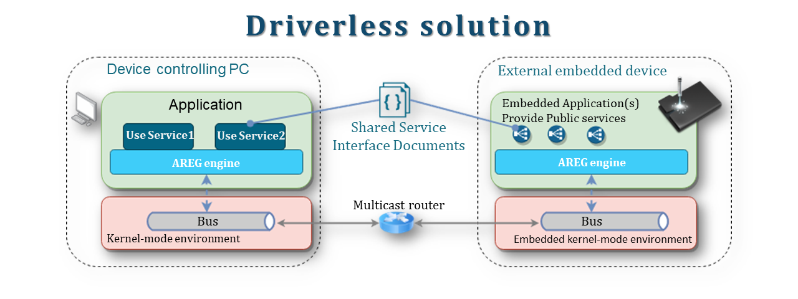

<h1 align="center" style="font-size:2.5em; font-weight:bold; margin:1em 0;">
  <a href="https://www.areg.tech">
    
  </a>
</h1>

[](https://github.com/aregtech/areg-sdk/releases/tag/v1.5.0)
[](https://github.com/aregtech/areg-sdk/compare/v1.5.0...master)
[](https://github.com/aregtech/areg-sdk/stargazers)
[](./docs/wiki/README.md)

⭐ **If you find Areg SDK useful, give us a star - it helps the project grow!**

---

Most C++ projects don't fail on algorithms. They fail on **threads, IPC, and brittle integration code**. Areg SDK eliminates this complexity using **Object RPC** to automate communication, unifying async RPC, Pub/Sub, and service discovery. Its self-managed service mesh enables scalable systems across threads, processes, and devices with no manual wiring and no fragile glue code.

*Named after the ancient Armenian word for "Sun", Areg creates a star network where services orbit around a central router - enabling automatic discovery, seamless communication, and fault-tolerant distributed computing.*

---

## Project Status[](#project-status)

<table class="no-border">
  <tr>
    <td><a href="https://github.com/aregtech/areg-sdk/actions/workflows/cmake.yml"></a></td>
    <td><a href="https://github.com/aregtech/areg-sdk/actions/workflows/msbuild.yml"></a></td>
    <td><a href="https://github.com/aregtech/areg-sdk/actions/workflows/codeql-analysis.yml"></a></td>
  </tr>
  <tr>
    <td></td>
    <td></td>
    <td></td>
  </tr>
</table>

---

## Table of Contents[](#table-of-contents)

- [Why Areg SDK](#why-areg-sdk)
- [What is Areg SDK](#what-is-areg-sdk)
- [Getting Started in 5 Minutes](#getting-started-in-5-minutes)
- [Architecture and Core Concepts](#architecture-and-core-concepts)
- [Real-World Use Cases](#real-world-use-cases)
- [Roadmap](#roadmap)
- [Documentation](#documentation)
- [License](#license)
- [Community and Contribution](#community-and-contribution)

> [!IMPORTANT]
> Complete technical documentation, build guides, and integration patterns are available in the [Wiki](./docs/wiki/).

---

## Why Areg SDK[](#why-areg-sdk)

### The Real Cost of Distributed C++

Every C++ developer knows the frustration: threading bugs that appear only in production, race conditions that vanish under debuggers, and IPC code that requires weeks of careful integration. Your algorithms work perfectly, but the scaffolding around them is fragile, time-consuming, and error-prone.

**Ask yourself these 5 questions:**

- [ ] Do threading and synchronization issues slow your development velocity?
- [ ] Does debugging across threads, processes, or devices consume excessive time?
- [ ] Is setting up communication between components complex and error-prone?
- [ ] Do remote failures and reconnections create cascading delays?
- [ ] Would location-transparent services simplify your architecture?

💡 **If you answered "Yes" to 3 or more**, Areg SDK will accelerate your development.

---

### How Areg SDK Solves This

Areg SDK eliminates infrastructure complexity with five core capabilities:

**1. Automated Threading Management**  
Thread creation, lifecycle, and message dispatch are fully managed by the framework. You define components and their dependencies - the framework handles threading, synchronization, and safe message passing between threads.

**2. Location-Transparent Services**  
Services work identically whether local (same thread), IPC (same machine), or remote (network). Change deployment without changing code.

**3. Self-Managing Service Mesh**  
Automatic discovery and routing across threads, processes, and devices. Services find each other with no configuration files, no manual wiring.

**4. Built-In Fault Tolerance**  
Components can join or leave dynamically. Watchdogs automatically restart failed threads. Systems stay operational under failure.

**5. Native Observability**  
Integrated distributed logging with visual analysis. Per-method execution timing enables performance profiling without external tools.

💡 **Best for:** Embedded to enterprise C++ applications on Linux and Windows, scaling from resource-constrained devices to high-performance server systems.  
⚠️ **Not for:** RTOS (planned), web services, or non-C++ ecosystems.

---

### Areg SDK vs. Alternatives

| Feature               | Areg SDK                            | gRPC / DDS / ZeroMQ                                  |
|-----------------------|----------------------------------|------------------------------------------------------|
| **Setup Complexity**  | ✅ Automated, zero boilerplate   | ⚠️ Manual configuration, [verbose setup](https://www.innoq.com/en/blog/2024/06/grpc/#whataresomechallengesofworkingwithgrpc) |
| **Threading**         | ✅ Automated threading           | ⚠️ Manual threading and synchronization              |
| **Code Generation**   | ✅ Full ORPC automation          | ⚠️ [Stubs only](https://grpc.io/docs/what-is-grpc/introduction/#overview), manual dispatch |
| **Service Discovery** | ✅ Built-in mesh management      | ✅ DDS: [native](https://opendds.readthedocs.io/en/latest-release/devguide/introduction_to_dds.html#discovery-matching-and-association), ⚠️ gRPC/ZeroMQ: [external](https://stackoverflow.com/questions/59398556/grpc-equivalent-of-wcf-service-discovery) |
| **Fault Recovery**    | ✅ Watchdog auto-restart         | ✅ DDS: [QoS policies](https://opendds.readthedocs.io/en/latest-release/devguide/quality_of_service.html), ⚠️ gRPC/ZeroMQ: [manual](https://grpc.io/docs/guides/retry/) |
| **Request-Reply**     | ✅ Native Object RPC             | ✅ gRPC: [RPC calls](https://grpc.io/docs/what-is-grpc/core-concepts/#overview), ⚠️ DDS/ZeroMQ: [topic/pattern](https://zguide.zeromq.org/docs/chapter3/) |
| **Pub/Sub**           | ✅ Native Attributes             | ✅ DDS: [topics](https://opendds.readthedocs.io/en/latest-release/devguide/built_in_topics.html), ⚠️ gRPC/ZeroMQ: add-ons |
| **API Consistency**   | ✅ Identical for threads and IPC | ⚠️ Different APIs for local vs. remote               |
| **Logging System**    | ✅ Distributed logs + viewer     | ⚠️ [Vendor-specific](https://community.rti.com/static/documentation/connext-dds/current/doc/manuals/addon_products/observability/telemetry_data/logs.html) or external tools |
| **Developer Speed**   | ✅ Faster via automation         | ⚠️ Slower, more boilerplate                          |

🔹 **Key Differentiators:**
- **Complete automation** - Not just transport, but threading, dispatch, and lifecycle
- **True location transparency** - Same interface whether thread, process, or network
- **Zero configuration** - Services auto-discover, no manual registry setup
- **Integrated stack** - Framework + Router + Tools + Logging in one cohesive SDK

<div align="right"><kbd><a href="#table-of-contents">↑ Back to top ↑</a></kbd></div>

---

## What is Areg SDK[](#what-is-areg-sdk)

**Areg SDK** is a complete toolkit for building service-oriented C++ systems, centered around the **Areg Framework** - a runtime that automates threading, IPC, and service orchestration using **interface-centric Object RPC (ORPC)**.

### The ORPC Model

Unlike traditional RPC that treats remote calls as simple functions, Areg's Object RPC represents services as **stateful objects** with:
- **Methods** - Request-reply interactions
- **Attributes** - Publish-subscribe data with automatic update notifications
- **Events** - Asynchronous notifications across service boundaries

This enables true **service-oriented architecture** where services are logical entities independent of physical location.

---

### What's Inside the SDK

**Core Runtime:**  
🔹 **Areg Framework** (`areg`) - The engine that automates threading, IPC, and service mesh  
🔹 **Multitarget Router** (`mtrouter`) - Central message router for inter-process and network communication

**Development Tools:**  
🔹 **Code Generator** (`codegen.jar`) - Eliminates boilerplate, generates service stubs from interfaces  
🔹 **[Lusan GUI](https://github.com/aregtech/areg-sdk-tools)** - Visual service designer and distributed log viewer

**Monitoring & Debug:**  
🔹 **Log Collector** (`logcollector`) + **Observer** (`logobserver`) - Distributed logging and real-time analysis  
🔹 **Areg Extend** - Additional utilities and extensions

> 📦 **All components** work together seamlessly with no integration glue required.

---

### How Location Transparency Works

With Areg SDK, you:
1. Define service interfaces (methods, attributes, events)
2. Run code generator to create base classes
3. Implement your business logic
4. Load services via model configuration

**The same service code runs:**
- **Multithreaded** - Components in different threads, same process
- **Multiprocess** - Components in different processes, same machine (requires `mtrouter`)
- **Multi-device** - Components across network devices (requires `mtrouter`)

**No code changes required** - just configuration. Example: [`03_helloservice`](./examples/03_helloservice) demonstrates this flexibility.

<div align="right"><kbd><a href="#table-of-contents">↑ Back to top ↑</a></kbd></div>

---

## Getting Started in 5 Minutes[](#getting-started-in-5-minutes)

### Prerequisites

- **C++17 compiler**: GCC, Clang, MSVC, or MinGW
- **CMake 3.20+**
- **Java 17+** (for code generation)
- **OS:** Linux or Windows  
- **Hardware:** x86, x86_64, ARM, AArch64

See [CMake Configuration Guide](./docs/wiki/02d-cmake-config.md) for detailed setup and troubleshooting.

---

### Quick Build

```bash
git clone https://github.com/aregtech/areg-sdk.git
cd areg-sdk
cmake -B build
cmake --build build -j20
```

> [!TIP]
> These commands work in Linux Terminal, Windows CMD, or PowerShell.

---

### Run Your First Example

The [`01_minimalrpc`](./examples/01_minimalrpc/) example demonstrates automated multithreading:

**Example location after build:**
```bash
# Linux:
./product/build/gnu-g++/linux-64-x86_64-release-shared/bin/01_minimalrpc

# Windows (adjust for compiler):
.\product\build\msvc-cl\windows-64-amd64-release-shared\bin\01_minimalrpc.exe
```

**What happens:**
- Service **Consumer** and **Provider** run in separate threads
- Consumer calls Provider's method asynchronously
- Communication is fully automated with zero manual wiring

**Message flow:**
```
🟢 main() → 🏗 load model → 🔗 auto-connect → 📤 Consumer request → 🖨 Provider prints → ✅ exit
```

---

### Understanding the Code

**1. Service Provider (responds to requests):**
```cpp
class ServiceProvider : public Component, protected HelloServiceStub {
public:
  ServiceProvider(const NERegistry::ComponentEntry& entry, ComponentThread& owner)
    : Component(entry, owner), HelloServiceStub(static_cast<Component&>(*this)) {}

  void requestHelloService() override {
    std::cout << "'Hello Service!'" << std::endl;
    Application::signalAppQuit();
  }
};
```

**2. Service Consumer (initiates requests):**
```cpp
class ServiceConsumer : public Component, protected HelloServiceClientBase {
public:
  ServiceConsumer(const NERegistry::ComponentEntry& entry, ComponentThread& owner)
    : Component(entry, owner)
    , HelloServiceClientBase(entry.mDependencyServices[0].mRoleName, owner) {}

  bool serviceConnected(NEService::eServiceConnection status, ProxyBase& proxy) override {
    HelloServiceClientBase::serviceConnected(status, proxy);
    if (NEService::isServiceConnected(status))
      requestHelloService();  // Service found, call it now
    return true;
  }
};
```

**3. Model (defines threads and dependencies):**
```cpp
BEGIN_MODEL("ServiceModel")
  BEGIN_REGISTER_THREAD("Thread1")
    BEGIN_REGISTER_COMPONENT("ServiceProvider", ServiceProvider)
      REGISTER_IMPLEMENT_SERVICE(NEHelloService::ServiceName, NEHelloService::InterfaceVersion)
    END_REGISTER_COMPONENT("ServiceProvider")
  END_REGISTER_THREAD("Thread1")

  BEGIN_REGISTER_THREAD("Thread2")
    BEGIN_REGISTER_COMPONENT("ServiceClient", ServiceConsumer)
      REGISTER_DEPENDENCY("ServiceProvider")
    END_REGISTER_COMPONENT("ServiceClient")
  END_REGISTER_THREAD("Thread2")
END_MODEL("ServiceModel")
```

**4. Main function (loads model and runs):**
```cpp
int main() {
  Application::initApplication();
  Application::loadModel("ServiceModel");
  Application::waitAppQuit(NECommon::WAIT_INFINITE);
  Application::releaseApplication();
  return 0;
}
```

📄 **Full source:** [examples/01_minimalrpc/src/main.cpp](./examples/01_minimalrpc/src/main.cpp)

---

### Learning Path

Follow this progression to master Areg SDK:

1. **[01_minimalrpc](examples/01_minimalrpc/)** - Start here: minimal RPC between components
2. **[02_minimalipc](examples/02_minimalipc/)** - IPC across processes (**requires `mtrouter`**)
3. **[03_helloservice](examples/03_helloservice/)** - Location transparency: same code, different deployment
4. **[23_pubdatarate](examples/23_pubdatarate/)** - High-throughput benchmark
5. **[More Examples](examples/README.md)** - Advanced patterns and features
6. **[Areg and Edge AI](https://github.com/aregtech/areg-edgeai)** - Real-world AI integration

> [!IMPORTANT]
> **IPC examples** require `mtrouter` to be running. See [mtrouter documentation](./docs/wiki/05a-mtrouter.md).

---

### Create Your Own Project

Use the project setup script to bootstrap a new Areg-based application:

**On Linux:**
```bash
./areg-sdk/tools/setup-project.sh
```

**On Windows:**
```bash
.\areg-sdk\tools\setup-project.bat
```

The script will:
- Prompt for project name and location
- Ask whether to create multithreaded or multiprocess architecture
- Generate ready-to-build project with CMake files
- Create "Hello Service" example as starting point

After generation, build with:
```bash
cd <your_project>
cmake -B build
cmake --build build -j20
```

For multiprocess projects, ensure `mtrouter` is running to enable Service Consumer-Provider communication.

---

### Integration Options

- **CMake FetchContent:** [Integration Guide](./docs/wiki/02b-cmake-integrate.md)
- **Demo Project:** [areg-sdk-demo](https://github.com/aregtech/areg-sdk-demo)
- **Qt Tools (Lusan):** [areg-sdk-tools](https://github.com/aregtech/areg-sdk-tools)
- **Edge AI Use Cases:** [areg-edgeai](https://github.com/aregtech/areg-edgeai)

> 💡 **Advanced builds** (IDE setup, cross-compilation, custom configurations) - see the [Wiki](./docs/wiki/).

<div align="right"><kbd><a href="#table-of-contents">↑ Back to top ↑</a></kbd></div>

---

## Architecture and Core Concepts[](#architecture-and-core-concepts)

### Modules Overview

| Module | Purpose | When Required |
|--------|---------|---------------|
| **[Areg Library](./docs/HelloService.md)**<br/>(`areg`) | Core framework automating Object RPC, threading,<br/>IPC routing, and fault recovery | ✅ Always |
| **[Code Generator](./docs/wiki/03a-code-generator.md)**<br/>(`codegen.jar`) | Generates service stubs from interface definitions,<br/>eliminating boilerplate | ✅ Build-time |
| **[Multitarget Router](./docs/wiki/05a-mtrouter.md)**<br/>(`mtrouter`) | Central message router for inter-process and<br/>network communication | ⚠️ IPC/Network only |
| **[Log Collector](./docs/wiki/04d-logcollector.md)**<br/>(`logcollector`) | Aggregates distributed logs for monitoring<br/>and debugging | ❌ Optional |
| **[Lusan GUI](https://github.com/aregtech/areg-sdk-tools)**<br/>(`lusan`) | Visual service designer and log analysis tool | ❌ Optional |
| **[Examples](./examples/README.md)** | Sample projects demonstrating SDK features | ❌ Optional |

---

### Interface-Centric Architecture

Areg's **Object RPC (ORPC)** model treats services as **stateful objects** rather than simple function calls. Applications expose **Service Providers** and interact via **Service Consumers**, with the **Multitarget Router** handling inter-process and network communication.

<div align="center"><a href="https://github.com/aregtech/areg-sdk/blob/master/docs/img/interface-centric.png"></a></div>

**Key architectural patterns:**
- **Request-Reply** - Traditional RPC method calls
- **Publish-Subscribe** - Automatic attribute updates across all subscribers
- **Event Broadcasting** - Asynchronous notifications to interested parties

This architecture supports **multithreading**, **multiprocessing**, and **multi-device** systems with consistent low-latency characteristics.

---

### Lusan Development Tool

**Lusan** streamlines service-oriented development with two core capabilities: **visual service design** and **distributed log analysis**.

#### Service Interface Designer

The visual designer enables rapid, error-free service definition with automatic code generation. Define methods, attributes, and events graphically - Lusan generates production-ready C++ code for both providers and consumers.

<div align="center"><a href="./docs/img/lusan-service-if-general.png"></a></div>

**Benefits:**
- Visual clarity prevents interface design errors
- Consistent code generation eliminates manual mistakes
- Integrated documentation in the design process

📄 **Learn more:** [Service Interface Design Guide](./docs/wiki/06d-setup-lusan.md)

#### Live and Offline Log Viewer

Lusan's log viewer aggregates logs from multiple processes, supporting both **real-time monitoring** and **offline analysis** of recorded sessions.

**Key capabilities:**
- Real-time log aggregation across processes and devices
- Dynamic scope filtering and priority control at runtime
- Offline session replay for post-mortem debugging
- Performance profiling with per-method execution timing

<div align="center"><a href="./docs/img/lusan-live-log-scope-prio.png"></a></div>

📄 **Documentation:**
- [Live Log Viewer Guide](./docs/wiki/06f-lusan-live-logging.md) - Real-time monitoring
- [Offline Log Viewer Guide](./docs/wiki/06g-lusan-offline-logging.md) - Session analysis

**In summary**, Lusan unifies service design and runtime observability, accelerating development cycles and enabling safer development of service-oriented systems.

<div align="right"><kbd><a href="#table-of-contents">↑ Back to top ↑</a></kbd></div>

---

## Real-World Use Cases[](#real-world-use-cases)

### Embedded and Edge AI Systems

AI-powered edge devices require coordinating multiple concurrent processes: data acquisition, preprocessing, inference, decision-making, monitoring, and connectivity. Areg SDK lets each stage run as an **independent service** with event-driven communication and automatic thread management.

<div align="center"><a href="https://github.com/aregtech/areg-sdk/blob/master/docs/img/areg-for-embedded-ai.png"></a></div>

**Benefits:**
- **Modular pipelines** - Each AI stage (capture, preprocess, infer, decide) is isolated
- **Automatic concurrency** - Framework handles threading and synchronization
- **Real-time responsiveness** - Non-blocking architecture for fast control loops
- **Scalable orchestration** - Distribute AI workloads across devices seamlessly

> [!TIP]
> **See it in action:** [areg-edgeai](https://github.com/aregtech/areg-edgeai) - Real-world Edge AI integration examples

---

### IoT: Mist-to-Cloud Architecture

Traditional IoT architectures stream raw sensor data to distant cloud servers, creating latency, network congestion, and privacy concerns. With Areg SDK, devices form a **mist network** - a mesh of micro-services that process and aggregate data locally before sending refined insights to the cloud.

<div align="center"><a href="https://github.com/aregtech/areg-sdk/blob/master/docs/img/mist-network.png"></a></div>

**Benefits:**
- **Low-latency processing** - Data analyzed at the edge, not in distant datacenters
- **Autonomous operation** - Edge mesh continues working during network outages
- **Enhanced privacy** - Sensitive data stays on-device; only insights leave the edge
- **Reduced cloud costs** - Less data transmission and cloud compute needed

---

### Simulation and Testing Environments

Validating service-oriented systems traditionally requires expensive hardware and complex test environments. Areg SDK enables **Data Layer simulation** in external applications, providing realistic test environments without physical devices. Services appear **location-transparent** to higher layers - tests can't distinguish simulated from real hardware.

<div align="center"><a href="https://github.com/aregtech/areg-sdk/blob/master/docs/img/software-layers.png"></a></div>

**Benefits:**
- **Hardware-independent testing** - Test logic layer without physical devices
- **Continuous integration** - Automated testing without hardware dependencies
- **Fault injection** - Safely simulate failures and test recovery mechanisms
- **Cost reduction** - Eliminate expensive test hardware and lab time

---

### Driverless Device Architecture

Traditional device drivers are slow to develop, complex to maintain, and platform-specific. Areg SDK lets you **expose hardware as portable services**, making devices platform-independent and network-accessible.

<div align="center"><a href="https://github.com/aregtech/areg-sdk/blob/master/docs/img/driverless-solution.png"></a></div>

**Benefits:**
- **Faster development** - Accelerates prototyping and iteration
- **Platform independence** - Hardware abstracted as services
- **Network accessibility** - Devices accessible from anywhere on network
- **Early validation** - Test hardware integration before driver implementation

---

### Industry 4.0: Smart Manufacturing Systems

Traditional industrial automation relies on proprietary protocols and rigid architectures that make factory reconfiguration expensive and time-consuming. When production lines change, entire systems often require reprogramming. Areg SDK transforms factory components into **modular services** that communicate seamlessly, enabling flexible manufacturing systems that adapt to changing production needs.

<div align="center"><a href="https://github.com/aregtech/areg-sdk/blob/master/docs/img/areg-services.png"></a></div>

**Service types:**
- **Local Services** - Confined within a single process, protecting sensitive data from external access
- **Public Services** - Accessible across processes and devices within the network created by `mtrouter`

**Benefits:**
- **Flexible reconfiguration** - Add or replace equipment without reprogramming entire production lines
- **Protocol independence** - Abstract proprietary industrial protocols behind unified service interfaces
- **Digital twin integration** - Services work identically on physical equipment and simulation environments
- **Predictive maintenance** - Distributed logging enables real-time equipment health monitoring
- **Reduced integration costs** - Modular services eliminate expensive custom integration code

**Typical applications:**
- Coordinating robotic cells with conveyor systems and quality inspection stations
- Integrating edge gateways with modern MES and SCADA systems
- Building reconfigurable production lines for small-batch manufacturing
- Creating digital twins for production optimization and operator training

<div align="right"><kbd><a href="#table-of-contents">↑ Back to top ↑</a></kbd></div>

---

## Roadmap[](#roadmap)

Areg SDK evolves continuously for desktop and embedded platforms, focusing on automation, reliability, platform expansion, and developer experience.

**2026 Priorities:**  
🎯 **Multi-channel support** - Multiplexed communications for higher throughput  
🎯 **Enhanced security** - Encryption, authentication, and authorization  
🎯 **RTOS support (Zephyr OS)** - Real-time embedded environments  
🎯 **Lusan improvements** - Enhanced performance and usability ([Areg SDK Tools](https://github.com/aregtech/areg-sdk-tools))  
🎯 **Expanded documentation** - More tutorials and real-world examples  
🎯 **Performance optimization** - Profiling tools and benchmark suite

**Future Vision:**  
🔮 Cross-language bindings (Python, Rust, etc.)  
🔮 Cloud integration patterns and deployment guides  
🔮 Container orchestration (Kubernetes, Docker Compose)  
🔮 Advanced debugging and profiling tools

> [!TIP]
> Influence the roadmap: Join [discussions](https://github.com/aregtech/areg-sdk/discussions) or contribute via [issues](https://github.com/aregtech/areg-sdk/issues?q=is%3Aissue+is%3Aopen+label%3A%22help+wanted%22).

<div align="right"><kbd><a href="#table-of-contents">↑ Back to top ↑</a></kbd></div>

---

## Documentation[](#documentation)

- **[Installation and Build](./docs/wiki/README.md#1-installation-and-build)** - Cross-platform builds, toolchains, CMake integration
- **[Build Options and Integrations](./docs/wiki/README.md#2-build-options-and-integrations)** - FetchContent, packaging, embedding
- **[Networking and Communication](./docs/wiki/README.md#3-networking-and-communication)** - Router setup, IPC, low-latency messaging
- **[Logging and Monitoring](./docs/wiki/README.md#4-logging-and-monitoring)** - Distributed logging for debugging
- **[Persistence](./docs/wiki/README.md#5-persistence)** - Local data storage
- **[Development and Testing Tools](./docs/wiki/README.md#6-development-and-testing-tools)** - Code generator, Lusan, testing utilities
- **[Troubleshooting](./docs/wiki/README.md#7-troubleshooting)** - Common issues and solutions
- **[Examples and Tests](./docs/wiki/README.md#8-examples-and-tests)** - Sample projects catalog
- **[HOWTO Guide](docs/HOWTO.md)** - Practical development tasks

<div align="right"><kbd><a href="#table-of-contents">↑ Back to top ↑</a></kbd></div>

---

## License[](#license)

Areg SDK is released under the **[Apache License 2.0](LICENSE.txt)** - a permissive license suitable for both open-source and commercial use.

**Commercial support:** Enterprise licensing, training, and dedicated support available. Visit **[areg.tech](https://www.areg.tech/)** or email **info[at]areg[dot]tech**.

<div align="right"><kbd><a href="#table-of-contents">↑ Back to top ↑</a></kbd></div>

---

## Community and Contribution[](#community-and-contribution)

🚀 **Join the Areg SDK community** and help shape the future of service-oriented C++ development:

- 🛠️ [Contribute to open issues](https://github.com/aregtech/areg-sdk/issues?q=is%3Aissue+is%3Aopen+label%3A%22help+wanted%22) - Review [contribution guidelines](CONTRIBUTING.md) first
- 💡 Share ideas or request features via [issues](https://github.com/aregtech/areg-sdk/issues) or [discussions](https://github.com/aregtech/areg-sdk/discussions)
- 🔀 Submit pull requests following [contribution guidelines](CONTRIBUTING.md)
- ⭐ **Give us a star** if you find Areg SDK useful - it helps others discover the project
- 🌍 **Showcase your project** - Building with Areg SDK? [Share your work](https://github.com/aregtech/areg-sdk/discussions/new?category=show-and-tell)!

**Add this badge to projects built with Areg SDK:**
```markdown
[](https://github.com/aregtech/areg-sdk)
```

<div align="right"><kbd><a href="#table-of-contents">↑ Back to top ↑</a></kbd></div>

---

**Follow Us:**  
[](https://x.com/aregtech?lang=en)
[](https://www.linkedin.com/company/aregtech)
[](https://gitter.im/areg-sdk/community)

---