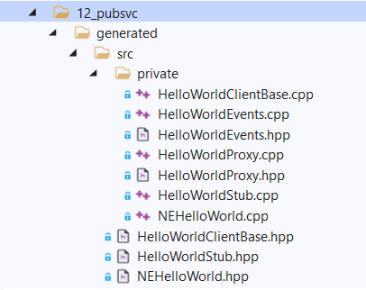

# Developer guide
```
This file is part of AREG SDK
Copyright (c) 2017-2021, Aregtech
Contact: info[at]aregtech.com
Website: https://www.aregtech.com
```

This document is a developer guide and describes how to develop a service enabled application.

## Table of content
1. [Service interface prototype](#service-interface-prototype)
    - [Public and Local services](#public-and-local-services)
    - [Data types](#data-types)
        * [Structures](#structures)
        * [Enumerations](#enumerations)
        * [Imported types](#imported-types)
        * [Defined containers](#defined-containers)
    - [Attributes](#attributes)
    - [Requests, responses and broadcasts](#requests-responses-and-broadcasts)
        * [Requests](#requests)
        * [Responses](#responses)
        * [Broadcasts](#broadcasts)
    - [Constants](#constants)
    - [Includes](#includes)
2. [Code generator](#code-generator)
3. [Generated codes](#generated-codes)
4. [Modeling and service initialization](#modeling-and-service-initialization)
5. [Hello Service!](#hello-service)
    - [Service Interface](#service-interface)
    - [Generate codes](#generate-codes)
    - [Develop the service](#develop-the-service)
    - [Develop the service client](#develop-the-service-client)
    - [Create and load model](#create-and-load-model)
        * [Model with single thread](#model-with-single-thread)
        * [Model with multiple threads](#model-with-multiple-threads)
        * [Model of separate processes](#model-of-separate-processes)
6. [Make the build](#make-the-build)
7. [Contact us!](#contact-us)

## Service interface prototype

AREG SDK is an interface-centric communication engine. Before creating a service, there should be service interface designed, which defines API of service, and has following sections:
1. The overview and type of service interface (_Public_ or _Local_).
2. The data types specific for the service or exported from any header file.
3. Attributes, which are the data of services and developers can describe to be notified on value change.
4. Methods, which are _requests_, _responses_ and _broadcasts_.
5. Constant values, needed by interface.
6. Any additional file to include.

The service interfaces can be defined in a prototype XML document used to generate base objects to extend and develop the service or the service client(s). An example of the service interface prototype is [Sample.siml](./Sample.siml), which contains all sections.

> 💡 The design UI tool to define interface is in development state and will be available in next release.

### Public and Local services

The following example defines _Sample_ service as _Public_ (used in IPC).
```xml
<Overview ID="1" Name="Sample" Version="1.0.0" isRemote="true">
    <Description>This is an example of defining service interface.</Description>
</Overview>
```
If there is no `isRemote` attribute or it is set to false `isRemote="true"`, the service interface is _Local_, used for multithreading communication and it is not visible outside of the process. Protect sensitive data with _Local_ services.

> 💡 The _Local_ services are not used in IPC, the system will ignore to forward messages and they will not be visible outside of process.

### Data types

Every service interface can have service specific data types. When a new data type is defined, it can be used to declare any variables and parameters of methods. New data types are listed in the section `<DataTypeList> ... </DataTypeList>`. All data types are automatically streamable objects.

#### Structures

The following example demonstrates how to declare a new structure with the fields. The default values are used to set when the object is created. The fields of structure must have `assigning operator`, `comparing operator`, `copy constructor` (if an object), must be possible explicitly to convert to `unsigned int` and must be possible to `stream`.

```xml
<DataType ID="2" Name="SomeStruct" Type="Structure">
    <Description>Some structure with data. It will become new type.</Description>
    <FieldList>
        <Field DataType="int16" ID="3" Name="anyFiled1">
            <Value IsDefault="true">0</Value>
            <Description>Some filed 1</Description>
        </Field>
        <Field DataType="int32" ID="4" Name="anyField2">
            <Value IsDefault="true">0</Value>
            <Description>Just another field</Description>
        </Field>
        <Field DataType="String" ID="5" Name="anyField3">
            <Value IsDefault="true"/>
            <Description>More field.</Description>
        </Field>
    </FieldList>
</DataType>
```
In this example, the structure has 3 fields with default values to set when creating the object.

#### Enumerations

The following example demonstrates how to declare enumeration. All enumerations have the `int` type.
```xml
<DataType ID="6" Name="SomeEnum" Type="Enumerate" Values="default">
    <FieldList>
        <EnumEntry ID="7" Name="Invalid">
            <Value>-1</Value>
        </EnumEntry>
        <EnumEntry ID="8" Name="Nothing">
            <Value>0</Value>
        </EnumEntry>
        <EnumEntry ID="9" Name="Something">
            <Value/>
        </EnumEntry>
        <EnumEntry ID="10" Name="Anything">
            <Value/>
        </EnumEntry>
    </FieldList>
</DataType>
```
 The enumeration fields may have explicit values. In this example, the `Invalid` field has value `-1`.

 #### Imported types

 The following example demonstrates how to import an existing type. The specified `NEMemory::uAlign` is already existing in `areg/base/NEMemory.hpp`. It is imported to be used in the service.
 ```xml
<DataType ID="11" Name="uAlign" Type="Imported">
    <Description>This example exports NEMemory::uAlign in the service interface.</Description>
    <Namespace>NEMemory</Namespace>
    <Location>areg/base/NEMemory.hpp</Location>
</DataType>
```

#### Defined containers

The following example demonstrates how to define a container. The container elements must be possible to copy, assign and compare. In case of hash-map, the key must be possible explicitly to convert to `unsigned int`.

**New array**:
```xml
<DataType ID="12" Name="SomeArray" Type="DefinedType">
    <Description>Defines new type of array</Description>
    <Container>Array</Container>
    <BaseTypeValue>uint32</BaseTypeValue>
</DataType>
```

**New linked list**:
```xml
<DataType ID="13" Name="SomeList" Type="DefinedType">
    <Description>New type of linked list.</Description>
    <Container>LinkedList</Container>
    <BaseTypeValue>String</BaseTypeValue>
</DataType>
```

**New hash-map**:
```xml
<DataType ID="14" Name="SomeMap" Type="DefinedType">
    <Description>This example defines hash-map where key is exported and value is new data type.</Description>
    <Container>HashMap</Container>
    <BaseTypeValue>SomeStruct</BaseTypeValue>
    <BaseTypeKey>String</BaseTypeKey>
</DataType>
```

### Attributes
_Attributes_ in services are data that clients can subscribe to get update notifications. The attributes are listed in the section `<AttributeList> ... </AttributeList>`. In this example the system notifies connected clients when the value of `SomeAttr1` is changed, i.e. not equal to previous value:
```xml
<Attribute DataType="SomeEnum" ID="15" Name="SomeAttr1" Notify="OnChange">
    <Description>An attribute to notify subscribers only when value is changed.</Description>
</Attribute>
```

In this example, the system notifies clients each time when the value is set, i.e. does not compare and check equality:
```xml
<Attribute DataType="SomeStruct" ID="16" Name="SomeAttr2" Notify="Always">
    <Description>Another attribute to notify subscribers any time when value is set (maybe not changed).</Description>
</Attribute>
```

### Requests, responses and broadcasts
Service interface may have `Request`, `Response` and `Broadcast` methods. The _Requests_ are called by clients to be executed on the service. The _Responses_ are replies to the requests. _Broadcasts_ are methods acting like events to delive multiple parameters.

#### Requests
The requests are called by clients to be executed on the service. The requests may have parameters. The requests may have linked response. If request has a response, then the processing request is blocked until service replies with the response. It is possible manually to unblock the request, but then the response must be manually prepared to reply. Multiple requests can be connected with the same response. The request may have no response at all. 

This example demonstrates the definition of request `SomeRequest1` with no parameter connected with a response `SomeResponse1`:
```xml
<Method ID="17" MethodType="request" Name="SomeRequest1" Response="SomeResponse1">
    <Description>Request and response with no parameters.</Description>
</Method>
```

This example demonstrates the definition of request `SomeRequest2` with multiple parameters connected with response `SomeResponse`:
```xml
<Method ID="20" MethodType="request" Name="SomeRequest2" Response="SomeResponse">
    <Description>A request with parameters that is connected to SomeResponse interface.</Description>
    <ParamList>
        <Parameter DataType="int32" ID="21" Name="param1"/>
        <Parameter DataType="SomeStruct" ID="23" Name="param2"/>
        <Parameter DataType="SomeEnum" ID="24" Name="param3">
            <Value IsDefault="true">SomeEnum::Nothing</Value>
            <Description>parameter with default value</Description>
        </Parameter>
    </ParamList>
</Method>
```

This example demonstrates the definition of 2 requests `SomeRequest2` and `SomeRequest3` connected with the same response `SomeResponse`:
```xml
<Method ID="20" MethodType="request" Name="SomeRequest2" Response="SomeResponse">
    <Description>A request with parameters that is connected to SomeResponse interface.</Description>
    <ParamList>
        <Parameter DataType="int32" ID="21" Name="param1"/>
        <Parameter DataType="SomeStruct" ID="23" Name="param2"/>
        <Parameter DataType="SomeEnum" ID="24" Name="param3">
            <Value IsDefault="true">SomeEnum::Nothing</Value>
            <Description>parameter with default value</Description>
        </Parameter>
    </ParamList>
</Method>
<Method ID="25" MethodType="request" Name="SomeRequest3" Response="SomeResponse">
    <Description>Another request with parameter that is connected with SomeResponse method</Description>
    <ParamList>
        <Parameter DataType="NEMemory::uAlign" ID="28" Name="param"/>
    </ParamList>
</Method>
```

This example demonstrates the definition of request `StandAlone` with no response:
```xml
<Method ID="27" MethodType="request" Name="StandAlone">
    <Description>A request with no response.</Description>
</Method>
```

#### Responses
The responses are sent to the service clients as a reply to execute one or more requests. When a client calls a request to execute on the service, the service may reply with response to the client. Clients as can dynamically to subscribe to receive certain response without calling the request. This example demonstrates the definition of response with and without parameters:
```xml
<Method ID="19" MethodType="response" Name="SomeResponse1">
    <Description/>
</Method>
<Method ID="22" MethodType="response" Name="SomeResponse">
    <Description>Response, where 2 requests can connect.</Description>
    <ParamList>
        <Parameter DataType="bool" ID="26" Name="succeeded"/>
    </ParamList>
</Method>
```

> 💡 The system sends only one response per request when the request is in running state. The multiple responses on one request will have no effect, because the first response will mark the request as idle, so that the next replies will have no effect.

#### Broadcasts
Broadcasts are methods to fireevent and send multiple  data at the same time. The clients may dynamically subscribe on broadcast to receive multiple data. The broadcasts are not connected to any request or response. This example demonstrates the definition of a broadcast with parameters.
```xml
<Method ID="29" MethodType="broadcast" Name="SomeBroadcast">
    <Description>Broadcast with parameters. Can pass multiple parameters at once.</Description>
    <ParamList>
        <Parameter DataType="SomeEnum" ID="30" Name="value1">
            <Description>We already have 'param1' in response, this parameter name must differ.</Description>
        </Parameter>
        <Parameter DataType="NEMemory::uAlign" ID="31" Name="value2"/>
        <Parameter DataType="SomeStruct" ID="32" Name="value3"/>
        <Parameter DataType="SomeArray" ID="34" Name="value4"/>
    </ParamList>
</Method>
```

### Constants
The constants are listed in `<ConstantList> ... </ConstantList>` of the prototype document, the constants are used to share read-only value between clients and the service. This example demonstrates the definition of service specific constant:
```xml
<Constant DataType="uint16" ID="35" Name="SomeConst">
    <Value>100</Value>
    <Description>Define a constant if need.</Description>
</Constant>
```

### Includes
The includes are listed in `<IncludeList> ... </IncludeList> of the prototype document. They are used to include headers when buil service interface. For example, a service may include header with algiruthms that are used by service. This example demonstrate the definition of includes:
```xml
<IncludeList>
    <Location ID="36" Name="areg/base/NEMath.hpp">
        <Description>can make additional includes</Description>
    </Location>
</IncludeList>
```

## Code generator
When the service interface prototype document is designed, with the help of code-generator developers can generate base objects to extend. This helps to avoid tedious jobs and escape mistakes when type codes. The code generator is located in the [tools](./../tools/) folder of `areg-sdk`. Edit and run `generate.sh` or `generate.bat` file to generate source code or call to run `codegen.jar` from command line.
Before calling code generator, make sure that there is Java installed on the machine and the `codegen.jar` is included in the `CLASSPATH` environment variable. 
```bash
$ java -jar codegen.jar --root=<project_root> --doc=<relative_path_to_siml> --target=<relative_path_to_target_location>
```
You may as well excplicitly specify the path of `codegen.jar`
```bash
$ java -jar <areg-sdk-root>/tools/codegen.jar --root=<project_root> --doc=<relative_path_to_siml> --target=<relative_path_to_target_location>
```
Where:
- `<project_root>` if the path of your project, for example `~/aregtech/areg-sdk/examples`;
- `<relative_path_to_siml>` the service interface prototype file path relative to the project root, for example `12_pubsvc/res/SystemShutdown.siml`
- `<relative_path_to_target_location>` the generated code output folder path relative to the project root, for example `12_pubsvc/generated`
- `<areg-sdk-root>` is the path to `areg-sdk` sources.

Example of running code generator, copied from [generate.bat](./../examples/12_pubsvc/res/generate.bat) file:
```bat
:: set the AREG_SDK_ROOT directory here
set AREG_SDK_ROOT=E:\Projects\aregtech\areg-sdk
:: .bat file directory
set BATCH_ROOT=%~dp0
:: In case of examples, one level up.
set PROJECT_ROOT=%BATCH_ROOT%\..
:: Specify the relative path of output folder
set CODE_GEN=generated\src
:: Include codegen.jar in CLASSPATH
set CLASSPATH=%CLASSPATH%;%AREG_SDK_ROOT%\tools;%AREG_SDK_ROOT%\tools\codegen.jar

@echo Generating class of HelloService Service Interface in folder %CODE_GEN% .....
java com.aregtech.CMFMain --root=%PROJECT_ROOT% --doc=res\HelloService.siml --target=%CODE_GEN%
```

## Generated codes

The code generator generates sources to implement service and clients, as well generates helper classes to send, receive and dispatch events. Example of generated codes:
<br><a href="./img/generated-sources.png"></a><br><br>
Since the codes are generated for both service and the clients, and both of them may be compiled in different projects, we recommend to compile generated codes as a static library to link with the executables or shared libraries.

## Modeling and service initialization

After generating codes, the implemented services must be a part of the `Component` object that run in a thread. The services and the clients can be either statically or dynamically defined in a _model_ that is loaded to initialize objects. The example of dynamic model is in [14_pubtraffic](./../examples/14_pubtraffic/). This is an example of static _model_:
```cpp
// Describe mode, set model name
BEGIN_MODEL( "ServiceModel" )

    // define component thread
    BEGIN_REGISTER_THREAD( "TestServiceThread" )
        // define component, set role name.
        BEGIN_REGISTER_COMPONENT( NECommon::ServiceHelloName, ServiceComponent )
            // register HelloService service implementation.
            REGISTER_IMPLEMENT_SERVICE( NEHelloService::ServiceName, NEHelloService::InterfaceVersion )
        // end of component description
        END_REGISTER_COMPONENT( NECommon::ServiceHelloName )
    // end of thread description
    END_REGISTER_THREAD( "TestServiceThread" )

// end of model description
END_MODEL( "ServiceModel" )

//////////////////////////////////////////////////////////////////////////
// main method.
//////////////////////////////////////////////////////////////////////////
DEF_TRACE_SCOPE(example_12_pubservice_main_main);
/**
 * \brief   The main method enables logging, service manager and timer.
 *          It loads and unloads the services, releases application resources.
 **/
int main()
{
    printf("Testing simple remote servicing component. Run as a ultra-small Server...\n");

    // Initialize application, enable logging, servicing and the timer.
    Application::initApplication(true, true, true, true, nullptr, nullptr );

    do 
    {
        TRACE_SCOPE(example_12_pubservice_main_main);
        TRACE_DBG("The application has been initialized, loading model [ %s ]", _modelName);

        // load model to initialize components
        Application::loadModel(_modelName);

        TRACE_DBG("Servicing model is loaded");
        
        // wait until Application quit signal is set.
        Application::waitAppQuit(NECommon::WAIT_INFINITE);

        // stop and unload components
        Application::unloadModel(_modelName);

        // release and cleanup resources of application.
        Application::releaseApplication();

    } while (false);
    
    printf("Completed testing simple remote servicing component. Check the logs...\n");

	return 0;
}

```

The example [10_locsvc](./../examples/10_locsvc/) and higher contain implementations of _Local_ and _Public_ services and the clients. Browse examples to learn more.

## Hello Service!

This topic is the step-by-step practical example to create a service enabled application(s) based on AREG SDK solution. The application discovers service, sends a request and a response. The source codes of this project are in [00_helloservice](./../examples/00_helloservice). First, download sources of AREG SDK. For simplicity, create the new project inside `examples` folder and name it `helloservice`, so that the `examples/helloservice` is the root of this training.

We create 3 types of applications that use same common the service and the client located in `common/src` subfolder of the project, where:
- service and client run in the same thread of the same application (same as _Local_ service);
- service and client run in different thread of the same application (same as _Local_ service);
- service and client run in different processes (same as _Public_ service).

The agenda is to demonstrate service and client implementation, as well the posibility to split and the merge services in processes to distribute computing power between processes.

> 💡 More examples are listed in [examples](./../examples/) folder of `areg-sdk`.

### Service Interface

In `helloservice` create another folder called `res` to locate the first service interface prototype XML document. Create a file `HelloService.siml` and copy this XML in the file, which is a definition of _Public_ service interface with one request and connected response.
```xml
<?xml version="1.0" encoding="utf-8" standalone="yes"?>
<ServiceInterface FormatVersion="1.0.0">
    <Overview ID="1" Name="HelloService" Version="1.0.0" isRemote="true">
        <Description>The hello world application</Description>
    </Overview>
    <MethodList>
        <Method ID="2" MethodType="request" Name="HelloService" Response="HelloService">
            <Description>The request to output a greeting.</Description>
            <ParamList>
                <Parameter DataType="String" ID="3" Name="client">
                    <Description>The name of client to output the greeting.</Description>
                </Parameter>
            </ParamList>
        </Method>
        <Method ID="4" MethodType="response" Name="HelloService">
            <Description>The response indicating success status to output a greeting</Description>
            <ParamList>
                <Parameter DataType="bool" ID="5" Name="success">
                    <Description>Flag, indicates the success of output.</Description>
                </Parameter>
            </ParamList>
        </Method>
    </MethodList>
</ServiceInterface>
```

### Generate codes

> 💡 You must have Java installed on your machine to be able to run code generator.

Open command line terminal in `helloservice` folder and run following command:
```bash
$ java -jar ./../../tools/codegen.jar --root=./ --doc=res/HelloService.siml --target=generated/src
```
This script is valid for Linux and Windows OS. It runs `codegen.jar` and generates files located in the `generated/src` subfolder of `helloservice`.

### Develop the service

We'll develop the service in the folder `common/src` and include in all projects. Before developing a service, it is important to know that:
1. The `Component` is the owner of the service object. The `Component` can provide more than one service interface. The component can contain a mixture of services and clients.
2. All service base class generated from a prototype XML document ends with `Stub` and contains the requests as pure virtual methods. For example, in our case the service base class has the name `HelloServiceStub` and it contains one pure virtual method.

In the `common/src` subfolder let's create file `ServiceComponent.hpp` to create **ServiceComponent** object of service component. 
- The `ServiceComponent` extends `Component` and `HelloServiceStub` classes.
- The `ServiceComponent` contains 2 static methods `Component * CreateComponent( ... )` and `void DeleteComponent( ... )` to instantiate and free  the object.
- The `ServiceComponent` contains the `void requestHelloService( const String & client )` override method.

The declaration of the service in the file [common/src/ServiceComponent.hpp](./../examples/00_helloservice/common/src/ServiceComponent.hpp):
```cpp
/**
 * \file    common/src/ServiceComponent.hpp
 * \brief   Declaration of the service component.
 **/
#pragma once

#include "areg/base/GEGlobal.h"
#include "areg/component/Component.hpp"
#include "generated/src/HelloServiceStub.hpp"

//////////////////////////////////////////////////////////////////////////
// ServiceComponent declaration
//////////////////////////////////////////////////////////////////////////
class ServiceComponent  : public    Component
                        , protected HelloServiceStub
{
//////////////////////////////////////////////////////////////////////////
// static methods
//////////////////////////////////////////////////////////////////////////
public:
    /**
     * \brief   Called to instantiate the service component when loading the model.
     * \param   entry   Indicates the component description entry from Registry.
     * \param   owner   The component owning thread.
     **/
    static Component * CreateComponent( const NERegistry::ComponentEntry & entry, ComponentThread & owner );

    /**
     * \brief   Called when unloading model to delete service component.
     **/
    static void DeleteComponent( Component & compObject, const NERegistry::ComponentEntry & entry );

protected:
    ServiceComponent(const NERegistry::ComponentEntry & entry, ComponentThread & owner);

    virtual ~ServiceComponent(void) = default;

//////////////////////////////////////////////////////////////////////////
// HelloService Interface Requests
//////////////////////////////////////////////////////////////////////////
    /**
     * \brief   The request to output a greeting.
     * \param   client  The name of client to output the greeting.
     **/
    virtual void requestHelloService( const String & client ) override;

//////////////////////////////////////////////////////////////////////////
// Hidden function calls
//////////////////////////////////////////////////////////////////////////
private:
    //!< The wrapper of this pointer.
    inline ServiceComponent & self( void )
    {   return (*this); }

//////////////////////////////////////////////////////////////////////////
// Forbidden calls
//////////////////////////////////////////////////////////////////////////
private:
    ServiceComponent( void ) = delete;
    DECLARE_NOCOPY_NOMOVE( ServiceComponent );
};
```

The implementation of the service in the file [common/src/ServiceComponent.cpp](./../examples/00_helloservice/common/src/ServiceComponent.cpp):

```cpp
/**
 * \file    common/src/ServiceComponent.cpp
 * \brief   Implementation of the service component.
 **/
#include "common/src/ServiceComponent.hpp"

Component * ServiceComponent::CreateComponent(const NERegistry::ComponentEntry & entry, ComponentThread & owner)
{
    return DEBUG_NEW ServiceComponent(entry, owner);
}

void ServiceComponent::DeleteComponent(Component & compObject, const NERegistry::ComponentEntry & entry)
{
    delete (&compObject);
}

ServiceComponent::ServiceComponent(const NERegistry::ComponentEntry & entry, ComponentThread & owner)
    : Component         ( owner, entry.mRoleName)
    , HelloServiceStub  ( static_cast<Component &>(self()) )
{
}

void ServiceComponent::requestHelloService(const String & client)
{
    // output message
    printf("\'Hello Service!\' from %s\n", client.getString());

    // reply to unblock the request
    responseHelloService(true);
}
```
In this example:
* The class `ServiceComponent` is an instance of `Component` and `HelloServiceStub`.
* The service is created in the **static** method `Component * ServiceComponent::CreateComponent(const NERegistry::ComponentEntry & entry, ComponentThread & owner)`.
* The service is deleted in the **static** method `void ServiceComponent::DeleteComponent(Component & compObject, const NERegistry::ComponentEntry & entry)`.
* The service implements virtual method `virtual void requestHelloService(const String & client)` inherited from `HelloServiceStub`.
* In the request `requestHelloService` replies `responseHelloService` to the client and unlocks the request.

### Develop the service client

We'll develop the client in the folder `common/src` to include in all projects. Before developing a client, it is important to know that:
1. The `Component` is the owner of the service client object. The `Component` can provide more than one service client. A component can contain a mixture of services and clients.
2. All service client base classes generated from a prototype XML document end with `ClientBase` and contain base implementations of responses, broadcasts, attribute updates, and request failure callback methods.
3. Whenever service client is connected with the service, the system triggers `bool serviceConnected( bool isConnected, ProxyBase & proxy )` callback to indicate the connection status and the proxy object that is communicating with the stub. 
4. Since there might be more than one client in the component, check both, `isConnected` and `proxy` parameters to figure the exact connection status of clients. For example, if there are more than one client implementation in component, the HelloService service client can be checked like this:
```cpp
bool HelloServiceClient::serviceConnected( bool isConnected, ProxyBase & proxy )
{
    bool result = false;

    // Is this a notification of HelloService client proxy object?
    // This is same 'if (HelloServiceClientBase::getProxy() == &proxy)' condition
    if ( HelloServiceClientBase::serviceConnected(isConnected, proxy) )
    {
        result = true;
        // it is a connection status of HelloService service
        if (isConnected)
        {
            // we've got a connection, can start sending requests and subscribe on attributes, broadcasts and responses.
        }
        else
        {
            // we lost connection, make fallback, free subscriptions
        }
    }
    else
    {
        // not a relevant service connection.
    }

    return result;
}
```

In the `common/src` subfolder let's create file `ClientComponent.hpp` to create the **ClientComponent** object of service client. 
- The `ClientComponent` extends `Component` and `HelloServiceClientBase` classes.
- The `ClientComponent` contains 2 static methods `Component * CreateComponent( ... )` and `void DeleteComponent( ... )` to instantiate and free the object.
- The `ClientComponent` waits when it is notified of the service connection and sends the request to run on the service.
- The `ClientComponent` contains overrides to handle reply and the request failure.

The declaration of the service in the file [common/src/ClientComponent.hpp](./../examples/00_helloservice/common/src/ClientComponent.hpp):
```cpp
/**
 * \file    common/src/ClientComponent.hpp
 * \brief   Declaration of the service client component.
 **/
#pragma once

#include "areg/base/GEGlobal.h"
#include "areg/component/Component.hpp"
#include "generated/src/HelloServiceClientBase.hpp"

//////////////////////////////////////////////////////////////////////////
// ClientComponent declaration
//////////////////////////////////////////////////////////////////////////
class ClientComponent   : public    Component
                        , protected HelloServiceClientBase
{
//////////////////////////////////////////////////////////////////////////
// static methods
//////////////////////////////////////////////////////////////////////////
public:
    /**
     * \brief   Called to instantiate the service component when loading the model.
     * \param   entry   Indicates the component description entry from Registry.
     * \param   owner   The component owning thread.
     **/
    static Component * CreateComponent( const NERegistry::ComponentEntry & entry, ComponentThread & owner );

    /**
     * \brief   Called when unloading model to delete service component.
     **/
    static void DeleteComponent( Component & compObject, const NERegistry::ComponentEntry & entry );

protected:
    ClientComponent(const NERegistry::ComponentEntry & entry, ComponentThread & owner);

    virtual ~ClientComponent(void) = default;

/************************************************************************
 * Response HelloService
 ************************************************************************/
    /**
     * \brief   The response indicating success status to output a greeting
     * \param   success Flag, indicates the success of output.
     **/
    virtual void responseHelloService( bool success ) override;

    /**
     * \brief   Overwrite to handle error of HelloService request call.
     * \param   FailureReason   The failure reason value of request call.
     **/
    virtual void requestHelloServiceFailed( NEService::eResultType FailureReason ) override;

/************************************************************************/
// IEProxyListener Overrides
/************************************************************************/
    /**
     * \brief   Triggered when gets service connected / disconnected event.
     *          Client should be initialized and the listeners should be setup
     *          here. No request can be called, while service is not connected.
     * \param   isConnected     Indicates service connection status.
     * \param   proxy           The Service Interface Proxy object.
     * \return  Return true if this service connect notification was relevant to client object.
     **/
    virtual bool serviceConnected( bool isConnected, ProxyBase & proxy ) override;

//////////////////////////////////////////////////////////////////////////
// Hidden function calls
//////////////////////////////////////////////////////////////////////////
private:
    //!< The wrapper of this pointer.
    inline ClientComponent & self( void )
    {   return (*this); }

//////////////////////////////////////////////////////////////////////////
// Forbidden calls
//////////////////////////////////////////////////////////////////////////
private:
    ClientComponent( void ) = delete;
    DECLARE_NOCOPY_NOMOVE( ClientComponent );
};
```
The implementation of the service in the file [common/src/ClientComponent.cpp](./../examples/00_helloservice/common/src/ClientComponent.cpp):

```cpp
/**
 * \file    common/src/ClientComponent.hpp
 * \brief   Implementation of the service client component.
 **/
#include "common/src/ClientComponent.hpp"

#include "areg/base/Thread.hpp"
#include "areg/base/NECommon.hpp"
#include "areg/component/ComponentThread.hpp"
#include "areg/appbase/Application.hpp"

Component * ClientComponent::CreateComponent(const NERegistry::ComponentEntry & entry, ComponentThread & owner)
{
    return DEBUG_NEW ClientComponent(entry, owner);
}

void ClientComponent::DeleteComponent(Component & compObject, const NERegistry::ComponentEntry & entry)
{
    delete (&compObject);
}

ClientComponent::ClientComponent(const NERegistry::ComponentEntry & entry, ComponentThread & owner)
    : Component             ( owner, entry.mRoleName )
    , HelloServiceClientBase  ( entry.mDependencyServices[0].mRoleName.getString(), owner )
{
}

bool ClientComponent::serviceConnected(bool isConnected, ProxyBase & proxy)
{
    bool result = false;
    if ( HelloServiceClientBase::serviceConnected(isConnected, proxy) )
    {
        if (isConnected)
        {
            // Up from this part the client can:
            //      a. call requests to run on server side.
            //      b. subscribe on data update notification
            //      c. subscribe on broadcasts and responses.

            // call request to run on server side.
            requestHelloService( getRoleName() );
        }
        else
        {
            // No connection, make cleanups, release subscription here, signal to quit application.
            Application::signalAppQuit();
        }
    }

    return result;
}

void ClientComponent::responseHelloService( bool success )
{
    printf("%s to output message.\n", success ? "succeeded" : "failed");

    // Sleep for no reason! Do not do this in a real application.
    // It is done to give chance to see output message on console.
    // Otherwise, the next line of code close the application and yuo miss the message on console.
    Thread::sleep(NECommon::WAIT_1_SECOND);

    // The client completed the job, set signal to quit application
    Application::signalAppQuit();
}

void ClientComponent::requestHelloServiceFailed(NEService::eResultType FailureReason)
{
    // make error handling here.
    printf("Failed to execute request, retry again.\n");
    if (isConnected())
    {
        // the service is still connected, and can resend the request.
        requestHelloService( getRoleName() );
    }
}
```
In this example:
* The `ServiceClient` is an instance of `Component` and `HelloServiceClientBase`.
* The service client is created in the **static** method `Component * ServiceClient::CreateComponent(const NERegistry::ComponentEntry & entry, ComponentThread & owner)`.
* The service client is deleted in the **static** method `void ServiceClient::DeleteComponent(Component & compObject, const NERegistry::ComponentEntry & entry)`.
* The service client overrides virtual method `virtual bool serviceConnected(bool isConnected, ProxyBase & proxy)` to react on service connect / disconnect events.
* The service client overrides virtual method `virtual void responseHelloService( bool success )` to react on service reply.
* The service client overrides virtual method `virtual requestHelloServiceFailed(NEService::eResultType FailureReason)` to react on request failure (error handling).
* In the `serviceConnected` when clients establishes the connection, it calls method `requestHelloWorl` to run on remote service.

### Create and load model

When services and clients are created, the developers can decide how to distribute service and client objects.
* The service and the client can run in the same thread of the same process.
* The service and the client can run in separate threads of the same process.
* The service and the client can run in separate processes (_Public_ service case).

We'll consider each case and for each case we create a new project to run. The _model_ can be created either statically (fixed) or dynamically (can vary). Here we create static models.

#### Model with single thread

This example demonstrates how to instantiate service and client in **one thread** to act as _Local_ service. Create `onethread/src` subfolder in the `helloservice`, and create the `main.cpp` source file to implement the _model_ and application. File [./onethread/src/main.cpp](./../examples/00_helloservice/onethread/src/main.cpp).

> 💡 In the example, there are 2 components declared in one thread.

```cpp
/**
 * \file    onethread/src/main.cpp
 * \brief   Runs service and the client in one thread.
 **/
#include "areg/base/GEGlobal.h"
#include "areg/base/NEUtilities.hpp"
#include "areg/appbase/Application.hpp"
#include "areg/component/ComponentLoader.hpp"

#include "common/src/ServiceComponent.hpp"
#include "common/src/ClientComponent.hpp"

#include <string>

// Use these options if compile for Windows with MSVC
// It links with areg library (dynamic or static) and generated static library
#ifdef WINDOWS
    #pragma comment(lib, "areg")
    #pragma comment(lib, "00_generated.lib")
#endif // WINDOWS

namespace
{
//!< The name of model
constexpr char const _modelName[]   { "ServiceModel" };
//! Service component role
constexpr char const _service[]     { "ServiceComponent" };
//!< Client component name. Let's generate the name for client service, we'll use it later.
const std::string   _client( NEUtilities::generateName("ServiceClient").getString() );
}

// Describe model, register the service and the client in one thread "Thread1"
BEGIN_MODEL(_modelName)

    BEGIN_REGISTER_THREAD( "Thread1" )
        // register service in the thread
        BEGIN_REGISTER_COMPONENT( _service, ServiceComponent )
            REGISTER_IMPLEMENT_SERVICE( NEHelloService::ServiceName, NEHelloService::InterfaceVersion )
        END_REGISTER_COMPONENT( _service )
        // register client in the same thread
        BEGIN_REGISTER_COMPONENT( _client.c_str(), ClientComponent )
            REGISTER_DEPENDENCY( _service ) /* reference to the service*/
        END_REGISTER_COMPONENT( _client )
    END_REGISTER_THREAD( "Thread1" )

// end of model description
END_MODEL(_modelName)

//////////////////////////////////////////////////////////////////////////
// main method
//////////////////////////////////////////////////////////////////////////

int main( void )
{
    // Initialize application, enable logging, servicing and the timer.
    Application::initApplication(true, true, true, true, nullptr, nullptr );

    // load model to initialize components
    Application::loadModel(_modelName);

    // wait until Application quit signal is set.
    Application::waitAppQuit(NECommon::WAIT_INFINITE);

    // stop and unload components
    Application::unloadModel(_modelName);

    // release and cleanup resources of application.
    Application::releaseApplication();

    return 0;
}
```

#### Model with multiple threads

This example demonstrates how to instantiate service and client in **two threads** to act as _Local_ service. Create `twothreads/src` subfolder in the `helloservice`, and create the `main.cpp` source file to implement the _model_ and application. File [./twothreads/src/main.cpp](./../examples/00_helloservice/twothreads/src/main.cpp).

```cpp
/**
 * \file    twothreads/src/main.cpp
 * \brief   Runs service and the client in one thread.
 **/
#include "areg/base/GEGlobal.h"
#include "areg/base/NEUtilities.hpp"
#include "areg/appbase/Application.hpp"
#include "areg/component/ComponentLoader.hpp"

#include "common/src/ServiceComponent.hpp"
#include "common/src/ClientComponent.hpp"

#include <string>

// Use these options if compile for Windows with MSVC
// It links with areg library (dynamic or static) and generated static library
#ifdef WINDOWS
    #pragma comment(lib, "areg")
    #pragma comment(lib, "00_generated.lib")
#endif // WINDOWS

namespace
{
//!< The name of model
constexpr char const _modelName[]   { "ServiceModel" };
//! Service component role
constexpr char const _service[]     { "ServiceComponent" };
//!< Client component name. Let's generate the name for client service, we'll use it later.
const std::string   _client( NEUtilities::generateName("ServiceClient").getString() );
}

// Describe model, register the service and the client in 2 different threads "Thread1" and "Thread2"
BEGIN_MODEL(_modelName)
    // Thread 1, provides a service
    BEGIN_REGISTER_THREAD( "Thread1" )
        BEGIN_REGISTER_COMPONENT( _service, ServiceComponent )
            REGISTER_IMPLEMENT_SERVICE( NEHelloService::ServiceName, NEHelloService::InterfaceVersion )
        END_REGISTER_COMPONENT( _service )
    END_REGISTER_THREAD( "Thread1" )

    // Thread 2, is a client / service consumer.
    BEGIN_REGISTER_THREAD( "Thread2" )
        BEGIN_REGISTER_COMPONENT( _client.c_str(), ClientComponent )
            REGISTER_DEPENDENCY( _service ) /* reference to the service*/
        END_REGISTER_COMPONENT( _client )
    END_REGISTER_THREAD( "Thread2" )

// end of model description
END_MODEL(_modelName)

//////////////////////////////////////////////////////////////////////////
// main method
//////////////////////////////////////////////////////////////////////////

int main( void )
{
    // Initialize application, enable logging, servicing and the timer.
    Application::initApplication(true, true, true, true, nullptr, nullptr );

    // load model to initialize components
    Application::loadModel(_modelName);

    // wait until Application quit signal is set.
    Application::waitAppQuit(NECommon::WAIT_INFINITE);

    // stop and unload components
    Application::unloadModel(_modelName);

    // release and cleanup resources of application.
    Application::releaseApplication();

    return 0;
}
```

#### Model of separate processes

This example demonstrates how to instantiate service and client in **two separate processes** to act as _Public_ service. This requires 2 projects for each process. Create empty `main.cpp` source file in 2 `multiprocess\serviceproc\src` and `multiprocess\clientproc\src` subfolder of the `helloservice`.

> 💡 Note, the model and thread names in these 2 processes have same name, but the service roles differ.

In file [./multiprocess/serviceproc/src/main.cpp](./../examples/00_helloservice/multiprocess/serviceproc/src/main.cpp) we declare and instantiate the _Public_ service.
```cpp
/**
 * \file    multiprocess/serviceproc/src/main.cpp
 * \brief   Runs service in the process.
 **/
#include "areg/base/GEGlobal.h"
#include "areg/base/NEUtilities.hpp"
#include "areg/appbase/Application.hpp"
#include "areg/component/ComponentLoader.hpp"

#include "common/src/ServiceComponent.hpp"

#include <string>

// Use these options if compile for Windows with MSVC
// It links with areg library (dynamic or static) and generated static library
#ifdef WINDOWS
    #pragma comment(lib, "areg")
    #pragma comment(lib, "00_generated.lib")
#endif // WINDOWS


namespace
{
//!< The name of model
constexpr char const _modelName[]   { "ServiceModel" };
//! Service component role
constexpr char const _service[]     { "ServiceComponent" };
}

// Describe model, register the provided service in this model
BEGIN_MODEL(_modelName)

    BEGIN_REGISTER_THREAD( "Thread1" )
        BEGIN_REGISTER_COMPONENT( _service, ServiceComponent )
            REGISTER_IMPLEMENT_SERVICE( NEHelloService::ServiceName, NEHelloService::InterfaceVersion )
        END_REGISTER_COMPONENT( _service )
    END_REGISTER_THREAD( "Thread1" )

// end of model description
END_MODEL(_modelName)

//////////////////////////////////////////////////////////////////////////
// main method
//////////////////////////////////////////////////////////////////////////

int main( void )
{
    // Initialize application, enable logging, servicing and the timer.
    Application::initApplication(true, true, true, true, nullptr, nullptr );

    // load model to initialize components
    Application::loadModel(_modelName);

    // wait until Application quit signal is set.
    Application::waitAppQuit(NECommon::WAIT_INFINITE);

    // stop and unload components
    Application::unloadModel(_modelName);

    // release and cleanup resources of application.
    Application::releaseApplication();

    return 0;
}
```

In file [./multiprocess/clientproc/src/main.cpp](./../examples/00_helloservice/multiprocess/clientproc/src/main.cpp) we declare and instantiate the client of _Public_ service.

```cpp
/**
 * \file    multiprocess/clientproc/src/main.hpp
 * \brief   Runs service and the client in one thread.
 **/

#include "areg/base/GEGlobal.h"
#include "areg/base/NEUtilities.hpp"
#include "areg/appbase/Application.hpp"
#include "areg/component/ComponentLoader.hpp"

#include "common/src/ClientComponent.hpp"

#include <string>

// Use these options if compile for Windows with MSVC
// It links with areg library (dynamic or static) and generated static library
#ifdef WINDOWS
    #pragma comment(lib, "areg")
    #pragma comment(lib, "00_generated.lib")
#endif // WINDOWS


namespace
{
//!< The name of model
constexpr char const _modelName[]   { "ServiceModel" };
//! Service component role
constexpr char const _service[]     { "ServiceComponent" };
//!< Client component name. Let's generate the name for client service, we'll use it later.
const std::string   _client( NEUtilities::generateName("ServiceClient").getString() );
}

// Describe model, register the service consumer (client)
BEGIN_MODEL(_modelName)

    BEGIN_REGISTER_THREAD( "Thread1" )
        BEGIN_REGISTER_COMPONENT( _client.c_str(), ClientComponent )
            REGISTER_DEPENDENCY( _service ) /* reference to the service*/
        END_REGISTER_COMPONENT( _client )
    END_REGISTER_THREAD( "Thread1" )

// end of model description
END_MODEL(_modelName)

//////////////////////////////////////////////////////////////////////////
// main method
//////////////////////////////////////////////////////////////////////////

int main( void )
{
    // Initialize application, enable logging, servicing and the timer.
    Application::initApplication(true, true, true, true, nullptr, nullptr );

    // load model to initialize components
    Application::loadModel(_modelName);

    // wait until Application quit signal is set.
    Application::waitAppQuit(NECommon::WAIT_INFINITE);

    // stop and unload components
    Application::unloadModel(_modelName);

    // release and cleanup resources of application.
    Application::releaseApplication();

    return 0;
}
```

For this particular project, there can be multiple instances of service clients to start, because the role is generated and it is unique. The application will work if a client runs on another machine(s) within the network connected to the `mcrouter`.

### Make the build

The builds can be done with the help of MS Visual Studio, Eclipse or Makefile. We do not consider in details all cases and hope that developers will be able to creae projects for MS Visual Studio and Eclipse. You can also use project files in [00_helloservice](./../examples/00_helloservice) and subfodels to use them as templates. Here are the Makefiles to place in folders to compile. The Makefile should be present in following folrders
```
helloservice/Makefile

helloservice/generated/Makefile
helloservice/generated/src/Makefile

helloservice/multiprocess/clientproc/Makefile
helloservice/multiprocess/clientproc/src/Makefile

helloservice/multiprocess/serviceproc/Makefile
helloservice/multiprocess/serviceproc/src/Makefile

helloservice/onethread/Makefile
helloservice/onethread/src/Makefile

helloservice/twothreads/Makefile
helloservice/twothreads/src/Makefile
```

We'll use `Makefile` settings of `areg-sdk` to build the projects, but will not go to much into the details. To escape flooding of this manual, I'll not output each Makefile of `helloservice` project. Instead, use identical structure of [00_helloservice](./../examples/00_helloservice), copy Makefiles and remove everywhere string `00_`, so that for example the `Makefile` in `helloservice` will look like this:

```shell
helloservice_BASE       := $(AREG_EXAMPLES)/helloservice
helloservice_OUTPUT_OBJ := $(AREG_OUTPUT_OBJ)/helloservice

helloservice_CXXFLAGS   = -I$(helloservice_BASE) $(examples_CXXFLAGS)
helloservice_LDFLAGS    = -L $(AREG_OUTPUT_LIB) -Wl,-Bstatic -l$(generated_PROJECT_NAME) -Wl,-Bdynamic $(examples_LDFLAGS)

# 'generated' have to be first
include $(helloservice_BASE)/generated/Makefile
include $(helloservice_BASE)/onethread/Makefile
include $(helloservice_BASE)/twothreads/Makefile
include $(helloservice_BASE)/multiprocess/serviceproc/Makefile
include $(helloservice_BASE)/multiprocess/clientproc/Makefile

helloservice: $(AREG_OUTPUT_BIN)/$(onethread_TARGET_BIN) $(AREG_OUTPUT_BIN)/$(twothreads_TARGET_BIN) $(AREG_OUTPUT_BIN)/$(serviceproc_TARGET_BIN) $(AREG_OUTPUT_BIN)/$(clientproc_TARGET_BIN)

.PHONY: helloservice
```
When go through all subfolders, do not forget to include new projects of `helloservice` in the `examples/Makefile`. To to so, let's make the last step in [example/Makefile](./../examples/Makefile) and modify followings:

**Step #1:** Include `Makefile` of `helloservice`:
```shell
include $(AREG_EXAMPLES)/helloservice/Makefile
```
**Step #2:** Include `helloservice` in build (project added at the end):
```shell
examples: 00_helloservice 01_hello 02_buffer 03_file 04_trace \
    05_timer 06_threads 07_synch 08_service 09_svcmulti \
    10_locsvc 11_locmesh 12_pubsvc 13_pubmesh \
    14_pubtraffic 15_pubworker 16_pubfsm helloservice
```
Now the projects are ready for compilation. Open the Terminal and if already have build `areg` library, call from commandline to build only examples:
```shell
$ make examples
```
or if you want to build all, just call `make` with or without optional `all` option:
```shell
$make
```

The compiled binaries you find in <areg-sdk>/product/build/<compiler-platform-path>/bin. You can run them ans see the results. 

> 💡 When testing _Public_ service implemented in `serviceproc` and the client `clientproc` do not forget to start `mcrouter`. The sequence of process startup has no dependency, the client and service communicate as soon as _Automatic Service Discovery_ detects the availability of service and the client.

## Contact us!

Contact us at info[at]aregtech.com for any reason.
Do not forget to  at GitHub.
