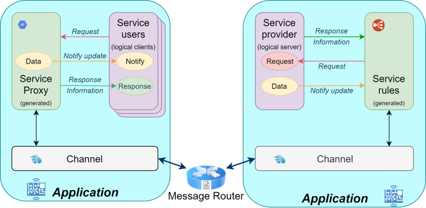
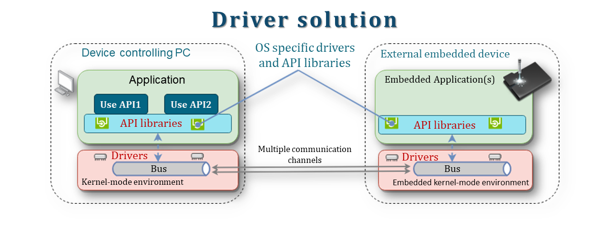
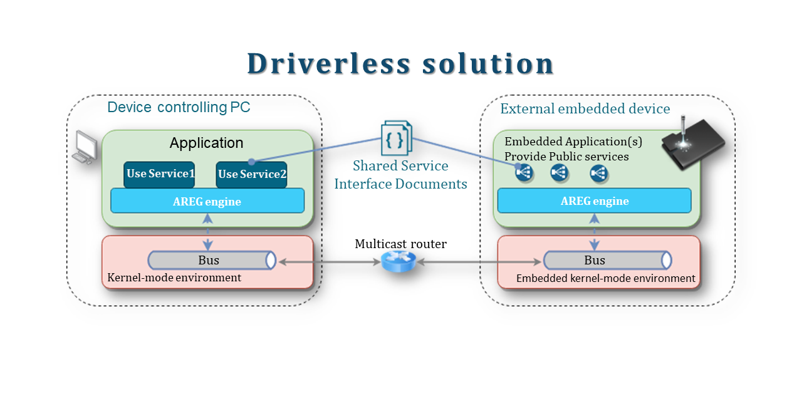
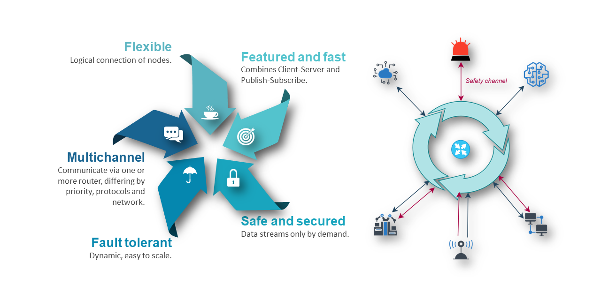
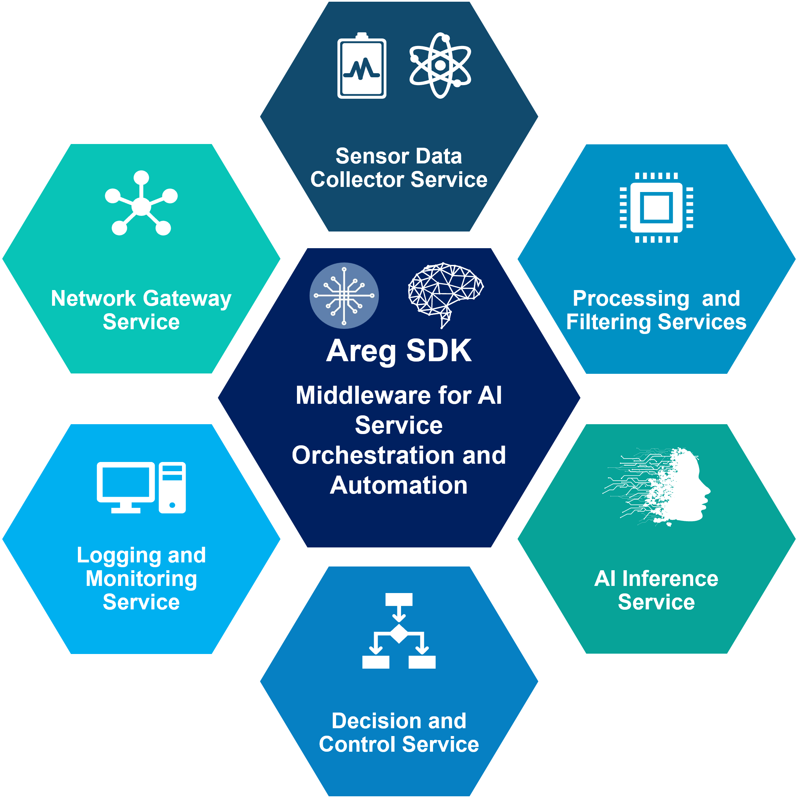
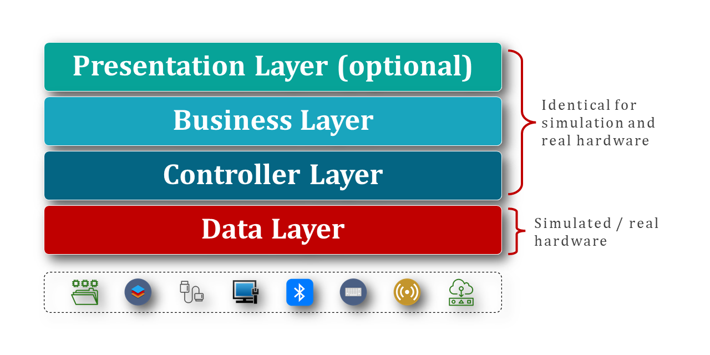
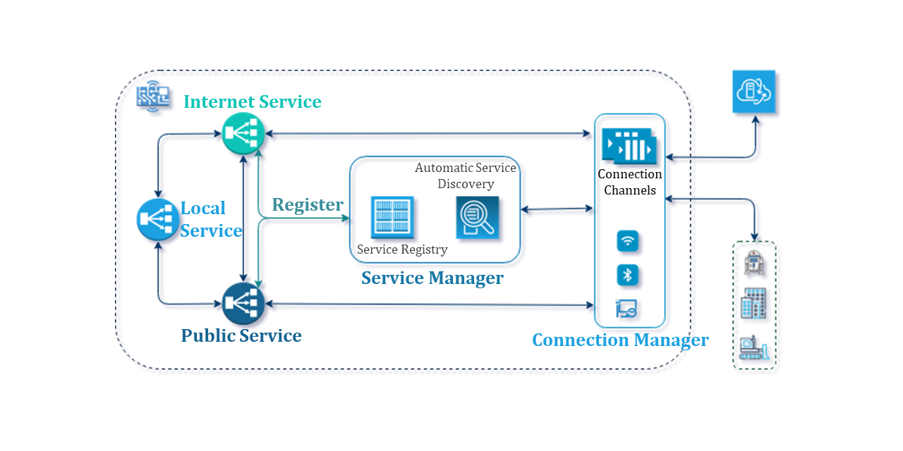

# Use Cases and Benefits

```
This file is part of Areg SDK
Copyright (c) 2021-2026, Aregtech
Contact: info[at]areg.tech
Website: https://www.areg.tech
```

Areg SDK eliminates the infrastructure that C++ developers should never have to write twice:
threading, IPC, service discovery, fault recovery, and distributed communication — automated,
generated, and ready to deploy from a single machine to an entire network.

This document shows where Areg SDK fits, what it replaces, and why the replacement matters.

---

## Table of Contents

- [Scientific and Industrial Imaging Pipelines](#scientific-and-industrial-imaging-pipelines)
- [Device-as-a-Service (Driverless Hardware)](#device-as-a-service-driverless-hardware)
- [Industrial Automation and Robotics](#industrial-automation-and-robotics)
- [Edge AI and Inference Pipelines](#edge-ai-and-inference-pipelines)
- [Digital Twins and Real-Time Monitoring](#digital-twins-and-real-time-monitoring)
- [Simulation and Hardware-in-the-Loop Testing](#simulation-and-hardware-in-the-loop-testing)
- [Distributed C++ Applications](#distributed-c-applications)
- [Live Component Replacement Without Restart](#live-component-replacement-without-restart)
- [Incremental Decomposition of C++ Monoliths](#incremental-decomposition-of-c-monoliths)
- [Dynamic Configuration Propagation](#dynamic-configuration-propagation)
- [Plugin and Extension Architectures](#plugin-and-extension-architectures)
- [Multi-Display and Multi-UI Architectures](#multi-display-and-multi-ui-architectures)
- [Coordinated System-Wide Shutdown](#coordinated-system-wide-shutdown)
- [Summary](#summary)

---

## Scientific and Industrial Imaging Pipelines

<details open><summary>Click to show / hide</summary><br/>

Imaging systems — laser confocal microscopes, X-ray detectors, electron microscopes, industrial cameras — generate continuous high-rate data streams that must move between acquisition, preprocessing, analysis, and storage without dropping frames. Development teams routinely spend weeks building custom shared-memory rings or hand-written socket protocols between pipeline stages, only to find them fragile when a stage crashes, non-portable when the OS changes, and impossible to restructure without touching the transport layer.

Areg SDK replaces that custom transport with **typed service interfaces** that the code generator produces from a single `.siml` definition. Pipeline stages communicate through generated proxies — whether they run as threads in the same process, separate processes on the same machine, or nodes on a network. Restructuring the pipeline topology is a configuration change, not a code rewrite.

<div align="center"><a href="./img/interface-centric.png"></a></div>

The transport performance leaves no room for objection: **2.4–7.0 GB/s full-stack IPC on mobile-class hardware**, measured with service discovery, type-safe serialization, automatic reconnection, and threading dispatch all active. No kernel bypass. No shared memory. No stripped-down conditions. This covers the software pipeline layer for virtually every known imaging detector on standard hardware.

**Where it applies:** Synchrotron beamlines, cryo-EM acquisition pipelines, X-ray and CT reconstruction systems, machine vision inspection lines, medical imaging pre/post-processing.

</details>

<div align="right"><kbd><a href="#table-of-contents">↑ Back to top ↑</a></kbd></div>

---

## Device-as-a-Service (Driverless Hardware)

<details open><summary>Click to show / hide</summary><br/>

External hardware has traditionally required a kernel-mode driver installed on the host — a development effort measured in months, not weeks, with a compatibility matrix that grows with every OS update and a debugging model where mistakes crash the host machine.

<div align="center"><a href="./img/driver-solution.png"></a></div>

Areg SDK makes the driver unnecessary. The device application exposes its capabilities as Areg services. Host applications call device functionality through a **generated, typed proxy** — no driver installation, no kernel-mode code, no special permissions, no ioctl calls. The device is discovered automatically when it connects to `mtrouter`. If it restarts, the host applications are notified through standard service connection callbacks.

<div align="center"><a href="./img/driverless-solution.png"></a></div>

The result: hardware that previously required 2–6 months of driver engineering per platform ships with a user-mode service in 1–2 weeks, debuggable with standard tools, upgradeable without driver signing, and portable across Linux, Windows, and macOS without platform-specific branches.

**Where it applies:** Laboratory instruments, industrial sensor nodes, embedded controllers, motor drives, smart edge devices exposing APIs to host applications.

</details>

<div align="right"><kbd><a href="#table-of-contents">↑ Back to top ↑</a></kbd></div>

---

## Industrial Automation and Robotics

<details open><summary>Click to show / hide</summary><br/>

Distributed industrial systems fail in three predictable ways: a node crashes and nothing recovers without operator intervention; processes must start in a precise sequence that breaks when deployment changes; adding a sensor or controller requires modifying existing node code. The standard answers — heartbeat protocols, reconnection state machines, startup scripts — produce infrastructure that outlasts its authors and fails in production at the worst possible moment.

<div align="center"><a href="./img/areg-sdk-features.png"></a></div>

Areg SDK handles all three at the architecture level. The built-in watchdog monitors threads and restarts a failed thread without terminating the process — components in that thread are re-initialized, and dependent services receive the standard `serviceDisconnected` / `serviceConnected` callbacks automatically. Zero reconnection code in the application. Services register when they start and consumers connect when providers appear, eliminating startup ordering entirely. Adding a new node means starting a new process; existing nodes discover it automatically without code changes.

**Where it applies:** PLC replacement on GPOS Linux, robot arm coordination, conveyor and sorting systems, factory floor supervisory control, multi-AGV fleet management.

</details>

<div align="right"><kbd><a href="#table-of-contents">↑ Back to top ↑</a></kbd></div>

---

## Edge AI and Inference Pipelines

<details open><summary>Click to show / hide</summary><br/>

An edge AI pipeline connects stages with fundamentally different resource profiles — CPU-bound preprocessing, GPU-bound inference, FPGA-attached acquisition — that may need to run as threads, separate processes, or nodes on different physical boards depending on hardware constraints. Every topology change with conventional IPC frameworks means modifying application code. Hardware configuration changes become integration projects.

<div align="center"><a href="./img/areg-for-embedded-ai.png"></a></div>

Areg SDK's **location transparency** removes that coupling. Each pipeline stage exposes a typed service interface. Whether the inference engine runs in the same process or on a networked GPU node, the preprocessor API is identical — the framework resolves the location at runtime. Develop in a single process, test with separate processes, deploy distributed: the application code does not change at any transition. Only `areg.init` configuration changes.

At 1.0–1.2M messages per second transport throughput on mobile-class hardware, the framework does not constrain the data rates of any current edge inference pipeline.

**Where it applies:** Industrial defect detection, smart traffic analysis, agricultural yield monitoring, predictive maintenance, medical edge imaging.

</details>

<div align="right"><kbd><a href="#table-of-contents">↑ Back to top ↑</a></kbd></div>

---

## Digital Twins and Real-Time Monitoring

<details open><summary>Click to show / hide</summary><br/>

Digital twin implementations typically introduce a broker layer — MQTT, OPC-UA, or a custom message bus — between the physical device and its software representation. That broker adds latency, becomes a single point of failure, requires separate operational management, and forces a translation layer between the physical device's interface and what the twin exposes. State synchronization based on polling misses rapid transitions.

Areg SDK eliminates the broker entirely. The same service interface defines both the physical device and its digital twin — providing an identical API whether connecting to real hardware or its virtual counterpart. `mtrouter` routes communication directly between providers and consumers. Pub/sub attribute broadcasts push state changes on occurrence — no polling, no batching, no delay.

The digital twin can mirror, simulate, or proxy the real device — all sharing the same service interface. Consumers require no code changes when switching between real hardware and its twin.

When a physical device goes offline, `serviceDisconnected()` fires immediately. When it returns, communication resumes automatically. This is the behavior that emergency response, security monitoring, and safety-critical systems require — not polling on a timer.

**Where it applies:** Industrial equipment monitoring, smart building management, autonomous vehicle component monitoring, critical infrastructure supervision, remote hardware fleet management.

</details>

<div align="right"><kbd><a href="#table-of-contents">↑ Back to top ↑</a></kbd></div>

---

## Simulation and Hardware-in-the-Loop Testing

<details open><summary>Click to show / hide</summary><br/>

Testing C++ application logic against simulated hardware forces a choice between bad options: conditional compilation contaminates production code and diverges from reality; mock frameworks require the architecture to be designed around mockability; custom simulator processes speak protocols that drift from the real hardware interface. None of these approaches test the actual application code over the actual IPC path with the actual service discovery in a controlled environment.

<div align="center"><a href="./img/software-layers.png"></a></div>

Areg SDK services are discovered by name and interface version. A simulated service and a real hardware service are indistinguishable to the application — the framework routes requests to whichever is currently registered. The testing progression is: all components in one process for fast iteration and CI, separate processes with simulated services for IPC path coverage, hardware-in-the-loop with real devices replacing simulation one interface at a time, and finally full production deployment. The application code does not change at any step. Only configuration changes — or none at all, if the simulated service registers under the same service name as the real hardware service.

**Where it applies:** Embedded systems developed before hardware exists, medical and safety-critical software requiring reproducible test environments, automotive ADAS tested against sensor simulators, industrial robots programmed in virtual environments.

</details>

<div align="right"><kbd><a href="#table-of-contents">↑ Back to top ↑</a></kbd></div>

---

## Distributed C++ Applications

<details open><summary>Click to show / hide</summary><br/>

Every C++ distributed application project starts with the same invisible tax: 4–12 weeks of threading and IPC infrastructure that is custom-built for that project, not reusable for the next, and understood only by whoever wrote it. Frameworks like ZeroMQ, gRPC, and Thrift address transport but leave threading, lifecycle management, fault recovery, and service discovery entirely to the application. The infrastructure becomes the hardest part of the project and contributes nothing to the business logic.

<div align="center"><a href="./img/areg-services.png"></a></div>

Areg SDK replaces that infrastructure with a **model-based component architecture**. The developer declares a model — threads, components, provided services, consumed services — and calls `Application::load_model()`. The framework instantiates threads, loads components, starts services, and begins routing. Models can be declared statically at compile time or constructed dynamically at runtime. Loading and unloading is always safe: `unload_model()` stops all services, exits all threads, and notifies every consumer that services are no longer available.

```cpp
Application::load_model("MyModel");   // instantiates threads, components, services
Application::wait_quit();
Application::unload_model("MyModel"); // stops everything, notifies consumers
```

The same model runs as threads in a single process for development and as distributed processes in production. No code changes between the two.

**Where it applies:** Game server backends, physics and simulation engines, financial data processing, distributed sensor aggregation, any C++ system currently managing threads and IPC manually.

</details>

<div align="right"><kbd><a href="#table-of-contents">↑ Back to top ↑</a></kbd></div>

---


## Live Component Replacement Without Restart

<details open><summary>Click to show / hide</summary><br/>

In C++ systems that run continuously — factory lines, monitoring systems, data pipelines — updating a single component requires stopping the entire application. The standard alternatives are a full stop-update-restart cycle, or a progressively complicated versioning mechanism built by hand, neither of which is safe under real operating conditions.

Areg SDK's model lifecycle eliminates the problem. `unload_model()` stops a specific set of threads and their components cleanly, sending `serviceDisconnected` to every dependent consumer before anything exits. `load_model()` brings the updated component online; consumers reconnect automatically when the service reappears. The rest of the system continues running throughout. No other open-source C++ framework provides controlled partial restart as a first-class operation.

**Where it applies:** Algorithm updates in running data pipelines, rolling upgrades in factory automation, component replacement in continuously operating monitoring systems.

</details>

<div align="right"><kbd><a href="#table-of-contents">↑ Back to top ↑</a></kbd></div>

---

## Incremental Decomposition of C++ Monoliths

<details open><summary>Click to show / hide</summary><br/>

Every team with a large C++ monolith eventually needs to split it into separate processes — for isolation, independent deployment, or resource separation. The standard path is either a high-risk big-bang rewrite or a months-long extraction project that touches every component simultaneously. Both approaches are expensive and routinely fail.

With Areg SDK, decomposition is incremental and reversible. A monolith component wrapped in a service interface behaves identically whether it runs as a thread inside the existing process or as a separate process behind `mtrouter`. Extract one component at a time: verify it works in-process, then move it out by changing a single model declaration. Nothing else changes. The migration can stop, reverse, or accelerate at any step without touching application logic.

**Where it applies:** Legacy C++ codebases being modernized, growing monoliths approaching scaling limits, any system where full decomposition carries too much risk to attempt at once.

</details>

<div align="right"><kbd><a href="#table-of-contents">↑ Back to top ↑</a></kbd></div>

---

## Dynamic Configuration Propagation

<details open><summary>Click to show / hide</summary><br/>

Configuration changes in distributed C++ systems either require restarting processes or depend on polling mechanisms that check files on a timer — adding latency, wasting cycles, and still requiring careful coordination when multiple components must update simultaneously. Building reliable runtime reconfiguration without restart is treated as an advanced feature requiring significant custom engineering.

In Areg SDK, a configuration service publishes settings as **attributes** — the framework's pub/sub primitive. When a value changes, all subscribed components receive the update immediately without polling and without restart. A component subscribes when it starts, receives the current configuration state on first connection, and receives incremental updates automatically for the rest of its lifetime. One change propagates to every subscriber in the system simultaneously, in the same notification model used for all other service communication.

**Where it applies:** Distributed systems requiring runtime parameter tuning, multi-process applications with shared configuration state, embedded systems where restart cost is prohibitive.

</details>

<div align="right"><kbd><a href="#table-of-contents">↑ Back to top ↑</a></kbd></div>

---

## Plugin and Extension Architectures

<details open><summary>Click to show / hide</summary><br/>

C++ plugin systems are dominated by two approaches: shared library loading with C-linkage entry points (no type safety, ABI fragility, version incompatibility) or platform-specific IPC (COM on Windows, D-Bus on Linux). Both produce extension APIs that are fundamentally different from the internal application API, platform-locked, and difficult to version safely.

In Areg SDK, a plugin is a process that registers services via `mtrouter`. The host discovers plugins the same way it discovers any other service — by name and interface version. The plugin API is a `.siml` file: typed, versioned, generated, and structurally identical to every other service in the system. Version compatibility is enforced by the framework at connection time. Plugins are hot-loadable by virtue of being separate processes. The mechanism works identically on Linux, Windows, and macOS.

**Where it applies:** Extensible C++ applications, third-party plugin ecosystems, systems requiring runtime capability extension without shared library ABI constraints.

</details>

<div align="right"><kbd><a href="#table-of-contents">↑ Back to top ↑</a></kbd></div>

---

## Multi-Display and Multi-UI Architectures

<details open><summary>Click to show / hide</summary><br/>

Separating backend logic from UI in C++ traditionally means COM on Windows, D-Bus on Linux, or a custom IPC protocol. Each approach is platform-specific, requires substantial boilerplate, and tightly couples the UI to the backend's communication mechanism. Running multiple UI instances against the same backend — a common requirement in control rooms, monitoring stations, and multi-operator systems — multiplies the complexity linearly.

In Areg SDK, the backend publishes its state as service attributes and handles commands through request/reply. Any number of UI processes subscribe as service consumers — each receives the same state broadcasts independently. Adding a second or third display means starting another consumer process. The backend does not change and is not aware of how many UIs are connected or on what platform they run.

**Where it applies:** Control room multi-screen architectures, industrial HMI panels, monitoring dashboards with multiple operator views, any system where the same backend state must be visible to multiple independent frontends simultaneously.

</details>

<div align="right"><kbd><a href="#table-of-contents">↑ Back to top ↑</a></kbd></div>

---

## Coordinated System-Wide Shutdown

<details open><summary>Click to show / hide</summary><br/>

Graceful shutdown of a distributed C++ system is one of the hardest problems to get right consistently. Components must stop in dependency order, in-flight requests must complete or be cancelled, resources must be released without deadlock, and no process should exit while another is waiting for a response. Hand-written shutdown sequences are fragile, rarely tested under real conditions, and usually the last thing anyone wants to touch.

In Areg SDK, shutdown is built into the service model. `unload_model()` stops services in dependency order, sends `serviceDisconnected` to all consumers before providers exit, and waits for in-flight requests to complete before teardown. Each component has a defined and consistent teardown path. The application does not implement a shutdown sequence — it calls one function and the framework handles ordering.

**Where it applies:** Safety-critical systems, systems with hardware side effects on exit, long-running services where disorderly shutdown leaves persistent state corrupted.

</details>

<div align="right"><kbd><a href="#table-of-contents">↑ Back to top ↑</a></kbd></div>

---

## Summary

### Use Cases and Core Advantages

| Use Case | What Areg SDK Replaces | Impact |
|---|---|---|
| **Imaging Pipelines** | Custom IPC transport + manual topology management | Months of fragile code → configuration change |
| **Driverless Hardware** | Kernel-mode driver development | 2–6 months per platform → 1–2 weeks |
| **Industrial Automation** | Heartbeat protocols, reconnection state machines | Infrastructure code → zero application code |
| **Edge AI Pipelines** | Per-topology IPC rewrites | Code rewrite per hardware config → config change |
| **Digital Twins** | Broker middleware + polling | Added latency and failure point → direct routing |
| **Simulation / HiL** | Conditional compilation, mock frameworks | Test-production divergence → identical code path |
| **Distributed C++ Apps** | Per-project threading and IPC infrastructure | 4–12 weeks infrastructure → model declaration |
| **Live Component Replacement** | Full application restart for component update | System downtime → zero-downtime partial reload |
| **Monolith Decomposition** | Big-bang rewrite or full extraction project | High-risk migration → incremental, reversible steps |
| **Configuration Propagation** | Polling, restart cycles, custom push mechanisms | Delayed or complex propagation → instant push |
| **Plugin Architectures** | COM, D-Bus, C-linkage shared libraries | Platform-locked, ABI-fragile → typed, versioned, cross-platform |
| **Multi-UI Architectures** | COM, D-Bus, custom IPC per backend | Per-platform coupling → start another consumer process |
| **System-Wide Shutdown** | Hand-written shutdown sequences | Fragile ordering → framework-managed dependency teardown |

### The Common Thread

Across all thirteen use cases, Areg SDK does the same thing: it moves a class of problems from application code to framework infrastructure, or eliminates the problem entirely through architectural design. Threading, discovery, fault recovery, topology management, test-production parity — none of these belong in application code. Areg SDK is the argument that they never needed to be.

The same programming model scales from a single multithreaded process on an embedded board to a distributed system across multiple machines, with only configuration and build script changes between deployments.

### Scope and Limitations

All use cases described here target **General Purpose Operating Systems** (Linux, Windows, macOS). RTOS support (FreeRTOS, Zephyr) is in development. The current architecture uses TCP for inter-process communication; optional TLS transport is planned for deployments crossing untrusted network boundaries. Every Areg SDK message carries a fixed routing header (~200 bytes) that enables automated discovery and dispatch — this is the cost of the automation, and a known design trade-off for high message-rate applications.

---

*Performance benchmark data and recipes: [23_pubdatarate README](../examples/23_pubdatarate/ReadMe.md)*  
*API reference and tutorials: [Wiki](./wiki/README.md)*  
*Working examples: [examples directory](../examples/)*
