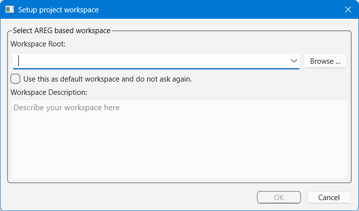
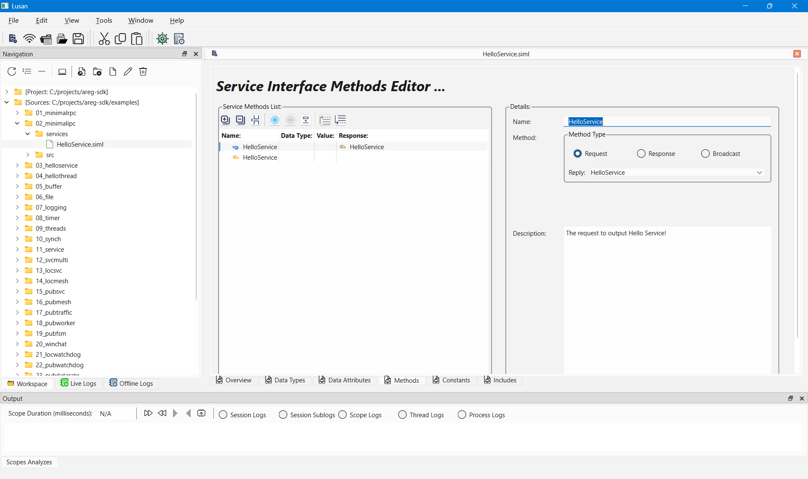
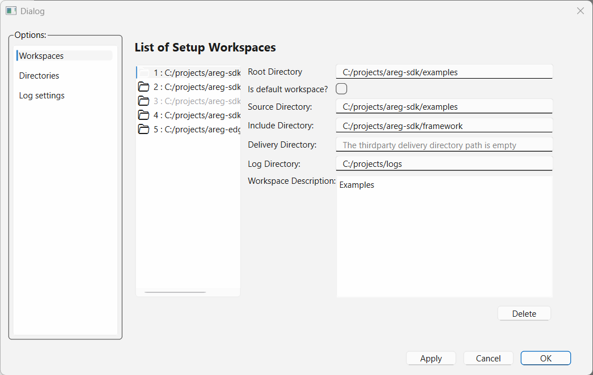

# Setup and Using Lusan

This guide explains how to build, configure, and use **Lusan**, the graphical development and diagnostics tool for the Areg SDK ecosystem. Lusan combines visual service interface design, centralized log collection, live monitoring, and offline analysis in a unified workspace environment.

Lusan is designed for daily development workflows, system debugging, integration testing, and distributed application analysis.

---

## Table of Contents

- [Overview](#overview)
- [What Is Lusan Used For](#what-is-lusan-used-for)
- [Prerequisites](#prerequisites)
- [Building Lusan](#building-lusan)
- [Starting Lusan](#starting-lusan)
- [Workspace Concept](#workspace-concept)
- [Setting Up a Workspace](#setting-up-a-workspace)
- [Configuring Workspace Directories](#configuring-workspace-directories)
- [Configuring Log Collector Connection](#configuring-log-collector-connection)
- [Core Workflows](#core-workflows)
- [Runtime Settings](#runtime-settings)
- [Best Practices](#best-practices)
- [Summary](#summary)

---

## Overview

**Lusan** is a comprehensive graphical tool that supports the complete development lifecycle of Areg-based distributed applications. It provides an integrated environment for:

- **Visual Service Interface Design**: Create and edit `.siml` service definitions with a graphical editor
- **Centralized Log Collection**: Aggregate logs from multiple distributed applications
- **Live Log Monitoring**: Real-time visualization with filtering and correlation
- **Offline Log Analysis**: Post-mortem debugging and investigation
- **Runtime Control**: Dynamic adjustment of logging scopes and priorities

Lusan operates as part of the Areg SDK toolchain and works in conjunction with `logcollector` for live logging capabilities.

<div align="right"><kbd><a href="#table-of-contents">↑ Back to top ↑</a></kbd></div>

---

## What Is Lusan Used For

### Primary Use Cases

**Service Interface Development**
- Design and maintain service interface documents (`.siml` files)
- Define data types, attributes, methods, and constants
- Validate interfaces before code generation
- Visual editing eliminates manual XML authoring

**Real-Time System Monitoring**
- Monitor logs from distributed applications in real time
- Track request/response flows across service providers and consumers
- Correlate events across multiple components and processes
- Filter and search log streams dynamically

**Offline Diagnostics**
- Analyze recorded logs without live system access
- Investigate intermittent issues and rare edge cases
- Share log files with team members for collaborative debugging
- Perform post-mortem analysis of production incidents

**Runtime Configuration**
- Control logging scopes and priorities without restarting applications
- Adjust log verbosity for specific components on-the-fly
- Save configuration changes for subsequent application launches

### Target Users

- **Application Developers**: Daily development and debugging
- **System Integrators**: Multi-component system testing
- **DevOps Engineers**: Production troubleshooting
- **QA Teams**: Test scenario analysis

<div align="right"><kbd><a href="#table-of-contents">↑ Back to top ↑</a></kbd></div>

---

## Prerequisites

### Required Software

Before using Lusan, ensure the following are available:

| Component | Requirement | Notes |
|-----------|-------------|-------|
| **Lusan** | Built and installed | From [areg-sdk-tools](https://github.com/aregtech/areg-sdk-tools) |
| **Qt Libraries** | Qt 5.x or 6.x | Runtime libraries must be accessible |
| **logcollector** | Built and accessible | Required for live log monitoring |
| **Configuration** | `lusan.init` file | Network settings for log collector connection |

### Optional Components

- **Areg SDK**: For building applications to monitor
- **Service Interface Files**: `.siml` files for interface design work
- **Log Files**: Previously recorded logs for offline analysis

<div align="right"><kbd><a href="#table-of-contents">↑ Back to top ↑</a></kbd></div>

---

## Building Lusan

Lusan is hosted in a separate repository from the Areg SDK core:  
📦 [github.com/aregtech/areg-sdk-tools](https://github.com/aregtech/areg-sdk-tools)

### Build Process

```bash
git clone https://github.com/aregtech/areg-sdk-tools.git
cd areg-sdk-tools
cmake -B build -DCMAKE_BUILD_TYPE=Release
cmake --build build -j
```

### Automatic Dependency Resolution

If the Areg SDK is not installed locally, the build system automatically:
1. Fetches Areg SDK sources from GitHub
2. Builds required Areg libraries (`areg`, `aregextend`)
3. Links them with Lusan
4. Copies runtime dependencies to the output directory

> [!IMPORTANT]
> Internet access is required during the initial build if Areg SDK is not present locally.

### Building with Qt Creator

If Qt is not installed system-wide, use Qt Creator for simplified configuration:

1. **Open Project**: Launch Qt Creator and open `areg-sdk-tools/CMakeLists.txt`
2. **Configure Kit**: Select compiler (GCC, Clang, MSVC, MinGW) and Qt version
3. **Set Build Type**: Choose Debug or Release
4. **Build**: Qt Creator automatically resolves Qt dependencies and builds all components

All required dependencies, including Areg Framework libraries and Qt runtime libraries, are automatically copied to the build directory.

### Build Output

After successful build, find executables in `build/bin/`:
- `lusan` - Main application
- `logcollector` - Log collection service
- `mtrouter` - Message router service
- Required Qt and Areg runtime libraries

**For detailed build instructions**, see [Building Lusan with CMake or Qt Creator](./06c-build-lusan.md).

<div align="right"><kbd><a href="#table-of-contents">↑ Back to top ↑</a></kbd></div>

---

## Starting Lusan

### First Launch

When Lusan is launched for the first time, it prompts you to create a new workspace:

<div align="center"><a href="../img/lusan-workspace-setup.png"></a></div>

**Initial Setup Steps**:
1. Click **Create New Workspace**
2. Specify workspace (project) directory
3. Optionally configure additional directories (sources, includes, logs)
4. Click **OK** to create and load the workspace

### Subsequent Launches

On subsequent starts, Lusan:
- Displays the list of available workspaces
- Automatically selects the last accessed workspace as default
- Allows switching between workspaces via the workspace selector

### Launch from Command Line

```bash
cd build/bin
./lusan
```

<div align="right"><kbd><a href="#table-of-contents">↑ Back to top ↑</a></kbd></div>

---

## Workspace Concept

### What Is a Workspace?

A **workspace** in Lusan defines the project environment and organizes all project-related resources. It serves as the central configuration unit that groups together:

- **Project Directory** (workspace root) - Required
- **Source Code Directory** - Optional, for browsing service interfaces
- **Include Directory** - Optional, for referenced header files
- **Delivery Directory** - Optional, for third-party deliverables
- **Log Directory** - Optional, default location for saved logs

### Workspace Benefits

**Project Isolation**: Each workspace maintains independent settings and configurations

**Multi-Project Support**: Switch between different projects without reconfiguration

**Team Collaboration**: Share workspace configurations across development teams

**Flexible Structure**: Adapt to various project layouts and directory organizations

### Visual Organization

Within the workspace, Lusan provides:
- **Workspace Navigation**: Browse project directories in the navigation pane
- **Service Interface Files**: Access and edit `.siml` definitions
- **Log Files**: Open saved logs from the log directory
- **Quick Access**: Frequently used files and locations

<div align="center"><a href="../img/lusan-app.png"></a></div>

<div align="right"><kbd><a href="#table-of-contents">↑ Back to top ↑</a></kbd></div>

---

## Setting Up a Workspace

### Creating a New Workspace

**Method 1: Startup Dialog**
- Launch Lusan for the first time
- Click **Create New Workspace** in the welcome dialog
- Specify workspace directory and optional paths

**Method 2: Menu Access**
- Open Lusan with an existing workspace
- Navigate to **File → New Workspace**
- Configure workspace settings
- Save and switch to the new workspace

### Workspace Configuration

When creating a workspace, specify:

**Required**:
- **Workspace Directory**: Root directory of your project

**Optional**:
- **Source Directory**: Location of `.cpp`, `.hpp` files
- **Include Directory**: Location of header files
- **Delivery Directory**: Third-party libraries and deliverables
- **Log Directory**: Default location for saved log files

All paths can be absolute or relative to the workspace directory.

### Workspace Persistence

Workspace configurations are automatically saved and include:
- Directory paths
- Log collector connection settings
- UI preferences (window layout, filters, etc.)
- Recently opened files

<div align="right"><kbd><a href="#table-of-contents">↑ Back to top ↑</a></kbd></div>

---

## Configuring Workspace Directories

### Accessing Directory Settings

Navigate to: **Tools → Options → Directories**

<div align="center"><a href="../img/lusan-option-workspace-dirs.png"></a></div>

### Directory Configuration Options

**Project Directory** (Required)
- The main project directory displayed in the workspace
- Cannot be changed after workspace creation
- Other directories can be located anywhere on the file system (inside or outside this directory)

**Source Directory** (Optional)
- Location where source code files are stored
- Service interface files (`.siml`), C++ source files (`.cpp`), and headers (`.hpp`) are typically found here
- Can be a subdirectory of the project directory or a completely separate location
- Used for browsing and opening source files and service definitions

**Include Directory** (Optional)
- Location of C++ header files when source and include directories are separated
- Common in projects with `src/` and `include/` directory structures
- Can point to external dependencies (e.g., Areg SDK framework headers)
- Can be located anywhere on the file system
- Used for browsing header files

**Delivery Directory** (Optional)
- Location of third-party deliverables and external dependencies
- Can point to system-wide installations or user-specific directories
- Used for tracking external libraries and tools (e.g., Qt installation or thir-party service interface directory)
- Can be located anywhere on the file system

**Log Directory** (Optional)
- Default location where Lusan saves log files
- Can be any location on the file system
- Used as the default path in save/load log file dialogs

### Directory Path Flexibility

All directories (except the project directory) can be:
- Subdirectories of the project directory
- Located outside the project directory
- Absolute paths on the file system
- Paths to system-wide installations
- User-specific directories

Service interface files (`.siml`) can be located in any of these configured directories, and Lusan will display them in the workspace navigation.

### Example Configuration (Linux)

```
Project Directory:   /home/user/projects/areg-sdk-demo
Source Directory:    /home/user/projects/areg-sdk-demo/demo
Include Directory:   /home/user/areg-sdk/framework
Delivery Directory:  /home/user/myproj/services
Log Directory:       /home/user/logs/areg-demo
```

In this example:
- Sources are in a subdirectory of the project
- Include directory points to a separate Areg SDK installation
- Delivery directory points to a service interface directory in the user's home delivered by third-party company
- Log directory is in the user's home directory

### Updating Directory Paths

1. Open **Tools → Options → Directories**
2. Modify desired directory paths
3. Click **Apply** or **OK**
4. Changes take effect immediately

Directory paths are saved to the workspace configuration file.

### Managing Multiple Workspaces

Access workspace management: **Tools → Options → Workspaces**

<div align="center"><a href="../img/lusan-option-workspace-list.png"></a></div>

**Available Actions**:
- **Add Workspace**: Register an existing workspace
- **Remove Workspace**: Delete workspace from list (files are not deleted)
- **Set Default**: Choose default workspace for startup
- **Switch Workspace**: Load a different workspace

> [!NOTE]
> You cannot remove the currently active workspace from the list. Switch to another workspace first.

<div align="right"><kbd><a href="#table-of-contents">↑ Back to top ↑</a></kbd></div>

---

## Configuring Log Collector Connection

### Connection Settings

Navigate to: **Tools → Options → Log Collector**

<div align="center"><a href="../img/lusan-option-logcollector.png"></a></div>

### Configuration Parameters

**Host Address**
- IP address or hostname of the machine running `logcollector`
- Default: `localhost` (same machine)
- Example: `192.168.1.100` for remote log collector

**Port Number**
- TCP port where `logcollector` listens for connections
- Default: `8282` (standard Areg log collector port)
- Must match the port configured in `areg.init` on the log collector side

**Connection Timeout**
- Maximum time to wait for connection establishment
- Default: 5 seconds
- Increase for slow or unreliable networks

### Testing Connection

1. Configure host address and port
2. Click **Test** button
3. View connection status in **Test Status** box

**Status Messages**:
- ✅ **Connected**: Log collector is reachable
- ❌ **Connection Failed**: Check network, firewall, or log collector status
- ⏱️ **Timeout**: Increase timeout or verify log collector is running

### Saving Connection Settings

1. Configure connection parameters
2. Test connection (recommended)
3. Click **OK** or **Apply**

Settings are saved to `lusan.init` configuration file and persist across sessions.

### Troubleshooting Connection Issues

**Log Collector Not Running**
```bash
# Start log collector
cd build/bin
./logcollector
```

**Firewall Blocking Connection**
- Allow TCP port 8282 in firewall settings
- Verify with: `telnet <host> 8282`

**Incorrect Configuration**
- Verify `areg.init` on log collector side:
  ```text
  logger::*::address::tcpip = <host-ip>
  logger::*::port::tcpip = 8282
  ```

<div align="right"><kbd><a href="#table-of-contents">↑ Back to top ↑</a></kbd></div>

---

## Core Workflows

### Service Interface Design

Lusan provides a visual editor for creating and maintaining service interface documents (`.siml` files).

<div align="center"><a href="../img/lusan-service-if-general.png"></a></div>

#### Creating a Service Interface

1. **Open Workspace**: Load workspace containing your project
2. **Create Interface**: Navigate to **File → New → Service Interface**
3. **Configure Service**:
   - **Overview**: Service name, version, description
   - **Data Types**: Define structures, enumerations, type aliases
   - **Attributes**: Shared state accessible to all consumers
   - **Methods**: Requests, responses, broadcasts
   - **Constants**: Service-level constants
   - **Includes**: External type definitions

4. **Save Interface**: Save as `.siml` file in workspace source directory

#### Editing Service Interfaces

- **Open Existing**: Browse workspace navigation pane or **File → Open**
- **Visual Editor**: Use tabs and forms to modify interface components
- **Validation**: Real-time syntax and consistency checking
- **Save Changes**: Ctrl+S or **File → Save**

#### Code Generation Integration

Service interfaces created in Lusan are consumed by the Areg code generator during build:

```cmake
addServiceInterface(MyServiceLib ./services/MyService.siml)
```

**For detailed interface design**, see [Creating Service Interface Documents with Lusan](./06e-lusan-service-interface.md).

### Live Log Monitoring

Monitor logs from running Areg applications in real time.

<div align="center"><a href="../img/lusan-live-log-gen.png"></a></div>

#### Setting Up Live Monitoring

**Prerequisites**:
1. Log collector running: `./logcollector`
2. Lusan connected to log collector (see configuration above)
3. Areg applications running with remote logging enabled

**Steps**:
1. **Start Log Collector**: Launch `logcollector` from command line
2. **Connect Lusan**: Open Lusan, verify connection indicator shows green
3. **Start Applications**: Launch your Areg-based applications
4. **View Logs**: Logs appear in real time in Lusan's log viewer

#### Log Viewer Features

**Filtering**
- Filter by log priority (DEBUG, INFO, WARN, ERROR, FATAL)
- Filter by scope name or pattern
- Filter by module (process) name
- Filter by thread ID
- Combine multiple filters

**Searching**
- Text search across log messages
- Regular expression support
- Highlight search results

**Correlation**
- Track request/response pairs across components
- Follow execution flow through distributed system
- Color-code related log entries

**Time Navigation**
- Jump to specific timestamp
- Navigate to next/previous occurrence
- Bookmark important log entries

#### Live Log Controls

**Pause/Resume**: Freeze log stream for detailed inspection
**Clear**: Clear current log buffer
**Save**: Save current logs to file for offline analysis
**Auto-Scroll**: Automatically scroll to newest log entries

### Offline Log Analysis

Analyze previously recorded logs without live system connection.

<div align="center"><a href="../img/lusan-offline-log-gen.png"></a></div>

#### Loading Log Files

**Method 1: File Menu**
1. Navigate to **File → Open Log File**
2. Browse to log file location
3. Select file and click **Open**

**Method 2: Drag and Drop**
- Drag log file from file manager
- Drop onto Lusan window

**Method 3: Workspace Navigation**
- Browse to log directory in workspace navigation pane
- Double-click log file

#### Offline Analysis Features

**Full Search and Filter**
- All filtering capabilities available in offline mode
- Search entire log file regardless of size
- No real-time constraints

**Post-Mortem Debugging**
- Trace execution leading to failures
- Identify root cause of intermittent issues
- Analyze timing and sequence of events

**Sharing and Collaboration**
- Share log files with team members
- Reproduce issues on different machines
- Archive logs for future reference

**Performance Analysis**
- Identify bottlenecks and slow operations
- Measure request/response times
- Analyze system behavior under load

<div align="right"><kbd><a href="#table-of-contents">↑ Back to top ↑</a></kbd></div>

---

## Runtime Settings

Lusan enables dynamic configuration changes without restarting applications.

<div align="center"><a href="../img/lusan-live-log-scope-prio.png"></a></div>

### Adjusting Log Scope Priorities

**Steps**:
1. **Connect to Live System**: Ensure connection to log collector
2. **Navigate Scopes**: Navigate Scopes on left panel
3. **Select Application**: Choose target application
4. **Modify Priorities**:
   - Enable/disable scopes: Check/uncheck scope entries
   - Change priority levels: Select DEBUG, INFO, WARN, ERROR, FATAL, or NOTSET
   - Click on save button to apply changes on target.
5. The current settings are applied immediately to the running application and will be applied on next start(s).

### Runtime Configuration Benefits

- **No Restarts Required**: Change logging behavior on-the-fly
- **Targeted Debugging**: Enable verbose logging for specific components only
- **Performance Optimization**: Reduce log overhead by disabling unnecessary scopes
- **Production Troubleshooting**: Increase logging temporarily without deployment

<div align="right"><kbd><a href="#table-of-contents">↑ Back to top ↑</a></kbd></div>

---

## Best Practices

### Workspace Management

**One Workspace Per Project**
- Create separate workspaces for different projects or systems
- Maintains clean separation of configurations and settings
- Prevents cross-project interference

**Meaningful Directory Structure**
```
project-workspace/
├── services/          # Service interface definitions
├── src/               # Source code
├── include/           # Header files
├── logs/              # Saved log files (better ourside of project)
└── config/            # Configuration files
```

**Version Control**
- Keep service interface files (`.siml`) under version control
- Exclude workspace-specific settings (`.lusan/*`) from VCS
- Share workspace templates across team members

### Service Interface Design

**Incremental Development**
- Start with minimal interface, expand as needed
- Validate frequently during design
- Use descriptive names for methods and attributes

**Documentation**
- Add descriptions to all service components
- Document parameter meanings and constraints
- Include usage examples in interface documentation

**Versioning**
- Use semantic versioning for service interfaces
- Update version numbers when making incompatible changes
- Maintain backward compatibility when possible

### Log Management

**Strategic Recording**
- Record logs for complex test scenarios
- Save logs before reproducing intermittent issues
- Archive logs from production incidents

**Dynamic Verbosity**
- Adjust log verbosity dynamically instead of restarting applications
- Enable verbose logging only for components under investigation
- Reduce log noise in stable components

**Efficient Filtering**
- Use specific scope patterns instead of wildcard searches
- Combine multiple filters for precise results
- Save commonly used filter configurations

<div align="right"><kbd><a href="#table-of-contents">↑ Back to top ↑</a></kbd></div>

---

## Summary

Lusan provides a **comprehensive workspace-driven environment** for developing, configuring, and analyzing Areg-based distributed systems. By integrating service interface design, live observability, offline analysis, and runtime control in a unified tool, Lusan significantly improves developer productivity and system insight.

### Key Capabilities

- **Visual Service Design**: Create `.siml` interface definitions without manual XML editing
- **Centralized Logging**: Aggregate logs from distributed applications in real time
- **Dynamic Configuration**: Adjust logging behavior without restarting applications
- **Offline Analysis**: Debug and investigate issues using recorded logs
- **Workspace Management**: Organize projects with flexible directory structures

### Integration with Areg SDK

Lusan is an essential component of the Areg SDK toolchain:
- Service interfaces designed in Lusan are consumed by `codegen.jar`
- Log collection uses `logcollector` backend service
- Configuration files follow Areg SDK standards
- Works seamlessly with Areg-based applications

Lusan is a core tool for building, testing, and maintaining reliable, scalable distributed applications with Areg SDK.

<div align="right"><kbd><a href="#table-of-contents">↑ Back to top ↑</a></kbd></div>

---

Copyright © 2026, Aregtech, www.areg.tech, email: info[at]areg.tech
