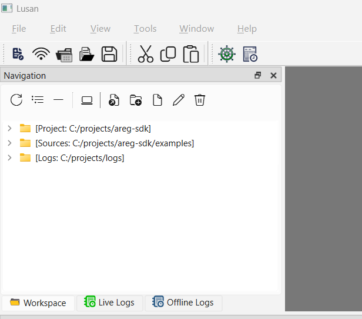
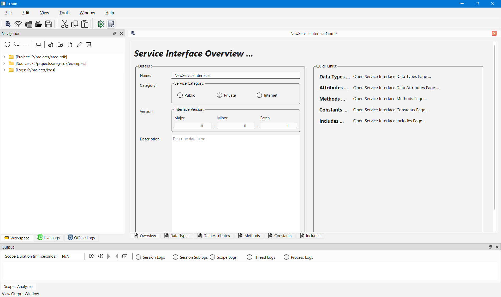
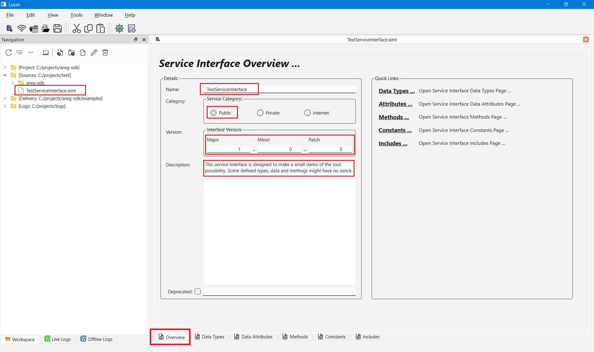
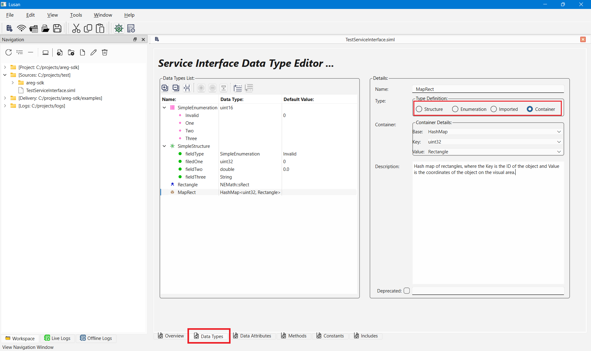
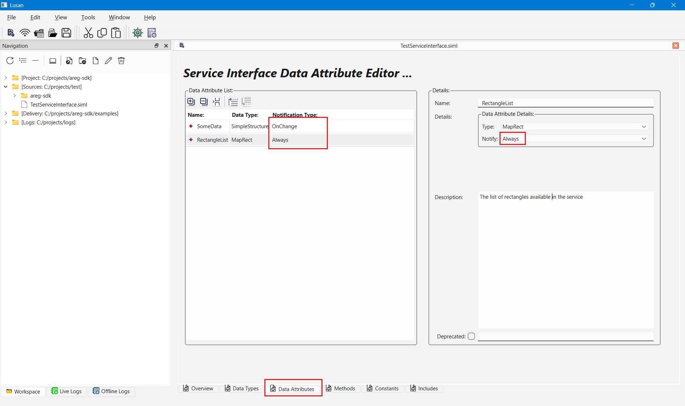
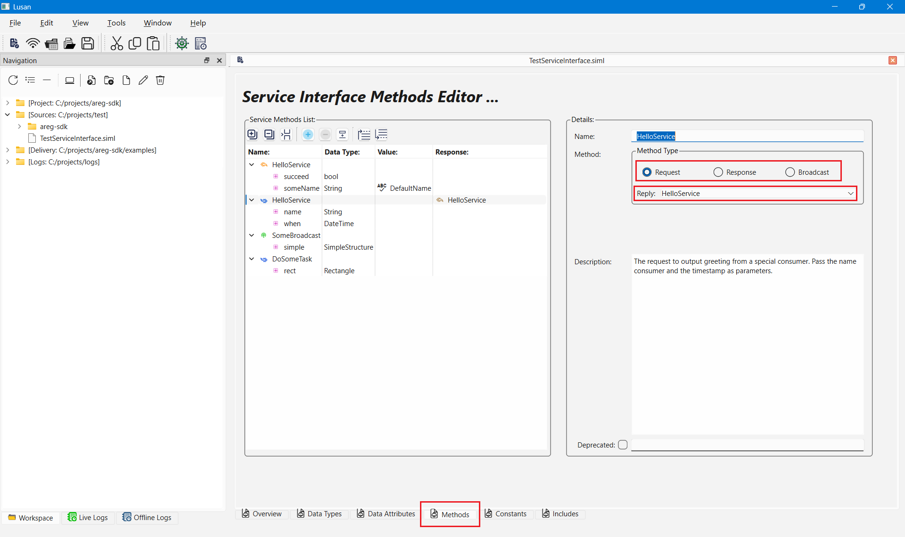
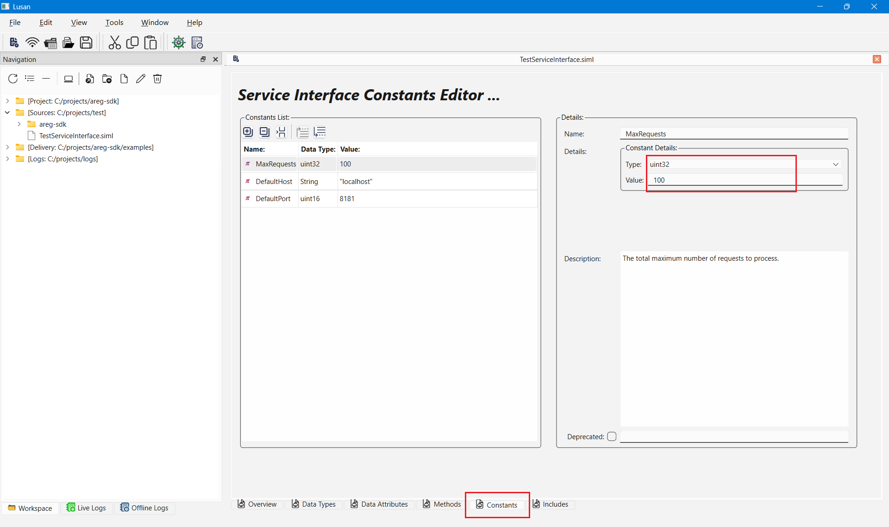

# Creating Service Interface Documents with Lusan

This document explains how to create and maintain **Service Interface documents** using **Lusan** -- the graphical design and diagnostics tool of the **Areg SDK** ecosystem. Service Interfaces define the communication contract between **Service Providers** and **Service Consumers** and serve as the foundation for code generation, runtime communication, and observability in Areg based distributed systems.

---

## Table of Contents

- [Introduction](#introduction)
- [Service Interface Concept in Areg SDK](#service-interface-concept-in-areg-sdk)
- [Why Design Service Interfaces with Lusan](#why-design-service-interfaces-with-lusan)
- [Prerequisites](#prerequisites)
- [Creating a Service Interface](#creating-a-service-interface)
  - [Launching Lusan](#launching-lusan)
  - [Creating or Opening a Document](#creating-or-opening-a-document)
  - [Defining Service Metadata](#defining-service-metadata)
  - [Defining Data Types](#defining-data-types)
  - [Defining Data Attributes](#defining-data-attributes)
  - [Defining Service Methods](#defining-service-methods)
  - [Defining Constants](#defining-constants)
  - [Defining Additional Includes](#defining-additional-includes)
- [Using the Service Interface in a Project](#using-the-service-interface-in-a-project)
- [Best Practices](#best-practices)
- [Summary](#summary)

---

## Introduction

A **Service Interface** describes how distributed components communicate in an Areg based system. It defines data, methods, notifications, and versioning rules in a technology independent manner. The Service Interface is later consumed by the Areg code generator to produce consistent and type safe C++ code for both Service Providers and Service Consumers.

Lusan provides a visual and validated environment to design these interfaces correctly and efficiently.

---

## Service Interface Concept in Areg SDK

A Service Interface defines the following elements:
- Service Interface name, version, and type
- Service specific custom data types
- Data attributes with notification behavior
- Remote methods including requests, responses, and broadcasts
- Constants shared between providers and consumers
- Additional include dependencies

Service Interfaces are **implementation independent**. They describe what the service provides, not how it is implemented. This separation ensures long term stability, compatibility, and maintainability of distributed systems.

---

## Why Design Service Interfaces with Lusan

Although Service Interface files can be written manually, Lusan provides a safer and more productive approach.

Key advantages include:
- Visual modeling instead of manual XML editing
- Immediate validation of interface structure
- Guaranteed compatibility with the Areg code generator
- Easier review, documentation, and maintenance
- Reduced risk of runtime communication errors

Lusan enforces correct relationships between interface elements and prevents many common design mistakes at creation time.

---

## Prerequisites

Before creating Service Interface documents, ensure the following conditions are met:
- Lusan is built and available  
  https://github.com/aregtech/areg-sdk-tools
- Areg SDK is available in the development environment
- Java is installed for later code generation
- Basic understanding of services, methods, and shared data
- Project workspace is configured according to  
  [Using Lusan](./09c-use-lusan.md)

---

## Creating a Service Interface

### Launching Lusan

Start the Lusan application from the build output or installation directory. Select or create a workspace with project specific directories. These directories are displayed in the `Workspace` navigation tab.

---

### Creating or Opening a Document

Use the `File` menu or toolbar to create a new Service Interface document. Existing documents can be opened directly from the workspace navigation.

A newly created interface is initialized with the name `NewServiceInterface`, type `Private`, and version `0.0.1`.

---

### Defining Service Metadata

In the `Overview` section, define the core metadata:

🔹**Service Interface Type**  
  `Private` is used for multithreading only and is not remotely accessible.  
  `Public` supports both multithreading and inter process communication.  
  `Internet` is currently reserved and not selectable.

🔹**Version**  
  Defines compatibility rules between providers and consumers.

🔹**Description**  
  Optional documentation for long term maintenance.

> [!IMPORTANT]
> The Service Interface name is assigned when the document is saved. The name must be a valid C++ identifier and may contain ASCII letters, numbers, and underscore characters. Spaces and special characters are not allowed. The Service Interface name is not the runtime service instance name.

---

### Defining Data Types

Custom data types are defined in the `Data Types` section.

Supported types include:
- Structures with primitive or complex fields
- Enumerations with named values
- Imported types from external headers
- Simple standard containers

All data types are generated within the Service Interface namespace and are available to attributes, methods, and constants.

---

### Defining Data Attributes

Data Attributes represent shared state published by the Service Provider and consumed by Service Consumers.

Attributes are defined in the `Data Attributes` section and support two notification modes:
- `OnChange` sends updates only when the value changes
- `Always` sends updates on every modification

Service Consumers may subscribe or unsubscribe at runtime. The Service Provider is responsible for publishing updates. This mechanism enables reactive and event driven communication.

---

### Defining Service Methods

Service methods define callable operations and notifications.

Supported method types include:
- **Requests** initiated by Service Consumers
- **Responses** sent by Service Providers
- **Broadcasts** used for event notifications and sending multiple data at once

- **Requests** may be blocking or fire-and-forget. Blocking requests are paired with responses and enforce sequential execution. Fire-and-forget requests allow parallel invocation. Advanced scenarios allow manual request unblocking and response ordering using system generated session identifiers.

- **Responses** always belong to a request and may carry output parameters.

- **Broadcasts** are independent notifications that may be subscribed to by multiple Service Consumers.

Lusan validates method relationships and ensures correct request response pairing.

---

### Defining Constants

Constants are defined in the `Constants` section and represent shared read only values.

Constants do not generate notifications and cannot be subscribed to.

---

### Defining Additional Includes

Additional C++ headers required by the Service Interface are defined in the `Includes` section.

These headers are automatically included in the generated code.

---

## Using the Service Interface in a Project

After saving the document, integrate it into the project build:
- Use `addServiceInterface()` or `addServiceInterfaceEx()` in CMake
- Specify the static library name and path to the `.siml` file
- The build triggers `codegen.jar` automatically
- Generated sources are compiled into a static library
- The library is linked by Service Providers and Service Consumers

More details are available in [`addServiceInterface()`](./02b-cmake-functions.md#addserviceinterface) and [Code Generator documentation](./03a-code-generator.md).

---

## Best Practices

- Design Service Interfaces before implementation
- Keep interfaces stable and versioned
- Prefer attributes and broadcasts over polling
- Use asynchronous request patterns when possible
- Review interfaces visually during code reviews

---

## Summary

Lusan provides a visual, validated, and developer friendly workflow for designing Service Interfaces in Areg SDK. By defining interfaces graphically and generating code automatically, development teams reduce errors, improve consistency, and accelerate the creation of scalable distributed systems.

Service Interfaces created with Lusan act as the single source of truth for communication across the entire application.
