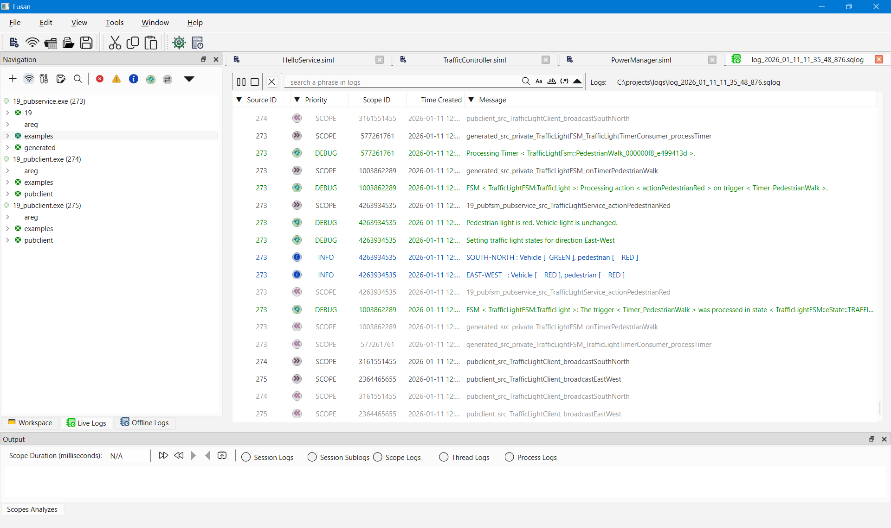

# Lusan Live Log Viewer: Real-Time Monitoring for Areg Applications

This guide explains how to use **Lusan** as a **live log viewer** for Areg-based applications. Live log viewing enables developers to observe, filter, and analyze logs from **distributed systems** in real time while applications are running.

Lusan is designed for **development, debugging, system integration, performance analysis, and runtime diagnostics** of complex multi-process and multi-threaded systems.

---

## Table of Contents

- [Overview](#overview)
- [Why Use Live Log Viewing](#why-use-live-log-viewing)
- [Prerequisites](#prerequisites)
- [Step-by-Step Guide to Live Log Viewing](#step-by-step-guide-to-live-log-viewing)
- [Troubleshooting Live Logging](#troubleshooting-live-logging)
- [Performance Considerations](#performance-considerations)
- [Summary](#summary)

---

## Overview

The Areg SDK provides a built-in logging infrastructure optimized for **distributed, multi-process, and multi-threaded architectures**. Logs generated by multiple applications can be collected centrally and visualized in real time.

Lusan acts as a centralized live log viewer that aggregates logs from multiple threads, processes, and devices into a **single, unified interface**. This provides immediate visibility into system behavior and significantly reduces the time required to debug complex interactions.

### Use Cases

- Interactive development and debugging
- Real-time performance monitoring
- Cross-service and cross-process interaction tracing
- Runtime troubleshooting without restarting applications

### Key Components

**Areg-based Applications**  
Generate structured runtime logs with configurable scopes and priorities.

**Log Collector (`logcollector`)**  
Aggregates logs from all applications at runtime, acting as a central collection point.

**Lusan**  
Connects to `logcollector` and visualizes logs live with filtering, searching, and analysis capabilities.

> [!NOTE]
> Lusan does not generate logs itself, but creates logging file. It connects to the Areg logging infrastructure, saves logs to the database and provides visualization, filtering, analysis, and runtime control.

<div align="right"><kbd><a href="#table-of-contents">↑ Back to top ↑</a></kbd></div>

---

## Why Use Live Log Viewing

Live log viewing with Lusan enables:

- **Immediate Visibility**: Real-time insight into distributed system behavior
- **Centralized Aggregation**: Logs from multiple applications and machines in one view
- **Event Correlation**: Trace interactions across processes and threads
- **Runtime Debugging**: Diagnose issues without application restarts
- **Dynamic Control**: Adjust logging scopes and priorities on-the-fly

These capabilities make Lusan especially valuable for diagnosing timing issues, race conditions, and cross-component interactions in distributed systems.

<div align="right"><kbd><a href="#table-of-contents">↑ Back to top ↑</a></kbd></div>

---

## Prerequisites

Before starting live log monitoring, ensure the following components are available and correctly configured.

### Required Components

| Component | Description |
|-----------|-------------|
| **Lusan** | Built from [areg-sdk-tools](https://github.com/aregtech/areg-sdk-tools) repository |
| **logcollector** | Built from Areg SDK, serves as log aggregation service |
| **Areg Applications** | Applications with logging enabled |
| **Configuration Files** | `areg.init` for applications/logcollector, `lusan.init` for Lusan |

### Configuration Requirements

Both `areg.init` (for applications and `logcollector`) and `lusan.init` (for Lusan) must define the same log service endpoint:

```text
logger::*::service          = logcollector  # Log collector process name
logger::*::connect          = tcpip         # Communication protocol
logger::*::enable::tcpip    = true          # Enable TCP/IP
logger::*::address::tcpip   = 127.0.0.1     # IP address (default: localhost)
logger::*::port::tcpip      = 8282          # Port number (default: 8282)
```

> [!IMPORTANT]
> All applications and Lusan must use the same configuration to communicate with `logcollector`.

**Example Configuration**:
- For local development: `logger::*::address::tcpip = 127.0.0.1`
- For distributed systems: `logger::*::address::tcpip = 192.168.1.100` (logcollector host IP)

<div align="right"><kbd><a href="#table-of-contents">↑ Back to top ↑</a></kbd></div>

---

## Step-by-Step Guide to Live Log Viewing

### Step 1: Launch the Log Collector Service

Run `logcollector` as a console application or system service on a reachable machine.

**Prerequisites**:
- `areg.init` file is accessible to `logcollector`
- TCP/IP address and port are correctly configured
- Network allows connections on the configured port

`logcollector` acts as the central aggregation point for all runtime logs.

#### Option A: Console Mode (Development)

```bash
./build/bin/logcollector
```

Console mode is recommended for development and debugging as it provides immediate feedback.

#### Option B: Service Mode (Testing or Production)

**Linux (systemd)**:

```bash
sudo systemctl enable logcollector.service
sudo systemctl start logcollector.service
```

**Windows**:

```powershell
.\logcollector.exe --install
net start logcollector
```

> [!TIP]
> For detailed information about running `logcollector` as a service, see [Areg SDK Log Collector Service](./04d-logcollector.md).

#### Verification Checklist

- ✅ Confirm successful startup in console or service logs
- ✅ Verify service listens on configured port (default: 8282)
- ✅ Ensure `areg.init` file is accessible

**Testing Port Availability**:
```bash
# Linux/macOS
netstat -an | grep 8282

# Windows
netstat -an | findstr 8282
```

#### Common Issues

**Port Already in Use**
- Change the port in `areg.init`: `logger::*::port::tcpip = 8283`
- Kill conflicting process or use a different port

**Permission Denied**
- Run with appropriate privileges (sudo on Linux, Administrator on Windows)
- Check firewall rules allow the port

**Configuration Not Found**
- Ensure `./config/areg.init` exists or specify path with environment variable
- Verify file permissions allow reading

### Step 2: Connect Lusan to Log Collector

Launch Lusan and establish a connection to the running `logcollector` service.

#### Connection Process

1. **Start Lusan Application**
   ```bash
   cd build/bin
   ./lusan
   ```

2. **Initiate Live Logging**:
   - **Method 1**: Menu → **File → New Live Logs**
   - **Method 2**: Click **New Live Logs** toolbar button
   - **Method 3**: Navigation pane → **Live Logs** tab → **Connect to Log Collector**

3. **Automatic Connection**:
   - Lusan reads settings from `./config/lusan.init`
   - Connects to configured `logcollector` address and port
   - Begins recording logs in real-time mode

4. **Verify Connection Status**:
   - Check for message: `Log observer connected to Log Collector service.`
   - Connection indicator shows green status

<div align="center"><a href="../img/lusan-live-log-connect.png"></a></div>

#### Recorded Log Formats

Lusan automatically saves logs in two formats:

**SQLite Database (`.sqlog`)**
- Primary storage format
- Optimized for Lusan's offline log viewer
- Supports advanced filtering and queries
- **Recommended** for long-term storage and analysis

**Plain Text (`.log`)**
- Human-readable format
- Can be opened with any text editor
- Useful for quick inspection and sharing
- Compatible with standard log analysis tools

> [!TIP]
> Use SQLite database format (`.sqlog`) as primary storage for comprehensive offline analysis with Lusan's offline log viewer.

### Step 3: Start Your Areg Applications

With `logcollector` running and Lusan connected, start your Areg-based applications.

> [!NOTE]
> Applications may be started before Lusan connects. Logs will be captured once Lusan establishes connection to `logcollector`.

#### Application Configuration Requirements

**Required Configuration**:
- `areg.init` file is present and accessible
- Logging is enabled: `log::*::enable = true`
- Remote logging is enabled: `log::*::enable::remote = true`
- Log service configuration matches `logcollector` settings

**Example Application Configuration**:
```text
log::*::enable              = true
log::*::enable::remote      = true
log::*::remote::service     = logger
log::*::scope::*            = DEBUG | SCOPE
```

#### Multi-Source Logging

Lusan can monitor logs from:
- **Multiple Applications**: On the same machine
- **Distributed Processes**: On different machines across the network
- **Multiple Threads**: Within each process
- **Service Providers and Consumers**: All components in a distributed system

#### Automatic Connection

Applications automatically connect to `logcollector` at startup:
1. Application reads `areg.init` configuration
2. Establishes connection to configured log collector
3. Begins sending log messages based on scope priorities
4. Messages appear in Lusan's log viewer in real time

### Step 4: Monitor and Analyze Real-Time Logs

Once connected, logs from all applications appear in the Lusan log viewer in real time.

<div align="center"><a href="../img/lusan-live-log-gen.png"></a></div>

#### Log Viewer Features

**Real-Time Display**
- Logs appear with minimal latency (typically < 100ms)
- Automatic scrolling to newest entries
- Color-coded priority levels for visual distinction

**Log Entry Information**

Each log entry displays:
- **Timestamp**: Date and time of log generation
- **Priority**: DEBUG, INFO, WARN, ERROR, FATAL, or SCOPE
- **Source**: Application (process) name and ID
- **Thread**: Thread name and ID
- **Scope**: Logging scope (function/component identifier)
- **Message**: Log message text

**Interactive Controls**

- **Pause/Resume**: Freeze log stream for detailed inspection
- **Clear**: Clear current log buffer
- **Auto-Scroll**: Toggle automatic scrolling to newest entries
- **Export**: Save filtered logs to file

#### Log Priority Levels

| Priority | Color | Description |
|----------|-------|-------------|
| **DEBUG** | Gray | Detailed diagnostic information |
| **INFO** | Blue | General informational messages |
| **WARN** | Yellow | Warning messages (potential issues) |
| **ERROR** | Orange | Error messages (failures occurred) |
| **FATAL** | Red | Fatal errors (critical failures) |
| **SCOPE** | Green | Function entry/exit boundaries |

### Step 5: Filter and Search Logs

Lusan provides multiple filtering mechanisms to isolate relevant log entries.

#### Scope-Level Filtering (Source Side)

Change logging priorities at the source application level, affecting which logs are generated and sent to `logcollector`.

<div align="center"><a href="../img/lusan-live-log-scope-prio.png"></a></div>

**How to Use**:
1. Open **Live Logs** navigation pane
2. Expand application node to view scopes
3. Right-click scope → **Change Priority**
4. Select new priority level or disable scope
5. Changes take effect immediately

**Benefits**:
- Reduces network traffic by filtering at source
- Decreases `logcollector` load
- Improves application performance by skipping log generation

#### Message-Level Filtering (Viewer Side)

Filter already received logs in the log viewer. This filtering is performed on the Lusan side—logs of unselected priorities are hidden from view but remain in the buffer.

<div align="center"><a href="../img/lusan-live-log-message-prio.png"></a></div>

**Supported Filtering Criteria**:

| Filter Type | Description |
|-------------|-------------|
| **Priority Level** | Show only messages of selected priority levels (DEBUG, INFO, WARN, ERROR, FATAL, SCOPE) |
| **Duration** | Show only messages with duration ≥ specified value (for scope entry/exit timing) |
| **Source** | Show only messages from specified application name |
| **Source ID** | Show only messages from specified process ID |
| **Thread** | Show only messages from specified thread name |
| **Thread ID** | Show only messages from specified thread ID |
| **Text Phrase** | Show only messages containing specified text (supports wildcards: `*`, `?`) |

**Applying Filters**:
- Click arrow on column header
- Select filter criteria
- Multiple filters can be applied simultaneously
- Clear filters to show all messages

#### Filtering in Output Log Analyzer Window

Advanced filtering by selecting and analyzing specific scope sessions.

<div align="center"><a href="../img/lusan-live-log-scope-analyzes.png"></a></div>

**How to Use**:
1. Double-click a log message in the main viewer
2. Log Analyzer Window opens at the bottom (tab: **Scope Analyzes**)
3. Select filtering mode using radio buttons

**Filtering Modes**:

- **Session Logs**: Show only messages from the selected scope session
- **Session Sublogs**: Show messages from selected session and all child scopes
- **Scope Logs**: Show all messages from the scope, regardless of session
- **Thread Logs**: Show all messages from the thread, regardless of scope
- **Process Logs**: Show all messages from the process, regardless of thread or scope

**Use Cases**:
- Trace execution flow through a single function call
- Analyze nested scope hierarchies
- Investigate thread-specific behavior
- Debug process-wide interactions

#### Filtering Best Practices

**Progressive Narrowing**:
1. Start with broad filters (e.g., filter by process)
2. Narrow down by thread
3. Further narrow by scope or text phrase
4. Use scope analyzer for detailed investigation

**Performance Optimization**:
- Use source-side filtering for high-volume logs
- Combine multiple filters for precise investigation
- Clear filters periodically to avoid missing related events

### Step 6: Runtime Logging Control

Lusan enables dynamic control of logging behavior without restarting applications.

#### Dynamic Control Capabilities

**Enable/Disable Log Scopes**
- Turn specific component logging on or off
- Change logging priority levels in real time
- Reduce noise from verbose components
- Enable detailed logging for components under investigation

**Adjust Priority Levels**
- Increase verbosity: `INFO` → `DEBUG` → add `SCOPE`
- Reduce verbosity to minimize overhead
- Per-scope priority control
- Independent control for each application

**Application-Wide Settings**
- Enable/disable all logging for an application
- Bulk scope management
- Quick toggles for emergency situations

**Save Configuration**
- Save current `logcollector` connection settings (IP address and port)
- Save logging scope priorities for all applications
- Persisted configuration used on next application start

<div align="center"><a href="../img/lusan-live-log-config.png"></a></div>

#### Saving Log Settings

**Steps**:
1. Configure desired scope priorities in the Live Logs navigation pane
2. Click **Save log settings** toolbar button
3. Lusan collects scope priority information from each application
4. Sends configuration change request to applications
5. Applications save configuration to `areg.init`
6. On next start, applications use saved priorities

**Configuration Persistence**:
- Scope priorities saved in `areg.init` file
- Settings persist across application restarts
- Can be version-controlled with project configuration

#### Logging Priority Behavior

> [!NOTE]
> Logs are generated if lower-level logging is enabled. For example:
> - Scope with `INFO` level generates: INFO, WARN, ERROR, FATAL
> - `SCOPE` priority is independent and must be enabled explicitly
> - Users can disable log priorities while keeping `SCOPE` enabled
> - If `SCOPE` is not enabled, no entry/exit messages are generated

**Priority Levels (Ascending Order)**:
1. **DEBUG** (lowest) - Generates: DEBUG, INFO, WARN, ERROR, FATAL
2. **INFO** - Generates: INFO, WARN, ERROR, FATAL
3. **WARN** - Generates: WARN, ERROR, FATAL
4. **ERROR** - Generates: ERROR, FATAL
5. **FATAL** (highest) - Generates: FATAL only
6. **SCOPE** (independent) - Generates: Enter/Exit scope messages
7. **NOTSET** - Disables logging for the scope

#### Benefits of Runtime Control

- **No Downtime**: Adjust logging without service interruption
- **Performance Optimization**: Disable verbose logging in production
- **Targeted Debugging**: Enable detailed logs only where needed
- **Production Diagnostics**: Safely investigate issues in live systems

#### Best Practices

**Production Environments**:
- Keep default logging at `INFO` or `WARN` level
- Disable `SCOPE` logging by default (reduces overhead)
- Enable `DEBUG` and `SCOPE` only when actively investigating
- Disable verbose logging after capturing necessary information

**Development Environments**:
- Use `DEBUG | SCOPE` for active development
- Reduce verbosity in stable components
- Document scope purposes for effective filtering

**Performance-Critical Systems**:
- Minimize logging in hot paths
- Use fire-and-forget logging patterns
- Monitor `logcollector` resource usage

<div align="right"><kbd><a href="#table-of-contents">↑ Back to top ↑</a></kbd></div>

---

## Troubleshooting Live Logging

### Logs Not Appearing

#### Check Log Collector Status

Verify `logcollector` is running.

**Linux**:
```bash
ps aux | grep logcollector
```

**Windows**:
```powershell
tasklist | findstr logcollector
```

If not running, start `logcollector` as described in [Step 1](#step-1-launch-the-log-collector-service).

#### Verify Network Connectivity

Test connection to `logcollector` service port:

```bash
# Using telnet
telnet 127.0.0.1 8282

# Using netcat
nc -zv 127.0.0.1 8282

# Using curl (if HTTP endpoint available)
curl http://127.0.0.1:8282
```

**Expected Result**: Connection successful or port responding.

#### Confirm Application Configuration

**Check `areg.init` for applications and `logcollector`**:
- File exists and is readable: `./config/areg.init`
- Logging is enabled: `log::*::enable = true`
- Remote logging is enabled: `log::*::enable::remote = true`
- Service address matches `logcollector` host
- Port number matches `logcollector` configuration

**Check `lusan.init` for Lusan**:
- File exists and is readable: `./config/lusan.init`
- Logger service configuration matches `logcollector`

#### Verify Scope Priorities

Check that application scopes have logging enabled:
```text
log::*::scope::* = DEBUG | SCOPE    # Enable all scopes
```

If scopes are set to `NOTSET`, no logs will be generated.

### Performance Issues

#### High Log Volume

**Symptoms**: Lusan lag, high CPU usage, memory consumption

**Solutions**:
- Increase filter specificity to reduce displayed logs
- Disable unnecessary scopes at source
- Reduce priority verbosity (INFO instead of DEBUG)
- Use offline analysis for intensive logging scenarios
- Clear log buffer periodically

#### Network Latency

**Symptoms**: Delayed log appearance, connection timeouts

**Solutions**:
- Ensure `logcollector` runs on the same network segment
- Check for network congestion or bandwidth issues
- Consider local `logcollector` instances for remote sites
- Use wired connections instead of wireless for critical systems

#### Memory Consumption

**Symptoms**: Lusan or `logcollector` consuming excessive memory

**Solutions**:
- Enable log rotation in `logcollector`
- Clear old logs from Lusan buffer
- Reduce log retention time
- Increase system RAM if log volume is legitimately high

### Connection Drops

**Symptoms**: Intermittent log gaps, disconnection messages, connection lost errors

#### Check Network Stability

- Verify network connection between Lusan and `logcollector` is stable
- Check for intermittent network issues
- Review router/switch logs for errors

#### Verify Log Collector Resources

- Check `logcollector` CPU usage (should be < 50%)
- Check `logcollector` memory usage
- Review `logcollector` logs for errors or warnings
- Ensure `logcollector` service has not crashed

#### Review Firewall Rules

- Verify firewall allows TCP port 8282 (or configured port)
- Check network policies don't block connections
- Temporarily disable firewall to test (development only)

#### Log Collector Crash

If `logcollector` has crashed:
1. Review crash logs or core dumps
2. Check system resource limits (ulimit on Linux)
3. Verify sufficient disk space for log files
4. Restart `logcollector` service

<div align="right"><kbd><a href="#table-of-contents">↑ Back to top ↑</a></kbd></div>

---

## Performance Considerations

### System Impact

#### Lusan Client

**Resource Usage**:
- **CPU**: Minimal during normal operation (< 5%)
- **Memory**: Scales with log volume and buffer size (typically 100-500 MB)
- **Network**: Depends on log volume (typical: 1-10 Mbps)

**Best Practices**:
- Use filtering to reduce processed log volume
- Clear old logs periodically during long sessions
- Close unused live log connections
- Monitor Lusan resource usage on constrained systems

#### Log Collector

**Resource Usage**:
- **CPU**: Scales with number of connected applications and log volume
- **Memory**: Buffering and log storage (typical: 200 MB - 2 GB)
- **Network**: Aggregate of all application log streams
- **Disk I/O**: If saving logs to disk

**Optimization**:
- Run `logcollector` on dedicated hardware for large deployments
- Use SSD storage for log files
- Configure log rotation to manage disk space
- Monitor resource usage with system tools

### Production Environments

#### Recommended Settings

**Default Logging Levels**:
- Production: `log::*::scope::* = INFO` (without SCOPE)
- Staging: `log::*::scope::* = INFO | SCOPE`
- Development: `log::*::scope::* = DEBUG | SCOPE`

**Scope Enablement**:
- Enable `DEBUG` and `SCOPE` selectively and temporarily
- Monitor impact on application performance
- Disable verbose logging after investigation

**Infrastructure**:
- Dedicated logging infrastructure for high-volume systems
- Monitor `logcollector` resource usage continuously
- Set up alerts for connection issues or resource exhaustion
- Plan for log storage capacity (estimate 10-100 MB/hour per application)

#### Performance Monitoring

**Key Metrics**:
- Log message rate (messages/second)
- Network bandwidth usage
- `logcollector` CPU and memory usage
- Application performance impact (compare with logging disabled)

**Alerting**:
- Set alerts for high message rates
- Monitor connection drops
- Alert on `logcollector` resource exhaustion

<div align="right"><kbd><a href="#table-of-contents">↑ Back to top ↑</a></kbd></div>

---

## Summary

Lusan's live log viewer transforms distributed logging from a challenge into a powerful development and debugging tool. By centralizing logs, providing real-time visibility, and enabling dynamic control, Lusan significantly reduces the time required to understand and diagnose issues in complex Areg-based systems.

### Key Capabilities

- ✅ **Centralized View**: All distributed logs in a single interface
- ✅ **Real-Time Monitoring**: Minimal latency (< 100ms typical)
- ✅ **Powerful Filtering**: Multiple criteria, scope analysis, text search
- ✅ **Runtime Control**: Adjust logging without application restarts
- ✅ **Dual Format Logging**: SQLite database and plain text

### Essential Tool For

- Distributed system development and debugging
- Multi-threaded application analysis
- Production troubleshooting and diagnostics
- System integration testing
- Performance optimization

### Next Steps

- **Explore Offline Analysis**: [Lusan Offline Log Analysis](./06g-lusan-offline-logging.md) for post-mortem debugging
- **Configure Log Collector**: [Log Collector Service Setup](./04d-logcollector.md) for production deployment
- **Optimize Configuration**: [Key-Value Data Persistence](./03b-key-value-persistence.md) for advanced settings

<div align="right"><kbd><a href="#table-of-contents">↑ Back to top ↑</a></kbd></div>

---

Copyright © 2026, Aregtech, www.areg.tech, email: info[at]areg.tech
