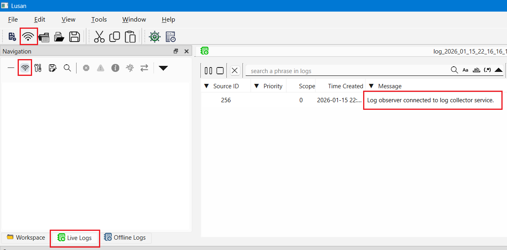
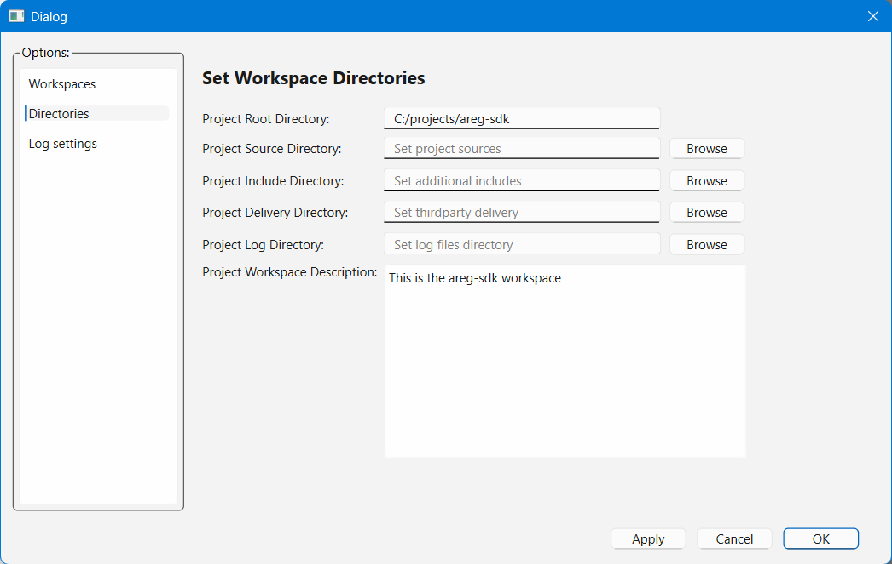
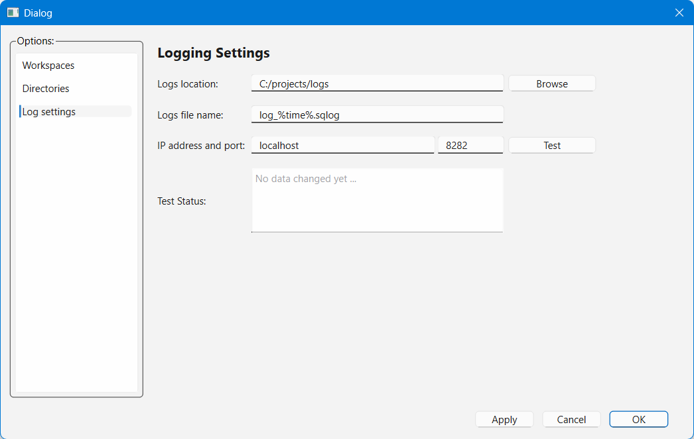
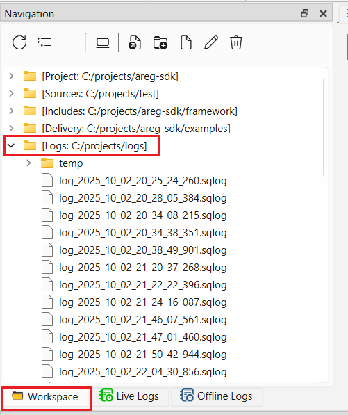
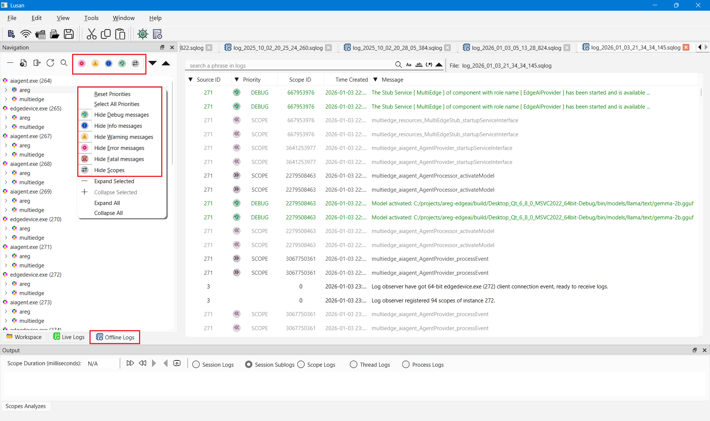
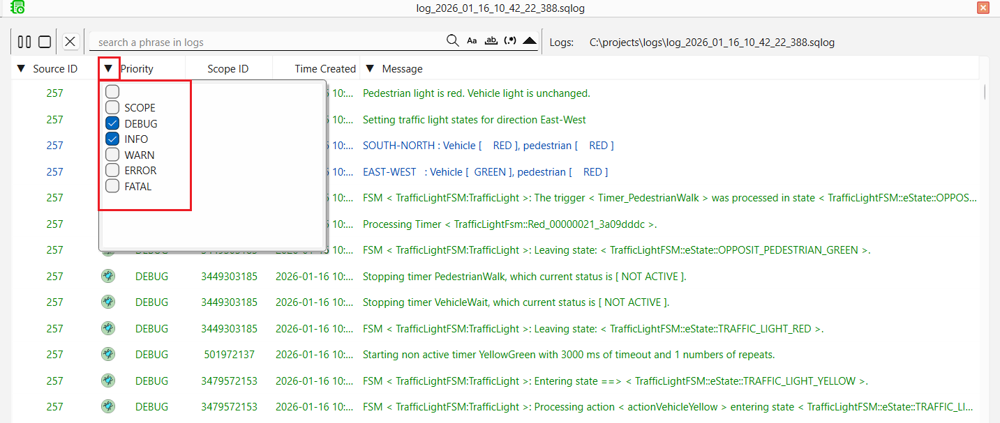
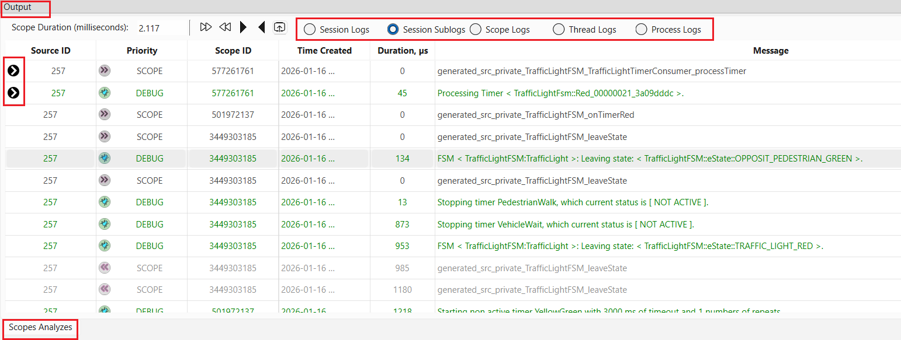

# Lusan Offline Log Viewer: Post-Mortem Analysis for AREG Applications

This document explains how to use **Lusan** for **offline log analysis**. Offline mode allows developers to load and analyze previously recorded log files without running applications or log collectors. It is ideal for post-mortem debugging, issue investigation, and log sharing across teams.

---

## Table of Contents

- [Overview](#overview)
- [Why Use Offline Log Analysis](#why-use-offline-log-analysis)
- [Prerequisites](#prerequisites)
- [Recording Logs for Offline Analysis](#recording-logs-for-offline-analysis)
  - [Method 1: Using logcollector](#method-1-using-logcollector)
  - [Method 2: Using logobserver](#method-2-using-logobserver)
  - [Method 3: Using Lusan GUI](#method-3-using-lusan-gui)
- [Step-by-Step Guide to Offline Log Analysis](#step-by-step-guide-to-offline-log-analysis)
  - [Step 1: Open Recorded Log Files](#step-1-open-recorded-log-files)
  - [Step 2: Navigate the Log Session](#step-2-navigate-the-log-session)
  - [Step 3: Apply Filters and Search](#step-3-apply-filters-and-search)
- [Advanced Offline Analysis Features](#advanced-offline-analysis-features)
- [Use Cases for Offline Analysis](#use-cases-for-offline-analysis)
- [Best Practices for Offline Logging](#best-practices-for-offline-logging)
- [Comparison: Live Logging vs Offline Log Analysis](#comparison-live-logging-vs-offline-log-analysis)
- [Summary](#summary)

---

## Overview

Offline mode is designed for **post-mortem debugging**, **incident investigation**, **performance analysis**, and **collaborative troubleshooting**, especially for issues that occur in production or cannot be reproduced easily.

Lusan provides the same rich navigation, filtering, and correlation capabilities available in live logging, but operates entirely on recorded log data.

---

## Why Use Offline Log Analysis

Offline log analysis provides capabilities that are difficult or impossible to achieve with live logging alone.

### Reproducibility

Recorded logs capture the exact sequence of events, enabling:
- Repeated analysis from different perspectives
- Correlation discovery over multiple review sessions
- Validation of fix effectiveness against the original issue

### Collaboration

Share log files across teams:
- Remote team members can analyze issues independently
- Subject matter experts can review without system access
- Support teams can investigate customer issues safely

### No Runtime Dependencies

Analyze logs anywhere:
- No need for running applications
- No `logcollector` service required
- Works offline or in isolated environments
- Reduces system load during analysis

### Historical Analysis

Maintain forensic capabilities:
- Compare behavior across different time periods
- Identify regression patterns
- Track performance trends
- Meet compliance and audit requirements

---

## Prerequisites

### Required Components

- **Lusan application** - installed on system or built from the [areg-sdk-tools repository](https://github.com/aregtech/areg-sdk-tools)
- **Recorded log files** - in supported formats, generated by `logcollector`, `logobserver`, or Lusan

> [!NOTE]
> Unlike live logging, offline analysis requires no network connectivity, running services, or active applications. The `./config/lusan.init` file is optional but required if you switch to live logging. The dependency on the AREG Framework still exists.

---

## Recording Logs for Offline Analysis

Before you can perform offline analysis, logs must be recorded during runtime.

### Method 1: Using `logcollector`

Configure `logcollector` to save logs to files or database. The `./config/areg.init` file should contain the following configuration:

```ini
log::*::enable                  = true              # Global logging enable/disable flag
log::*::enable::remote          = true              # Remote logging enable/disable flag
log::logcollector::enable::db   = true              # Log Collector: enable database output
log::logcollector::db::engine   = sqlite3           # Log Collector: database engine
log::logcollector::db::name     = log_%time%.sqlog  # Log Collector: database name
log::logcollector::db::location = ./logs            # Log Collector: database location
```

🔹**Benefits:**
- Automatic recording of all aggregated logs
- Structured storage in database format
- No application code changes required
- Centralized log collection point

---

### Method 2: Using `logobserver`

Record logs using the `logobserver` console tool of AREG SDK. The `./config/areg.init` file should contain the following configuration:

```ini
log::*::enable                  = true              # Global logging enable/disable flag
log::*::enable::remote          = true              # Remote logging enable/disable flag
log::logobserver::enable::db    = true              # Logobserver: enable database output
log::logobserver::db::engine    = sqlite3           # Logobserver: database engine
log::logobserver::db::name      = log_%time%.sqlog  # Logobserver: database name
log::logobserver::db::location  = ./logs            # Logobserver: database location
```

🔹**Benefits:**
- Selective recording of specific sessions
- Lightweight and flexible
- Command-line scriptable
- Works with existing `logcollector` setup

> [!TIP]
> **Tip:** More details about the `logobserver` console application, configuration, and command-line options can be found in the [Log Observer Documentation](./04c-logobserver.md).

---

### Method 3: Using Lusan GUI

Record directly from Lusan's live view:

1. Start the Lusan application
2. Select one of the following options:
   - In the menu, select `File` → `New Live Logs`
   - Click the `New Live Logs` toolbar button
   - Switch to the `Live Logs` tab in the Navigation pane and click `Connect to Log Collector`
3. Lusan automatically connects using settings from `./config/lusan.init`
4. Once connected to `logcollector`, Lusan records logs in real-time to a `.sqlog` file

<div align="center"><a href="../img/lusan-live-log-connect.png"></a></div>

🔹**Benefits:**
- Visual confirmation of recorded data
- Pause, resume, and manage recordings
- Collection of scopes and priorities of interest
- User-friendly interface

🔹**Recorded Log Formats:**
- **`.sqlog`** - SQLite3 database format (recommended for Lusan offline analysis)
- **`.log`** - Plain text format (can be opened with any text editor)

🔹**Best Practice:**  
  Use SQLite3 database format (`.sqlog`) for primary storage to enable full-featured analysis with Lusan's offline log viewer.

---

## Step-by-Step Guide to Offline Log Analysis

### Step 1: Open Recorded Log Files

Launch Lusan and open previously recorded logs. If the `Project Log Directory` is configured, logs appear in the Workspace Navigation pane.

#### Configure Project Log Directory

If the `Project Log Directory` of the workspace is configured, the Workspace Navigation pane will display the directory contents, and saved logs can be opened directly from the navigation pane.

**To configure the Project Log Directory:**
1. Go to menu `Tools` → `Options`
2. In the opened dialog, select `Directories` option
3. Update the `Project Log Directory` field to display the content in the `Workspace` navigation pane

<div align="center"><a href="../img/lusan-option-workspace-dirs.png"></a></div>

**Alternative: Configure Log Settings**

You can also configure the log storage directory:
1. In the Options dialog, select `Log settings`
2. In the `Logs location:` field, specify the path to the log file storage directory

<div align="center"><a href="../img/lusan-option-logcollector.png"></a></div>

#### Opening Log Files

🔹**Method 1: From Workspace Navigation Pane**

Open logs directly from the `Workspace` navigation pane:

<div align="center"><a href="../img/lusan-navigation-logs.png"></a></div>

🔹**Method 2: From File Menu**

Open logs via menu: `File` → `Open Offline Logs`, or press `Ctrl + F`

**Loading Multiple Files:**

Lusan supports loading multiple log files simultaneously to:
- Compare logs from different sessions
- Analyze related incidents side-by-side
- View chronological timeline across sessions

---

### Step 2: Navigate the Log Session

Once loaded, Lusan presents a complete recorded session.

**Navigation Tools:**

🔹**Timeline Scrubber:**
  - Visual representation of the entire session duration
  - Click to jump to any point in time
  - Color-coded sections showing activity intensity

🔹**Scope Tree:**
  - Hierarchical view of all instances and scopes in the log
  - Show and hide logs of specific priorities on individual scopes
  - Expandable tree structure for drilling down into components

---

### Step 3: Apply Filters and Search

Offline analysis provides similar powerful filtering capabilities as live logging.

**Available Filtering Methods:**

#### 1. Filtering by Scope Priority Level

Filter by scope priority level via selecting/deselecting priority buttons on the Navigation pane or via the context menu when selecting a scope node and right-clicking on it. This filtering is performed on the database side, showing or hiding scope logs of the selected priority levels.

<div align="center"><a href="../img/lusan-offline-log-scopes.png"></a></div>

You can select/deselect scope-based priority levels to show or hide logs. The display is independent of priority level hierarchy. For example, if the `DEBUG` level of a scope node is selected, but `WARN` and `INFO` levels are not selected, only `DEBUG` level logs of that scope are shown while `WARN` and `INFO` logs are hidden. This allows filtering of particular components, even specific methods.

#### 2. Message-Level Filtering

Filter by message priority level in the log message window, functioning the same as in live logging. This filtering is performed on the Lusan side, and logs of unselected priorities will be hidden from the log viewer.

<div align="center"><a href="../img/lusan-live-log-message-prio.png"></a></div>

Multiple filtering criteria can be selected simultaneously. Click the arrow on the column header to apply filters.

🔹**Currently Supported Filtering Criteria:**
- **Filtering by Priority Level** - Show only messages of selected priority levels
- **Filtering by Duration** - Show only messages with duration values greater than or equal to the specified value
- **Filtering by Source** - Show only messages from the specified source name
- **Filtering by Source ID** - Show only messages from the specified source ID
- **Filtering by Thread** - Show only messages from the specified thread name
- **Filtering by Thread ID** - Show only messages from the specified thread ID
- **Filtering by Text Phrase** - Show only messages containing the specified text phrase in log messages (supports wildcards)

#### 3. Filtering in Output Log Analyzes Window

Filtering in the output `Log Analyzes` window works the same way as in live logging. Double-click on a message to select logs of the scope and session you want to analyze. This marks messages from the session of the selected scope and displays them in the Output Log Analyzer Window at the bottom of the application.

Use the following radio buttons to display filtered log messages:
- **Session Logs** - Show only messages of the selected scope session
- **Session Sublogs** - Show only messages of the selected scope session and all its child scopes
- **Scope Logs** - Show only messages of the selected scope, regardless of session
- **Thread Logs** - Show only messages of the selected thread, regardless of scope and session
- **Process Logs** - Show only messages of the selected process, regardless of thread, scope, and session

<div align="center"><a href="../img/lusan-live-log-scope-analyzes.png"></a></div>

**Filtering Best Practices:**
- Start with broad filters
- Narrow down progressively
- Combine multiple filters for precise investigation

---

## Advanced Offline Analysis Features

### Session Comparison

Compare logs from different time periods:
- Before vs. after a deployment
- Good run vs. failed run
- Different configuration scenarios
- Performance baseline vs. degraded state

### Timing Analysis

Measure execution durations:
- Method execution times
- Request processing latency
- Component response times

### Bottleneck Identification

Find performance issues:
- Slowest operations
- Resource wait times
- Network latency spikes

### Advanced Queries

Use SQL query language for complex searches directly in the SQLite database for advanced analysis and custom reporting.

---

## Use Cases for Offline Analysis

Offline analysis is ideal for:
- **Post-mortem debugging** - Investigate production incidents after they occur
- **Root cause analysis** - Deep-dive into complex issues without time pressure
- **Reviewing logs from customer environments** - Analyze issues reported by customers
- **Training and documentation** - Use real-world logs for educational purposes
- **Sharing logs with distributed teams** - Collaborate across time zones and locations
- **Compliance and auditing** - Maintain historical records for regulatory requirements
- **Performance benchmarking** - Compare system behavior across versions or configurations

---

## Best Practices for Offline Logging

### Recording Strategy

- Always record logs for complex or intermittent issues
- Store log files with clear timestamps and context in filenames
- Use descriptive naming conventions (e.g., `production_failure_2026-01-15.sqlog`)
- Configure automatic log rotation to manage disk space

### Storage Management

- Archive important logs for long-term reference
- Compress old log files to save storage space
- Maintain a log retention policy aligned with project requirements
- Back up critical incident logs to multiple locations

### Analysis Workflow

- Share offline logs with the team for collaborative debugging
- Use offline analysis to validate fixes before redeploying
- Document findings and correlations discovered during analysis
- Create playbooks for common issue patterns identified in logs

### Performance Optimization

- Use per-method execution measurement in the logs to find performance issues
- Track the sequences of calls and parallel tasks in the logs to identify bottlenecks
- Find performance gaps in the logs by comparing execution times across different runs
- Optimize the business logic to perform parallel computing based on log insights

---

## Comparison: Live Logging vs Offline Log Analysis

This table highlights when to use Live Log Viewer versus Offline Log Viewer in Lusan and how they complement each other.

| Aspect                        | Live Log Viewer                          | Offline Log Viewer                        |
|-------------------------------|------------------------------------------|-------------------------------------------|
| **Data Source**               | Real-time logs from running applications | Previously recorded log files             |
| **Requires Running Apps**     | Yes                                      | No                                        |
| **Requires `logcollector`**   | Yes                                      | No                                        |
| **Network Connectivity**      | Required                                 | Not required                              |
| **Runtime Overhead**          | Yes (configurable)                       | None                                      |
| **Best Suited For**           | Active development and debugging         | Post-mortem and deep investigation        |
| **Incident Reproduction**     | Limited                                  | Full replay of recorded events            |
| **Collaboration**             | Requires shared environment              | Shareable log files                       |
| **Performance Analysis**      | Near real-time observation               | Precise historical timing analysis        |
| **Production Safety**         | Medium (depends on verbosity)            | High (read-only analysis)                 |
| **Log Scope Control**         | Dynamic at runtime                       | Fixed to recorded configuration           |
| **Multi-Session Comparison**  | Limited                                  | Native support                            |
| **SQL-Based Analysis**        | No                                       | Yes (SQLite `.sqlog`)                     |

**Recommended Usage Pattern:**
- Use **Live Logging** during development, integration, and early testing
- Use **Offline Log Analysis** for production incidents, audits, regression analysis, and knowledge sharing
- **Combine both modes:** Capture logs live, then analyze them offline for deeper insights

---

## Summary

Lusan's offline log viewer is an indispensable tool for thorough analysis of AREG-based distributed systems and multithreading applications. By enabling detailed examination of recorded sessions without runtime dependencies, it facilitates effective debugging, collaboration, and knowledge building across development teams. It is an essential tool for production diagnostics and long-term maintenance.

**Key Capabilities:**
- ✅ No runtime dependencies required
- ✅ Complete session replay and navigation
- ✅ Powerful filtering and correlation capabilities
- ✅ Support for multiple simultaneous log files
- ✅ Advanced query capabilities via SQLite database
- ✅ Flexible recording options (logcollector, logobserver, Lusan)

**Complementary to Live Logging:**
- **Live logging** - For active development and immediate feedback
- **Offline analysis** - For deep investigation, documentation, and collaboration
