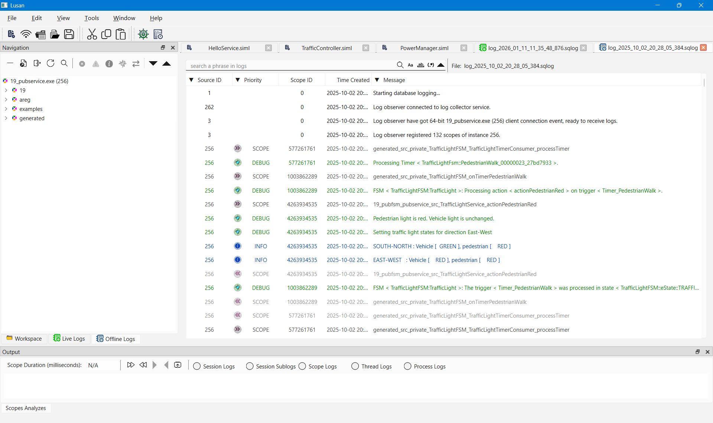

# Lusan Offline Log Viewer: Post-Mortem Analysis for Areg Applications

This guide explains how to use **Lusan** for **offline log analysis**. Offline mode allows developers to load and analyze previously recorded log files without running applications or log collectors. It is ideal for post-mortem debugging, issue investigation, and log sharing across teams.

---

## Table of Contents

- [Overview](#overview)
- [Why Use Offline Log Analysis](#why-use-offline-log-analysis)
- [Prerequisites](#prerequisites)
- [Recording Logs for Offline Analysis](#recording-logs-for-offline-analysis)
- [Step-by-Step Guide to Offline Log Analysis](#step-by-step-guide-to-offline-log-analysis)
- [Advanced Offline Analysis Features](#advanced-offline-analysis-features)
- [Use Cases for Offline Analysis](#use-cases-for-offline-analysis)
- [Best Practices for Offline Logging](#best-practices-for-offline-logging)
- [Comparison: Live Logging vs Offline Log Analysis](#comparison-live-logging-vs-offline-log-analysis)
- [Summary](#summary)

---

## Overview

Offline mode is designed for **post-mortem debugging**, **incident investigation**, **performance analysis**, and **collaborative troubleshooting**, especially for issues that occur in production or cannot be reproduced easily.

Lusan provides the same rich navigation, filtering, and correlation capabilities available in live logging, but operates entirely on recorded log data.

<div align="right"><kbd><a href="#table-of-contents">↑ Back to top ↑</a></kbd></div>

---

## Why Use Offline Log Analysis

Offline log analysis provides capabilities that are difficult or impossible to achieve with live logging alone.

### Reproducibility

Recorded logs capture the exact sequence of events, enabling:
- Repeated analysis from different perspectives
- Correlation discovery over multiple review sessions
- Validation of fix effectiveness against the original issue

### Collaboration

Share log files across teams:
- Remote team members can analyze issues independently
- Subject matter experts can review without system access
- Support teams can investigate customer issues safely

### No Runtime Dependencies

Analyze logs anywhere:
- No need for running applications
- No `logcollector` service required
- Works offline or in isolated environments
- Reduces system load during analysis

### Historical Analysis

Maintain forensic capabilities:
- Compare behavior across different time periods
- Identify regression patterns
- Track performance trends
- Meet compliance and audit requirements

<div align="right"><kbd><a href="#table-of-contents">↑ Back to top ↑</a></kbd></div>

---

## Prerequisites

### Required Components

| Component | Requirement | Notes |
|-----------|-------------|-------|
| **Lusan** | Built from [areg-sdk-tools](https://github.com/aregtech/areg-sdk-tools) | Main offline analysis tool |
| **Recorded Log Files** | `.sqlog` or `.log` format | Generated by `logcollector`, `logobserver`, or Lusan |

> [!NOTE]
> Unlike live logging, offline analysis requires no network connectivity, running services, or active applications. The `./config/lusan.init` file is optional but required if you switch to live logging. Lusan still depends on the Areg Framework for log parsing and visualization.

<div align="right"><kbd><a href="#table-of-contents">↑ Back to top ↑</a></kbd></div>

---

## Recording Logs for Offline Analysis

Before you can perform offline analysis, logs must be recorded during runtime.

### Method 1: Using `logcollector`

Configure `logcollector` to save logs to files or database. The `./config/areg.init` file should contain the following configuration:

```text
log::*::enable                  = true              # Global logging enable/disable flag
log::*::enable::remote          = true              # Remote logging enable/disable flag
log::logcollector::enable::db   = true              # Log Collector: enable database output
log::logcollector::db::engine   = sqlite3           # Log Collector: database engine
log::logcollector::db::name     = log_%time%.sqlog  # Log Collector: database name
log::logcollector::db::location = ./logs            # Log Collector: database location
```

**Benefits:**
- Automatic recording of all aggregated logs
- Structured storage in database format
- No application code changes required
- Centralized log collection point

### Method 2: Using `logobserver`

Record logs using the `logobserver` console tool. The `./config/areg.init` file should contain the following configuration:

```text
log::*::enable                  = true              # Global logging enable/disable flag
log::*::enable::remote          = true              # Remote logging enable/disable flag
log::logobserver::enable::db    = true              # Logobserver: enable database output
log::logobserver::db::engine    = sqlite3           # Logobserver: database engine
log::logobserver::db::name      = log_%time%.sqlog  # Logobserver: database name
log::logobserver::db::location  = ./logs            # Logobserver: database location
```

**Benefits:**
- Selective recording of specific sessions
- Lightweight and flexible
- Command-line scriptable
- Works with existing `logcollector` setup

> [!TIP]
> More details about the `logobserver` console application, configuration, and command-line options can be found in the [Log Observer Documentation](./04c-logobserver.md).

### Method 3: Using Lusan GUI

Record directly from Lusan's live view:

**Steps:**
1. Start the Lusan application
2. Select one of the following options:
   - In the menu, select **File → New Live Logs**
   - Click the **New Live Logs** toolbar button
   - Switch to the **Live Logs** tab in the Navigation pane and click **Connect to Log Collector**
3. Lusan automatically connects using settings from `./config/lusan.init`
4. Once connected to `logcollector`, Lusan records logs in real-time to a `.sqlog` file

<div align="center"><a href="../img/lusan-live-log-connect.png"></a></div>

**Benefits:**
- Visual confirmation of recorded data
- Pause, resume, and manage recordings
- Collection of scopes and priorities of interest
- User-friendly interface

**Recorded Log Formats:**
- **`.sqlog`**: SQLite3 database format (recommended for Lusan offline analysis)
- **`.log`**: Plain text format (can be opened with any text editor)

> [!TIP]
> Use SQLite3 database format (`.sqlog`) for primary storage to enable full-featured analysis with Lusan's offline log viewer.

<div align="right"><kbd><a href="#table-of-contents">↑ Back to top ↑</a></kbd></div>

---

## Step-by-Step Guide to Offline Log Analysis

### Step 1: Open Recorded Log Files

Launch Lusan and load previously recorded log files.

**Opening Methods:**

**Method 1: File Menu**
1. Launch Lusan
2. Navigate to **File → Open Offline Logs**
3. Browse to the location of recorded log files
4. Select one or more `.sqlog` or `.log` files
5. Click **Open**

**Method 2: Drag and Drop**
1. Launch Lusan
2. Drag log files from file manager
3. Drop onto Lusan window
4. Files open automatically in offline mode

**Method 3: Workspace Navigation**
1. Configure workspace log directory (see [Setup and Using Lusan](./06d-setup-lusan.md))
2. Browse to log directory in workspace navigation pane
3. Double-click a log file to open

<div align="center"><a href="../img/lusan-offline-log-gen.png"></a></div>

**Multi-File Support:**
- Open multiple log files simultaneously
- Each file opens in a separate tab
- Compare logs from different sessions or time periods
- Switch between files using tab bar

### Step 2: Navigate the Log Session

Once a log file is opened, navigate through the recorded session using Lusan's navigation features.

**Navigation Controls:**

**Timeline Navigation**
- Scroll through logs chronologically
- Jump to specific timestamps
- Bookmark important events
- Navigate to first/last log entry

**Scope Tree Navigation**

The scope tree on the left displays the hierarchical structure of logging scopes from the recorded session:

<div align="center"><a href="../img/lusan-offline-log-scopes.png"></a></div>

- **Expand/Collapse**: Navigate scope hierarchy
- **Scope Selection**: Click to highlight logs from specific scope
- **Priority Indicators**: Visual indication of enabled priority levels

**Log Entry Details**

Each log entry displays:
- **Timestamp**: Date and time of log generation
- **Priority**: DEBUG, INFO, WARN, ERROR, FATAL, or SCOPE
- **Source**: Application (process) name and ID
- **Thread**: Thread name and ID
- **Scope**: Logging scope (function/component identifier)
- **Message**: Log message text
- **Duration**: Execution time (for scope entry/exit pairs)

### Step 3: Apply Filters and Search

Lusan provides multiple filtering mechanisms to isolate relevant log entries in offline mode.

#### 1. Scope-Level Filtering

Filter logs by selecting or deselecting scope nodes in the scope tree.

You can select/deselect scope-based priority levels to show or hide logs. The display is independent of priority level hierarchy.

**Example:**
- If `DEBUG` level of a scope node is selected
- But `WARN` and `INFO` levels are not selected
- Only `DEBUG` level logs of that scope are shown
- `WARN` and `INFO` logs are hidden

This allows filtering of particular components, even specific methods.

#### 2. Message-Level Filtering

Filter by message priority level in the log message window, functioning the same as in live logging. This filtering is performed on the Lusan side—logs of unselected priorities are hidden from the log viewer.

<div align="center"><a href="../img/lusan-live-log-message-prio.png"></a></div>

Multiple filtering criteria can be selected simultaneously. Click the arrow on the column header to apply filters.

**Currently Supported Filtering Criteria:**

| Filter Type | Description |
|-------------|-------------|
| **Priority Level** | Show only messages of selected priority levels (DEBUG, INFO, WARN, ERROR, FATAL, SCOPE) |
| **Duration** | Show only messages with duration ≥ specified value (for scope timing analysis) |
| **Source** | Show only messages from specified application name |
| **Source ID** | Show only messages from specified process ID |
| **Thread** | Show only messages from specified thread name |
| **Thread ID** | Show only messages from specified thread ID |
| **Text Phrase** | Show only messages containing specified text (supports wildcards: `*`, `?`) |

#### 3. Filtering in Output Log Analyzer Window

Filtering in the output **Log Analyzer** window works the same way as in live logging. Double-click on a message to select logs of the scope and session you want to analyze. This marks messages from the session of the selected scope and displays them in the Output Log Analyzer Window at the bottom of the application.

Use the following radio buttons to display filtered log messages:

- **Session Logs**: Show only messages of the selected scope session
- **Session Sublogs**: Show messages of the selected scope session and all its child scopes
- **Scope Logs**: Show all messages of the selected scope, regardless of session
- **Thread Logs**: Show all messages of the selected thread, regardless of scope and session
- **Process Logs**: Show all messages of the selected process, regardless of thread, scope, and session

<div align="center"><a href="../img/lusan-live-log-scope-analyzes.png"></a></div>

**Filtering Best Practices:**
- Start with broad filters
- Narrow down progressively
- Combine multiple filters for precise investigation

<div align="right"><kbd><a href="#table-of-contents">↑ Back to top ↑</a></kbd></div>

---

## Advanced Offline Analysis Features

### Session Comparison

Compare logs from different time periods:
- Before vs. after a deployment
- Good run vs. failed run
- Different configuration scenarios
- Performance baseline vs. degraded state

**Workflow:**
1. Open multiple log files in separate tabs
2. Apply same filters to each session
3. Compare timing, behavior, and outcomes
4. Identify differences and anomalies

### Timing Analysis

Measure execution durations:
- Method execution times
- Request processing latency
- Component response times
- Scope entry/exit duration

**Use Cases:**
- Identify slow operations
- Measure performance improvements
- Detect timing regressions
- Optimize critical paths

### Bottleneck Identification

Find performance issues:
- Slowest operations in the execution flow
- Resource wait times
- Network latency spikes
- Thread synchronization delays

**Approach:**
1. Sort logs by duration column
2. Identify scopes with longest execution times
3. Analyze scope hierarchy for nested bottlenecks
4. Correlate with system resource logs if available

### Advanced Queries

Use SQL query language for complex searches directly in the SQLite database for advanced analysis and custom reporting.

**Example Use Cases:**
- Statistical analysis of log patterns
- Custom aggregations and summaries
- Complex correlation queries
- Export to external tools for visualization

**Accessing SQLite Database:**
```bash
# Open log file with SQLite command-line tool
sqlite3 log_2026-01-27.sqlog

# Example query: Find all ERROR logs from specific thread
SELECT timestamp, source, thread, scope, message 
FROM logs 
WHERE priority = 'ERROR' AND thread = 'WorkerThread'
ORDER BY timestamp;
```

<div align="right"><kbd><a href="#table-of-contents">↑ Back to top ↑</a></kbd></div>

---

## Use Cases for Offline Analysis

Offline analysis is ideal for:

**Post-Mortem Debugging**  
Investigate production incidents after they occur without system access or disruption.

**Root Cause Analysis**  
Deep-dive into complex issues without time pressure or live system constraints.

**Reviewing Logs from Customer Environments**  
Analyze issues reported by customers using logs they provide.

**Training and Documentation**  
Use real-world logs for educational purposes and creating troubleshooting guides.

**Sharing Logs with Distributed Teams**  
Collaborate across time zones and locations by sharing log files.

**Compliance and Auditing**  
Maintain historical records for regulatory requirements and audit trails.

**Performance Benchmarking**  
Compare system behavior across versions, configurations, or deployment environments.

**Regression Analysis**  
Identify when and where performance or functionality degraded over time.

<div align="right"><kbd><a href="#table-of-contents">↑ Back to top ↑</a></kbd></div>

---

## Best Practices for Offline Logging

### Recording Strategy

**Capture Important Events**
- Always record logs for complex or intermittent issues
- Enable appropriate priority levels before reproduction
- Include sufficient context (DEBUG + SCOPE for detailed analysis)

**Naming Conventions**
- Store log files with clear timestamps and context in filenames
- Use descriptive naming: `production_failure_2026-01-15.sqlog`
- Include environment, version, or issue ID in filename
- Example: `staging_v1.2.3_timeout_issue_2026-01-27.sqlog`

**Log Rotation**
- Configure automatic log rotation to manage disk space
- Set retention policies based on importance
- Archive critical logs before rotation

### Storage Management

**Archiving**
- Archive important logs for long-term reference
- Use compression to save storage space (`.sqlog.gz`, `.log.gz`)
- Maintain separate archives for critical incidents

**Retention Policy**
- Define retention periods aligned with project requirements
- Keep recent logs readily accessible (e.g., last 30 days)
- Archive older logs to cold storage
- Delete or compress logs beyond retention period

**Backup Strategy**
- Back up critical incident logs to multiple locations
- Use version control for reproducible test logs
- Document log file locations and access procedures

### Analysis Workflow

**Collaborative Debugging**
- Share offline logs with team members for collaborative analysis
- Include reproduction steps and context with shared logs
- Document findings in issue tracking systems

**Fix Validation**
- Use offline analysis to validate fixes before redeploying
- Compare logs before and after fix implementation
- Verify issue no longer appears in new log sessions

**Documentation**
- Document findings and correlations discovered during analysis
- Create playbooks for common issue patterns identified in logs
- Update troubleshooting guides based on log analysis insights

### Performance Optimization

**Execution Measurement**
- Use per-method execution measurement in logs to find performance issues
- Identify slowest operations using duration sorting
- Focus optimization efforts on high-impact areas

**Bottleneck Detection**
- Track sequences of calls and parallel tasks to identify bottlenecks
- Analyze scope hierarchy for nested performance issues
- Correlate with system metrics when available

**Comparative Analysis**
- Find performance gaps by comparing execution times across different runs
- Identify regressions by comparing current vs. baseline logs
- Validate performance improvements with before/after log analysis

**Optimization Strategy**
- Optimize business logic to perform parallel computing based on log insights
- Identify opportunities for asynchronous processing
- Reduce unnecessary logging in performance-critical paths

<div align="right"><kbd><a href="#table-of-contents">↑ Back to top ↑</a></kbd></div>

---

## Comparison: Live Logging vs Offline Log Analysis

This table highlights when to use Live Log Viewer versus Offline Log Viewer in Lusan and how they complement each other.

| Aspect                        | Live Log Viewer                          | Offline Log Viewer                        |
|-------------------------------|------------------------------------------|-------------------------------------------|
| **Data Source**               | Real-time logs from running applications | Previously recorded log files             |
| **Requires Running Apps**     | Yes                                      | No                                        |
| **Requires `logcollector`**   | Yes                                      | No                                        |
| **Network Connectivity**      | Required                                 | Not required                              |
| **Runtime Overhead**          | Yes (configurable)                       | None                                      |
| **Best Suited For**           | Active development and debugging         | Post-mortem and deep investigation        |
| **Incident Reproduction**     | Limited                                  | Full replay of recorded events            |
| **Collaboration**             | Requires shared environment              | Shareable log files                       |
| **Performance Analysis**      | Near real-time observation               | Precise historical timing analysis        |
| **Production Safety**         | Medium (depends on verbosity)            | High (read-only analysis)                 |
| **Log Scope Control**         | Dynamic at runtime                       | Fixed to recorded configuration           |
| **Multi-Session Comparison**  | Limited                                  | Native support                            |
| **SQL-Based Analysis**        | No                                       | Yes (SQLite `.sqlog`)                     |

### Recommended Usage Pattern

**Use Live Logging When:**
- Actively developing and debugging new features
- Performing system integration testing
- Monitoring applications in early testing phases
- Adjusting logging priorities on-the-fly

**Use Offline Log Analysis When:**
- Investigating production incidents
- Performing audit and compliance reviews
- Conducting regression analysis
- Sharing findings with distributed teams

**Combine Both Modes:**
- Capture logs live during critical operations
- Analyze them offline for deeper insights
- Use live mode for immediate feedback
- Use offline mode for thorough investigation

<div align="right"><kbd><a href="#table-of-contents">↑ Back to top ↑</a></kbd></div>

---

## Summary

Lusan's offline log viewer is an indispensable tool for thorough analysis of Areg-based distributed systems and multi-threaded applications. By enabling detailed examination of recorded sessions without runtime dependencies, it facilitates effective debugging, collaboration, and knowledge building across development teams. It is an essential tool for production diagnostics and long-term maintenance.

### Key Capabilities

- ✅ No runtime dependencies required
- ✅ Complete session replay and navigation
- ✅ Powerful filtering and correlation capabilities
- ✅ Support for multiple simultaneous log files
- ✅ Advanced query capabilities via SQLite database
- ✅ Flexible recording options (`logcollector`, `logobserver`, Lusan)

### Complementary to Live Logging

**Live Logging**: For active development and immediate feedback  
**Offline Analysis**: For deep investigation, documentation, and collaboration

Together, live and offline logging provide a complete observability solution for distributed Areg applications.

<div align="right"><kbd><a href="#table-of-contents">↑ Back to top ↑</a></kbd></div>

---

Copyright © 2026, Aregtech, www.areg.tech, email: info[at]areg.tech
