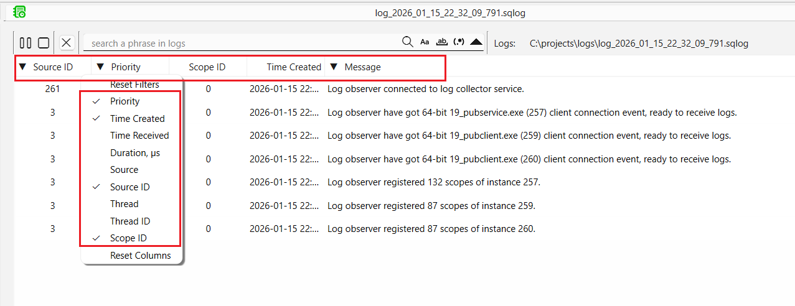
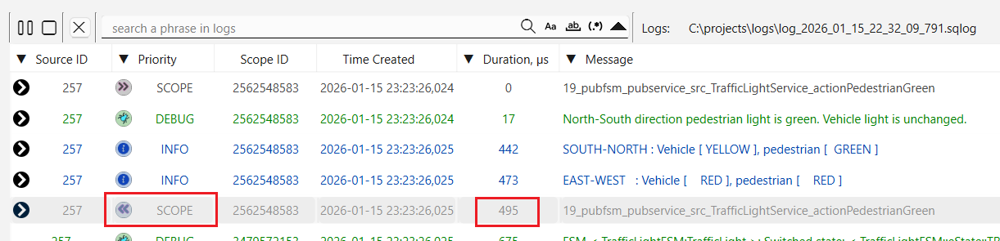
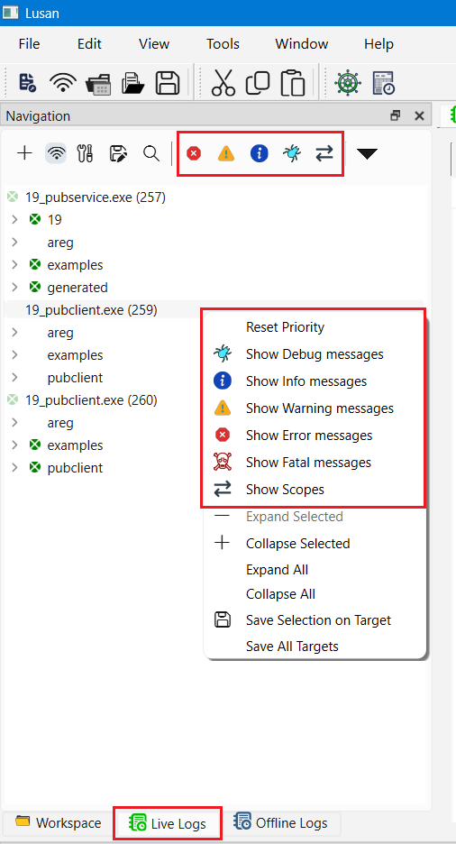
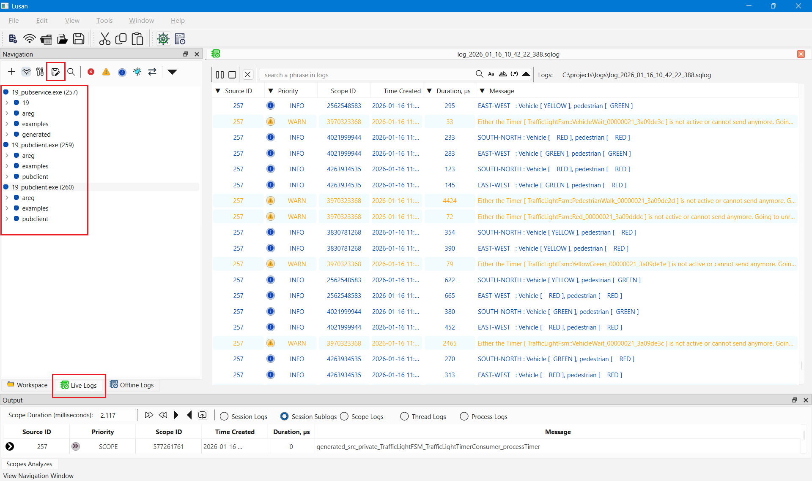

# Lusan Live Log Viewer: Real-Time Monitoring for Areg Applications

This document explains how to use **Lusan** as a **live log viewer** for Areg-based applications. Live log viewing allows developers to observe, filter, and analyze logs from **distributed systems** in real time while applications are running.

Lusan is designed for **development, debugging, system integration, performance analysis, and runtime diagnostics** of complex multi-process and multi-threaded systems.

---

## Table of Contents

- [Overview](#overview)
- [Why Use Live Log Viewing?](#why-use-live-log-viewing)
- [Prerequisites](#prerequisites)
  - [Required Components](#required-components)
- [Step-by-Step Guide to Live Log Viewing](#step-by-step-guide-to-live-log-viewing)
  - [Step 1: Launch the Log Collector Service](#step-1-launch-the-log-collector-service)
  - [Step 2: Connect Lusan to Log Collector](#step-2-connect-lusan-to-log-collector)
  - [Step 3: Start Your Areg Applications](#step-3-start-your-areg-applications)
  - [Step 4: Monitor and Analyze Real-Time Logs](#step-4-monitor-and-analyze-real-time-logs)
  - [Step 5: Filter and Search Logs](#step-5-filter-and-search-logs)
  - [Step 6: Runtime Logging Control](#step-6-runtime-logging-control)
- [Troubleshooting Live Logging](#troubleshooting-live-logging)
  - [Logs Not Appearing](#logs-not-appearing)
  - [Performance Issues](#performance-issues)
  - [Connection Drops](#connection-drops)
- [Performance Considerations](#performance-considerations)
  - [System Impact](#system-impact)
  - [Production Environments](#production-environments)
- [Summary](#summary)

---

## Overview

The **Areg SDK** provides a built-in logging infrastructure optimized for **distributed, multi-process, and multi-threaded architectures**. Logs generated by multiple applications can be collected centrally and visualized in real time.

Lusan acts as a centralized live log viewer that aggregates logs from multiple threads, processes, and devices into a **single, unified interface**. This provides immediate visibility into system behavior and significantly reduces the time required to debug complex interactions.

**Use Cases:**
- Interactive development and debugging
- Real-time performance monitoring
- Cross-service and cross-process interaction tracing
- Runtime troubleshooting without restarting applications

**Key Components:**
- **Areg-based applications**  
  Generate structured runtime logs.
- **logcollector**  
  Aggregates logs from all applications at runtime.
- **Lusan**  
  Connects to `logcollector` and visualizes logs live.

Lusan does not generate logs itself. It connects to the Areg logging infrastructure and provides visualization, filtering, analysis, and runtime control.

---

## Why Use Live Log Viewing?

Live log viewing with Lusan enables:

- Immediate visibility into distributed system behavior
- Centralized logs from multiple applications and machines
- Correlation of events across processes and threads
- Runtime debugging without application restarts
- Dynamic control of logging scopes and priorities

These capabilities make Lusan especially valuable for diagnosing timing issues, race conditions, and cross-component interactions.

---

## Prerequisites

Before starting live log monitoring, ensure the following components are available and correctly configured.

### Required Components
- **Lusan application**, built from the [areg-sdk-tools repository](https://github.com/aregtech/areg-sdk-tools)
- **`logcollector` service**, built from the Areg SDK
- **Areg-based applications** with logging enabled
- Configuration files:
  - `areg.init` for applications and `logcollector`
  - `lusan.init` for Lusan

Both `areg.init` and `lusan.init` must define the same log service endpoint:

```plaintext
logger::*::service          = logcollector  # Log Collector process name
logger::*::connect          = tcpip         # Communication protocol
logger::*::enable::tcpip    = true          # Enable TCP/IP
logger::*::address::tcpip   = 172.23.96.1   # IP address (default: 127.0.0.1)
logger::*::port::tcpip      = 8282          # Port number (default: 8282)
```

> [!NOTE]
> All applications and `Lusan` must use the same configuration to communicate with `logcollector`.

---

## Step-by-Step Guide to Live Log Viewing

### Step 1: Launch the Log Collector Service

Run `logcollector` as a console application or as a system service on a reachable machine.

Ensure that:

- The `areg.init` file is accessible
- The TCP/IP address and port are correctly configured

`logcollector` acts as the central aggregation point for all runtime logs.

**Option A: Console Mode (Development)**

```bash
./logcollector
```

**Option B: Service Mode (Testing or Production)**

On Linux (systemd):

```bash
sudo systemctl enable logcollector.service
sudo systemctl start logcollector.service
```

On Windows:

```powershell
.\logcollector.exe --install
net start logger.service
```

> [!TIP]
> More details about running `logcollector` as a service can be found in [Areg SDK Log Collector Service](./04d-logcollector.md) document.

**Verification Checklist**

- Confirm successful startup in console or service logs
- Verify that the service listens on the configured port (default: 8282)
- Ensure the `areg.init` file is accessible to `logcollector`

**Common Issues**

- Port already in use: change the port in `areg.init`
- Permission denied: run with appropriate privileges
- Configuration not found: ensure `./config/areg.init` exists or specify its path

---

### Step 2: Connect Lusan to Log Collector

Launch `Lusan` and establish a connection to the running `logcollector` service.

**Connection Process**

1. Start the `Lusan` application
2. In the menu, select `File` -> `New Live Logs`, or click the `New Live Logs` toolbar button
3. Alternatively, switch to the `Live Logs` tab in the Navigation pane and click `Connect to Log Collector`
4. Lusan automatically connects using settings from `./config/lusan.init` and in the real-time mode records logs in the `.sqlog` file
5. Verify the connection status in the log viewer

<div align="center"><a href="../img/lusan-live-log-connect.png"></a></div>

**Connection Indicator**
You should see the message `Log observer connected to Log Collector service.`

**Recorded Log Format**  
The logs are recorded in the `.sqlog` SQLite3 database format, which can be later analyzed using Lusan's offline log viewer, and as a plain text `.log` file, which can be opened with any text editor.

**Best Practice:** Use SQLite3 database format for primary storage to analyze later with Lusan's offline log viewer.

---

### Step 3: Start Your Areg Applications

With `logcollector` running and `Lusan` connected, start your Areg-based applications. Applications may also be started before Lusan connects.

**Application Configuration Requirements**

- The `areg.init` file is present
- Logging is enabled in configuration
- Applications automatically connect to `logcollector` at startup

**Multi-Source Logging**
Lusan can monitor logs from:

- Multiple applications on the same machine
- Distributed processes on different machines
- Multiple threads within each process
- Different devices in the network

**Expected Behavior**
As applications connect, initialization logs appear in Lusan and log scopes become visible in the Navigation pane.

<div align="center"><a href="../img/lusan-live-log-connected-apps.png"></a></div>

Logs are displayed in a structured, time-ordered format, making it easy to follow system activity as it happens. The log scopes appear in the left Navigation pane as an expandable tree structure, allowing you to browse scope nodes like modules and filter logs. Active priorities of log scopes are highlighted as selected (buttons in blue rectangles).

---

### Step 4: Monitor and Analyze Real-Time Logs

Once applications are connected, Lusan displays logs in real time with rich contextual information.

**Available Log Columns**

- **Priority**: `FATAL`, `ERROR`, `WARN`, `INFO`, `DEBUG`, `SCOPE` log priorities
- **Created Timestamp**: Time when the log was generated
- **Received Timestamp**: Time when the log was received by `Lusan`
- **Duration**: Time in **microseconds** elapsed when scope message activated
- **Source**: application name and ID within the `logcollector` system
- **Source ID**: Application unique identifier within the `logcollector` system
- **Thread**: Thread name in the application
- **Thread ID**: Thread unique identifier within the source application
- **Scope ID**: Scope unique identifier within the source application
- **Message**: Detailed log message with context

<div align="center"><a href="../img/lusan-live-log-columns.png"></a></div>

All columns except `Message` can be shown, hidden, and reordered using drag-and-drop.

> [!TIP]
> If you declare a scope message at the beginning of a method in the sources, the Duration value of `Exit Scope` messages will indicate the time in microseconds passed to execute the method as highlighted in the screenshot below.

<div align="center"><a href="../img/lusan-live-log-duration.png"></a></div>

**Visual Features**

- Color-coded priorities for fast issue detection
- Chronological log ordering
- Scope-based duration measurement
- Clear source and thread identification
- Visual scope highlighting
- Auto-scrolling for live updates
- Search result highlighting

---

### Step 5: Filter and Search Logs

Lusan provides multiple filtering layers to focus on relevant data.

**Available Filtering Methods:**

#### By Priority Level

Filter by scope priority level via selecting/deselecting priority buttons on the Navigation pane or via the context menu when selecting a scope node and right-clicking on it. This filtering is performed on the source application side, which generates logs of enabled priorities only and sends them to the `logcollector` service. Logs of disabled priorities are not generated at all.

<div align="center"><a href="../img/lusan-live-log-scope-log-prio.png"></a></div>

> [!NOTE]
> The scope priority level instructs the logging system to generate and send logs of the selected and higher priorities only. For example, if selected priority level `DEBUG`, all logs, except `Scope Enter` and `Scope Exit` messages will be displayed. If selected priority level is `ERROR` and `SCOPE`, all scope `Enter` and `Exit` messages will be generated and log message with priority `ERROR` and `FATAL`. The rest of logs is not generated by the system.

#### Message-level filtering (viewer side)

Filter by message priority level in the log message window to filter already received logs. This filtering is performed on the Lusan side, and logs of unselected priorities will be hidden from the log viewer.

<div align="center"><a href="../img/lusan-live-log-message-prio.png"></a></div>

Multiple filtering criteria can be selected simultaneously. Filtering by message priority level allows you to filter already received logs without requesting the source application to change the scope priority level. Click the arrow on the column header to apply filters.

**Currently Supported Filtering Criteria:**
- **Filtering by Priority Level** - Show only messages of selected priority levels
- **Filtering by Duration** - Show only messages with duration values greater than or equal to the specified value
- **Filtering by Source** - Show only messages from the specified source name
- **Filtering by Source ID** - Show only messages from the specified source ID
- **Filtering by Thread** - Show only messages from the specified thread name
- **Filtering by Thread ID** - Show only messages from the specified thread ID
- **Filtering by Text Phrase** - Show only messages containing the specified text phrase in log messages (supports wildcards)

#### Filtering in Output Log Analyzes Window

Filter by selecting and double-clicking on a message. This marks messages from the session of the selected scope and displays it in the output Log Analyzer Window at the bottom of the application (tab `Scope Analyzes`). Use the following radio buttons to display filtered log messages:

- **Session Logs** - Show only messages of the selected scope session
- **Session Sublogs** - Show only messages of the selected scope session and all its child scopes
- **Scope Logs** - Show only messages of the selected scope, regardless of session
- **Thread Logs** - Show only messages of the selected thread, regardless of scope and session
- **Process Logs** - Show only messages of the selected process, regardless of thread, scope, and session

<div align="center"><a href="../img/lusan-live-log-scope-analyzes.png"></a></div>

**Filtering Best Practices**

- Start with broad filters
- Narrow down progressively
- Combine multiple filters for precise investigation

---

### Step 6: Runtime Logging Control

Lusan enables dynamic control of logging behavior without restarting applications.

**Dynamic Control Capabilities:**

**Enable/Disable Log Scopes:**
- Turn specific component logging on or off, or change logging priority
- Reduce noise from verbose components
- Enable detailed logging for components under investigation

**Adjust Priority Levels:**
- Increase verbosity (e.g., `INFO` → `DEBUG` → `SCOPE`)
- Reduce verbosity to minimize overhead
- Per-scope node (component) priority control

**Application-Wide Settings:**
- Enable/disable all logging for an application
- Bulk scope management
- Quick toggles for emergency situations

**Save Configuration:**
- Save current logging configuration (IP address and port number of `logcollector`)
- Save logging priorities of scopes for source applications, so that on next start, applications use the saved priorities

<div align="center"><a href="../img/lusan-live-log-config.png"></a></div>

To save the current configuration, press the `Save log settings` tool button on the Live Logs Navigation window. Lusan will collect scope priority information from each source application and send a request to change the scopes and save the current configuration. On the next start, applications will use the saved information to filter and generate logs. Scopes with disabled logging will not generate logs at all.

> [!NOTE]
> Logs are generated if lower-level logging is enabled. For example, if a scope has `INFO` level logging enabled, all logs with priority `INFO` and higher (`WARN`, `ERROR`, `FATAL`) will be generated. This does not apply to `SCOPE` priority. Disabling `SCOPE` priority must be explicitly specified. This means users can disable any log priority on a scope while still enabling `SCOPE` priority, so the system will generate `Enter Scope` and `Exit Scope` logs. If `SCOPE` priority is not enabled, no scope messages are generated, as shown in the screenshot.

**Benefits of Runtime Control:**
- **No downtime** - Adjust logging without service interruption
- **Performance optimization** - Disable verbose logging in production
- **Targeted debugging** - Enable detailed logs only where needed
- **Production diagnostics** - Safely investigate issues in live systems

**Best Practices:**
- Keep production logging at `INFO` or `WARN` level by default
- Enable `DEBUG` and/or `SCOPE` only when actively investigating
- Disable `SCOPE` logging after capturing necessary information
- Document scope purposes to guide effective filtering

---

## Troubleshooting Live Logging

### Logs Not Appearing

**Check `logcollector` status:**

Verify `logcollector` is running.

On Linux:
```bash
ps aux | grep logcollector
```

On Windows:
```powershell
tasklist | findstr logcollector
```

**Verify network connectivity:**

Test connection to `logcollector` service port:

```bash
# Using telnet
telnet 127.0.0.1 8282

# Or use nc (netcat)
nc -zv 127.0.0.1 8282
```

**Confirm application configuration:**
- Ensure `config/areg.init` for `logcollector` and Areg-based applications is present and readable
- Ensure `config/lusan.init` for Lusan is present and readable
- Verify logging is enabled in configuration settings
- Check that the log service address matches `logcollector`

---

### Performance Issues

**High log volume:**
- Increase filter specificity
- Disable unnecessary scopes
- Reduce priority verbosity
- Consider offline analysis for intensive logging

**Network latency:**
- Ensure `logcollector` runs on the same network segment
- Check for network congestion
- Consider local `logcollector` instances for remote sites

---

### Connection Drops

**Symptoms:** Intermittent log gaps or disconnection messages

**Solutions:**
- Check network stability
- Verify `logcollector` resource availability (CPU, memory)
- Review firewall rules and network policies
- Ensure `logcollector` service has not crashed

---

## Performance Considerations

### System Impact

**Lusan Client:**
- Minimal CPU usage during normal operation
- Memory usage scales with log volume and log buffer size
- Network bandwidth depends on log volume

**Best Practices:**
- Use filtering to reduce processed log volume
- Clear old logs periodically during long sessions

### Production Environments

**Recommendations:**
- Use `INFO` or `WARN`, and disable `SCOPE` as default priority in production
- Enable `DEBUG` and/or `SCOPE` selectively and temporarily
- Monitor `logcollector` resource usage
- Consider dedicated logging infrastructure for high-volume systems

---

## Summary

Lusan's live log viewer transforms distributed logging from a challenge into a powerful development and debugging tool. By centralizing logs, providing real-time visibility, and enabling dynamic control, Lusan significantly reduces the time required to understand and diagnose issues in complex Areg-based systems.

**Key Takeaways:**
- ✅ Centralized view of all distributed logs
- ✅ Real-time monitoring with minimal latency
- ✅ Powerful filtering and correlation capabilities
- ✅ Runtime control without application restarts
- ✅ Essential tool for distributed system and multithreading application development

**Next Step:** Explore [Offline Log Analysis](./09f-use-offline-logging.md) for post-mortem debugging.
